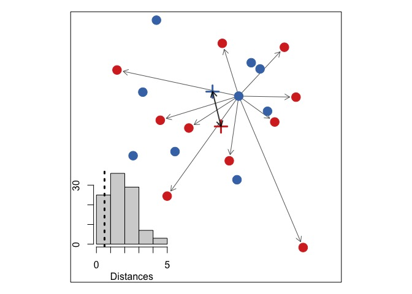

example in two dimensions
================

-   [illustrating the problem in two dimensions](#illustrating-the-problem-in-two-dimensions)

``` r
source('R/simanalysis.R')
```

illustrating the problem in two dimensions
==========================================

``` r
movePoints <- function(x0y0, xy, d){
  total.dist <- apply(cbind(x0y0, xy), 1,
                      function(x) stats::dist(rbind(x[1:2], x[3:4])))
  p <- d / total.dist
  p <- 1 - p
  x0y0[,1] <- xy[,1] + p*(x0y0[,1] - xy[,1])
  x0y0[,2] <- xy[,2] + p*(x0y0[,2] - xy[,2])
  return(x0y0)
}


gA <- MASS::mvrnorm(10, mu=c(10,10), Sigma=matrix(c(1,0,0,1), nrow=2))
gB <- MASS::mvrnorm(10, mu=c(10,10), Sigma=matrix(c(1,0,0,1), nrow=2))

gB2 <- movePoints(gB, matrix(rep(gA[1,], each=10), ncol=2), 0.1)

dists <- as.matrix(dist(rbind(gA,gB)))
rownames(dists) <- colnames(dists) <- rep(c('gA','gB'), each=10)

gmeans <- rbind(apply(gA, 2, gmean), apply(gB, 2, gmean))

par(pty='s')
par(mar=c(1,1,1,1), fig=c(0,1,0,1))

plot(1,1, type='n', ylim=c(7.5,11.5), xlim=c(7, 11) ,
     yaxt='n', xaxt='n', ylab='', xlab='')

arrows(gA[1,1], gA[1,2],
       gB2[,1], gB2[,2],
       length=0.1, angle=30, lwd=1,
       col=grey(0.2, 0.8))

points(rbind(gA,gB), col=rep(c('#4575b4','#d73027'), each=10), 
       pch=19, cex=2)

points(gmeans, pch=3, lwd=3, col=c('#4575b4', '#d73027'), cex=2)

arrows( x0=gmeans[1,1], y0=gmeans[1,2],
        x1=gmeans[2,1], y1=gmeans[2,2],
  length=0.1, angle=30, lwd=2, code=3, col=grey(0,0.8)
)

par(fig=c(0.18,0.46,0.16,0.46), new=TRUE, mar=c(0,0,1,0))

hist(dists[rownames(dists)=='gA', colnames(dists) == 'gB'], main=NULL, xlab='', ylab='', xaxt='n', yaxt='n', col='lightgrey', breaks=6)
mtext('Distances', side=1, line=2)
axis(1, at=0:5, labels=c(0,'','','','',5))
axis(2, at=c(0,10,20,30), labels=c(0,'','',30))


abline(v=as.numeric(dist(gmeans)), lty=3, lwd=3)
```



Figure for publication:

    ## pdf 
    ##   2
