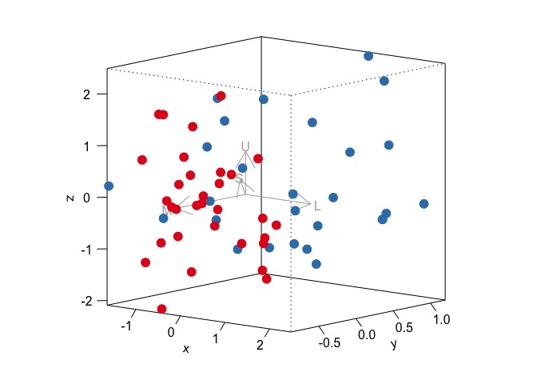
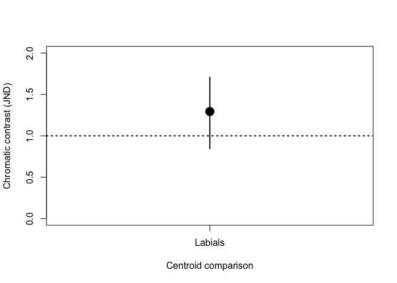
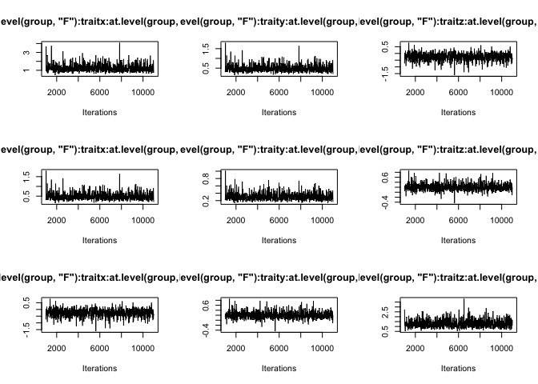
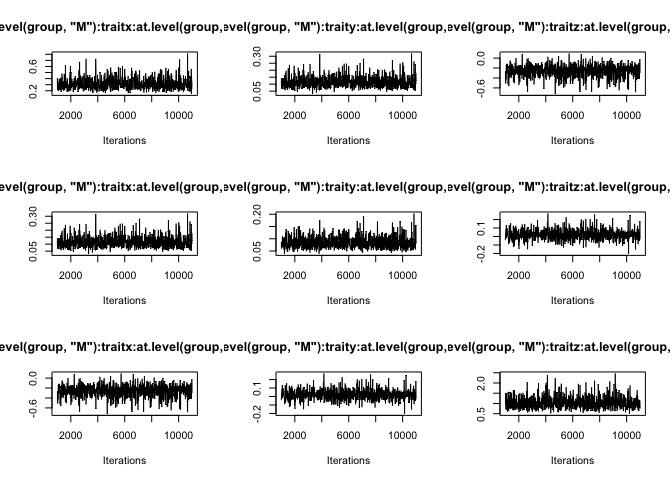
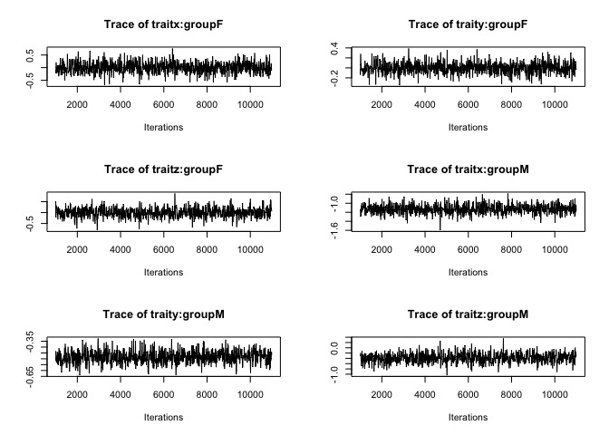
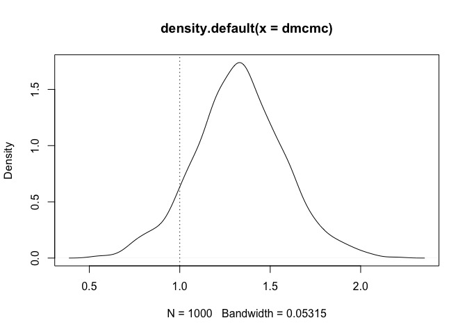
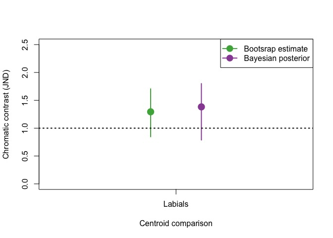

Electronic Supplementary Material for 'Comparing colours using visual models'
================
Rafael Maia & Thomas White

-   [Up-to-date scripts and examples](#up-to-date-scripts-and-examples)
-   [Supplementary figures](#supplementary-figures)
-   [Example analyses](#example-analyses)
    -   [The Data](#the-data)
    -   [Approach 1: distance-based PERMANOVA](#approach-1-distance-based-permanova)
    -   [Approach 2: Cartesian MANOVA](#approach-2-cartesian-manova)
    -   [Approach 3: Bayesian multi-response model using MCMCglmm](#approach-3-bayesian-multi-response-model-using-mcmcglmm)
    -   [Comparing Bayesian vs. Bootstrap estimates](#comparing-bayesian-vs.-bootstrap-estimates)

Up-to-date scripts and examples
===============================

For updated scripts and more reproducible scripts, check the github page. Link: <https://github.com/rmaia/msdichromatism>

Supplementary figures
=====================

 **Figure S1.** Results from threshold simulation using the receptor noise-corrected volume overlap metric. See Figure 6 in the main manuscript for color code. The receptor noise-correction had little impact on the conclusions drawn from using volume overlap.

Example analyses
================

load the necessary packages and functions:

``` r
require(pavo)
require(MCMCglmm)
require(scatterplot3d)
require(gridExtra)
require(vegan)
require(biotools)
```

    ## ---
    ## biotools version 3.1

``` r
require(MASS)
require(pbmcapply)
require(RColorBrewer)
```

The Data
--------

Reflectance data from four body regions of male and female *Ctenophorus ornatus* (Whiting et al. 2015, Biol J Linn Soc). Labium, throat, tongue, and mouth-roof.

**Question:** Is the labium region sexually dichromatic?

Calculate deltaS according to conspecific (tetrachromatic) visual system

``` r
specs <-  as.rspec(read.csv('data/dichromatism/lab.csv'), interp = FALSE)

# Ctenophorus ornatus
liz_vis <- sensmodel(c(360, 440, 493, 571)) 
names(liz_vis) <- c('wl', 'u', 's', 'm', 'l')

model <- vismodel(specs, visual = liz_vis, relative = FALSE, qcatch='Qi')

space <- colspace(model)

deltaS <- coldist(model, achro = FALSE, n = c(1,1,3.5,6), 
                         weber = 0.1, noise = "neural")
```

Approach 1: distance-based PERMANOVA
------------------------------------

``` r
# Setup distance matrix & grouping

mat <- dist(coldist2mat(deltaS)[['dS']])

group <- substring(rownames(as.matrix(mat)), 1, 1)
```

### Testing for separation among groups

Fist, let's test the assumption of homogeneity of variances

``` r
bdisp <- betadisper(mat, group, type='centroid')
anova(bdisp)
```

    ## Analysis of Variance Table
    ## 
    ## Response: Distances
    ##           Df  Sum Sq Mean Sq F value    Pr(>F)    
    ## Groups     1  46.283  46.283  13.518 0.0005246 ***
    ## Residuals 57 195.162   3.424                      
    ## ---
    ## Signif. codes:  0 '***' 0.001 '**' 0.01 '*' 0.05 '.' 0.1 ' ' 1

Males and females have unequal variances, which can influence the results of the PERMANOVA. When this assumption is violated but the largest group has the largest variance, it usually isn't a big problem. Unfortunately as we can see below that is not the case in this example: males have a slightly higher sample size but females have greater dispersion. so the PERMANOVA should be treated with caution.

``` r
# Difference between dispersions
TukeyHSD(bdisp)
```

    ##   Tukey multiple comparisons of means
    ##     95% family-wise confidence level
    ## 
    ## Fit: aov(formula = distances ~ group, data = df)
    ## 
    ## $group
    ##         diff       lwr        upr     p adj
    ## M-F -1.77779 -2.746055 -0.8095249 0.0005246

``` r
# Sample sizes
table(group)
```

    ## group
    ##  F  M 
    ## 27 32

Permutational MANOVA:

``` r
pmanova <- adonis(mat~group)
pmanova
```

    ## 
    ## Call:
    ## adonis(formula = mat ~ group) 
    ## 
    ## Permutation: free
    ## Number of permutations: 999
    ## 
    ## Terms added sequentially (first to last)
    ## 
    ##           Df SumsOfSqs MeanSqs F.Model      R2 Pr(>F)    
    ## group      1    455.04  455.04  12.473 0.17954  0.001 ***
    ## Residuals 57   2079.46   36.48         0.82046           
    ## Total     58   2534.50                 1.00000           
    ## ---
    ## Signif. codes:  0 '***' 0.001 '**' 0.01 '*' 0.05 '.' 0.1 ' ' 1

### Testing for above-threshold mean differences between groups

We will use a bootstrap approach to consider the uncertainty on the mean difference between groups when comparing it to a threshold value of 1 JND.

``` r
# Groups
bootds <- bootcoldist(model, group, n=c(1,1,3.5,6), weber=0.1, qcatch='Qi', achro=FALSE)

bootds
```

    ##      dS.mean    dS.lwr   dS.upr
    ## F-M 1.293707 0.9050629 1.766189

We can see that, though there is a statistically significant difference in colour between males and females, this distance cannot be considered to be above threshold, as its confidence interval does not exclude 1JND.

``` r
plot(bootds[,1], ylim=c(0, 2), pch=21, bg=1, cex=2, xaxt='n', xlab='Centroid comparison', ylab='Chromatic contrast (JND)')

abline(h=1, lty=3, lwd=2)
segments(1, bootds[,2], 1, bootds[,3], lwd=2)

axis(1, at=1, labels='Labials')
```


Approach 2: Cartesian MANOVA
----------------------------

First, we need to convert our distances into noise-corrected Cartesian coordinates:

``` r
# get perceptual xyz and group vector
pxyz <- jnd2xyz(deltaS)
pxyz$group <- substring(names(specs), 1, 1)[-1]

mfcol <- as.character(factor(pxyz$group, labels=brewer.pal(3, 'Set1')[2:1]))

plot(pxyz, col=mfcol, cex=1.5)
```



### Testing for separation among groups

We will perform Box's M-test for homogeneity of variances to test the assumption of equal covariances. This test is easily applicable but is known to be very conservative, so we recommend further reading on when multivariate tests are robust to these violations (e.g. equal and large sample sizes among groups, or greater dispersion in the group with greater sample size when samples are unequal, etc.). We will use the version of the test that is implemented in the `biotools` package

``` r
boxM(pxyz[,c('x', 'y', 'z')], pxyz$group)
```

    ## 
    ##  Box's M-test for Homogeneity of Covariance Matrices
    ## 
    ## data:  pxyz[, c("x", "y", "z")]
    ## Chi-Sq (approx.) = 22.7, df = 6, p-value = 0.0009035

``` r
cov(pxyz[pxyz$group %in% 'M',c('x', 'y', 'z')]) #male covariance
```

    ##             x          y          z
    ## x  0.27074562 0.09850013 -0.2252050
    ## y  0.09850013 0.07276417  0.0190442
    ## z -0.22520499 0.01904420  0.9026118

``` r
cov(pxyz[pxyz$group %in% 'F',c('x', 'y', 'z')]) #female covariance
```

    ##            x         y          z
    ## x  1.0402449 0.4039557 -0.2073683
    ## y  0.4039557 0.2552704  0.1692993
    ## z -0.2073683 0.1692993  1.0665040

``` r
table(pxyz$group) #sample sizes
```

    ## 
    ##  F  M 
    ## 27 32

The test indicates that males and females have unequal covariances. Females have slightly higher variances overall and lower sample size, so we should proceed with caution. However, the differences in sample size are small enough that it shouldn't be too problematic.

run MANOVA on cartesian coordinates:

``` r
summary(manova(lm(cbind(x,y,z)~group, data = pxyz)))
```

    ##           Df  Pillai approx F num Df den Df    Pr(>F)    
    ## group      1 0.43847   14.316      3     55 5.201e-07 ***
    ## Residuals 57                                             
    ## ---
    ## Signif. codes:  0 '***' 0.001 '**' 0.01 '*' 0.05 '.' 0.1 ' ' 1

### Testing for above-threshold mean differences between groups

We will use a bootstrap approach to consider the uncertainty on the mean difference between groups when comparing it to a threshold value of 1 JND.

``` r
# Groups
bootds <- bootcoldist(model, group, n=c(1,1,3.5,6), weber=0.1, qcatch='Qi', achro=FALSE)

bootds
```

    ##      dS.mean   dS.lwr   dS.upr
    ## F-M 1.293707 0.845325 1.705798

We can see that, though there is a statistically significant difference in colour between males and females, this distance cannot be considered to be above threshold, as its confidence interval does not exclude 1JND.

``` r
plot(bootds[,1], ylim=c(0, 2), pch=21, bg=1, cex=2, xaxt='n', xlab='Centroid comparison', ylab='Chromatic contrast (JND)')

abline(h=1, lty=3, lwd=2)
segments(1, bootds[,2], 1, bootds[,3], lwd=2)

axis(1, at=1, labels='Labials')
```



Approach 3: Bayesian multi-response model using MCMCglmm
--------------------------------------------------------

we can extract both statistical and perceptual information from the posterior distribution of a Bayesian analysis using a multi-response model and the package MCMCglmm. In this analysis, we will estimate the variance-covariance structure, so the assumption of homogeneity of variances is relaxed.

Before we do that, we will center all cartesian variables on the female means --- this way, since the model does not have an intercept, male estimates and pMCMC can be interpreted as the effect of sex on each response (X, Y and Z). **This step is essential if we want to interpret model estimates as differences**:

``` r
# get perceptual xyz and group vector
pxyz <- jnd2xyz(deltaS)
pxyz$group <- substring(names(specs), 1, 1)[-1]

# Centering variables to the mean of the first group (in this case, F)
pxyz.c <- pxyz
pxyz.c[,1:3] <- sweep(as.matrix(pxyz[,1:3]), 2, 
                        as.matrix(aggregate(pxyz[,1:3], list(pxyz[,4]), mean)[1,-1]), '-')
```

### Testing for separation among groups

For this illustrative example, we will run a short chain with default priors. **We urge readers to check for chain stationarity, adequate effective sample sizes, and consider appropriate priors to their data for publisheable analyses.**

``` r
pxyz.c$group <- factor(pxyz.c$group)
# Running MCMCglmm models with default priors
mcmcres <- MCMCglmm(
  fixed = cbind(x,y,z) ~ trait:group - 1,
  rcov = ~us(at.level(group, 'F'):trait):units + us(at.level(group, 'M'):trait):units,
  family = rep('gaussian', 3),
  data = pxyz.c,
  nit=11000, burnin=1000, thin=10,
  verbose = FALSE
  )
```

Check chain mixing.

``` r
plot(mcmcres$VCV, density = FALSE)
```



``` r
plot(mcmcres$Sol, density = FALSE)
```



We can see that the posterior estimates approximate the data fairly well (though the chain could probably have been run for a little longer):

``` r
summary(mcmcres)
```

    ## 
    ##  Iterations = 1001:10991
    ##  Thinning interval  = 10
    ##  Sample size  = 1000 
    ## 
    ##  DIC: 270.7793 
    ## 
    ##  R-structure:  ~us(at.level(group, "F"):trait):units
    ## 
    ##                                                               post.mean
    ## at.level(group, "F"):traitx:at.level(group, "F"):traitx.units    1.2543
    ## at.level(group, "F"):traity:at.level(group, "F"):traitx.units    0.4877
    ## at.level(group, "F"):traitz:at.level(group, "F"):traitx.units   -0.2469
    ## at.level(group, "F"):traitx:at.level(group, "F"):traity.units    0.4877
    ## at.level(group, "F"):traity:at.level(group, "F"):traity.units    0.3068
    ## at.level(group, "F"):traitz:at.level(group, "F"):traity.units    0.2043
    ## at.level(group, "F"):traitx:at.level(group, "F"):traitz.units   -0.2469
    ## at.level(group, "F"):traity:at.level(group, "F"):traitz.units    0.2043
    ## at.level(group, "F"):traitz:at.level(group, "F"):traitz.units    1.2840
    ##                                                               l-95% CI
    ## at.level(group, "F"):traitx:at.level(group, "F"):traitx.units  0.63182
    ## at.level(group, "F"):traity:at.level(group, "F"):traitx.units  0.20137
    ## at.level(group, "F"):traitz:at.level(group, "F"):traitx.units -0.87422
    ## at.level(group, "F"):traitx:at.level(group, "F"):traity.units  0.20137
    ## at.level(group, "F"):traity:at.level(group, "F"):traity.units  0.15493
    ## at.level(group, "F"):traitz:at.level(group, "F"):traity.units -0.03417
    ## at.level(group, "F"):traitx:at.level(group, "F"):traitz.units -0.87422
    ## at.level(group, "F"):traity:at.level(group, "F"):traitz.units -0.03417
    ## at.level(group, "F"):traitz:at.level(group, "F"):traitz.units  0.66875
    ##                                                               u-95% CI
    ## at.level(group, "F"):traitx:at.level(group, "F"):traitx.units   2.0814
    ## at.level(group, "F"):traity:at.level(group, "F"):traitx.units   0.8150
    ## at.level(group, "F"):traitz:at.level(group, "F"):traitx.units   0.2376
    ## at.level(group, "F"):traitx:at.level(group, "F"):traity.units   0.8150
    ## at.level(group, "F"):traity:at.level(group, "F"):traity.units   0.4984
    ## at.level(group, "F"):traitz:at.level(group, "F"):traity.units   0.5015
    ## at.level(group, "F"):traitx:at.level(group, "F"):traitz.units   0.2376
    ## at.level(group, "F"):traity:at.level(group, "F"):traitz.units   0.5015
    ## at.level(group, "F"):traitz:at.level(group, "F"):traitz.units   2.0569
    ##                                                               eff.samp
    ## at.level(group, "F"):traitx:at.level(group, "F"):traitx.units     1000
    ## at.level(group, "F"):traity:at.level(group, "F"):traitx.units     1000
    ## at.level(group, "F"):traitz:at.level(group, "F"):traitx.units     1000
    ## at.level(group, "F"):traitx:at.level(group, "F"):traity.units     1000
    ## at.level(group, "F"):traity:at.level(group, "F"):traity.units     1000
    ## at.level(group, "F"):traitz:at.level(group, "F"):traity.units     1529
    ## at.level(group, "F"):traitx:at.level(group, "F"):traitz.units     1000
    ## at.level(group, "F"):traity:at.level(group, "F"):traitz.units     1529
    ## at.level(group, "F"):traitz:at.level(group, "F"):traitz.units     1000
    ## 
    ##                ~us(at.level(group, "M"):trait):units
    ## 
    ##                                                               post.mean
    ## at.level(group, "M"):traitx:at.level(group, "M"):traitx.units   0.31261
    ## at.level(group, "M"):traity:at.level(group, "M"):traitx.units   0.11425
    ## at.level(group, "M"):traitz:at.level(group, "M"):traitx.units  -0.25737
    ## at.level(group, "M"):traitx:at.level(group, "M"):traity.units   0.11425
    ## at.level(group, "M"):traity:at.level(group, "M"):traity.units   0.08393
    ## at.level(group, "M"):traitz:at.level(group, "M"):traity.units   0.02075
    ## at.level(group, "M"):traitx:at.level(group, "M"):traitz.units  -0.25737
    ## at.level(group, "M"):traity:at.level(group, "M"):traitz.units   0.02075
    ## at.level(group, "M"):traitz:at.level(group, "M"):traitz.units   1.02976
    ##                                                               l-95% CI
    ## at.level(group, "M"):traitx:at.level(group, "M"):traitx.units  0.16943
    ## at.level(group, "M"):traity:at.level(group, "M"):traitx.units  0.05472
    ## at.level(group, "M"):traitz:at.level(group, "M"):traitx.units -0.51704
    ## at.level(group, "M"):traitx:at.level(group, "M"):traity.units  0.05472
    ## at.level(group, "M"):traity:at.level(group, "M"):traity.units  0.04817
    ## at.level(group, "M"):traitz:at.level(group, "M"):traity.units -0.09228
    ## at.level(group, "M"):traitx:at.level(group, "M"):traitz.units -0.51704
    ## at.level(group, "M"):traity:at.level(group, "M"):traitz.units -0.09228
    ## at.level(group, "M"):traitz:at.level(group, "M"):traitz.units  0.57942
    ##                                                               u-95% CI
    ## at.level(group, "M"):traitx:at.level(group, "M"):traitx.units  0.48766
    ## at.level(group, "M"):traity:at.level(group, "M"):traitx.units  0.19027
    ## at.level(group, "M"):traitz:at.level(group, "M"):traitx.units -0.04011
    ## at.level(group, "M"):traitx:at.level(group, "M"):traity.units  0.19027
    ## at.level(group, "M"):traity:at.level(group, "M"):traity.units  0.13160
    ## at.level(group, "M"):traitz:at.level(group, "M"):traity.units  0.13752
    ## at.level(group, "M"):traitx:at.level(group, "M"):traitz.units -0.04011
    ## at.level(group, "M"):traity:at.level(group, "M"):traitz.units  0.13752
    ## at.level(group, "M"):traitz:at.level(group, "M"):traitz.units  1.56688
    ##                                                               eff.samp
    ## at.level(group, "M"):traitx:at.level(group, "M"):traitx.units     1000
    ## at.level(group, "M"):traity:at.level(group, "M"):traitx.units     1000
    ## at.level(group, "M"):traitz:at.level(group, "M"):traitx.units     1000
    ## at.level(group, "M"):traitx:at.level(group, "M"):traity.units     1000
    ## at.level(group, "M"):traity:at.level(group, "M"):traity.units     1124
    ## at.level(group, "M"):traitz:at.level(group, "M"):traity.units     1000
    ## at.level(group, "M"):traitx:at.level(group, "M"):traitz.units     1000
    ## at.level(group, "M"):traity:at.level(group, "M"):traitz.units     1000
    ## at.level(group, "M"):traitz:at.level(group, "M"):traitz.units     1041
    ## 
    ##  Location effects: cbind(x, y, z) ~ trait:group - 1 
    ## 
    ##                post.mean   l-95% CI   u-95% CI eff.samp  pMCMC    
    ## traitx:groupF  0.0026080 -0.3742630  0.4440670   1000.0  0.984    
    ## traity:groupF -0.0001171 -0.2214692  0.2180383   1099.3  0.998    
    ## traitz:groupF -0.0003377 -0.4182701  0.4198535    919.7  0.980    
    ## traitx:groupM -1.1319938 -1.3182184 -0.9302701   1078.4 <0.001 ***
    ## traity:groupM -0.4832312 -0.5875484 -0.3803522   1000.0 <0.001 ***
    ## traitz:groupM -0.3830946 -0.7226812 -0.0187306    897.9  0.032 *  
    ## ---
    ## Signif. codes:  0 '***' 0.001 '**' 0.01 '*' 0.05 '.' 0.1 ' ' 1

Let's interpret the results above. According to the location effects, males and females are statistically different in their position in colour space along all three axes of variation (X, Y and Z; since we centered values on female means, male estimates can be interpreted as the difference between sexes). Further, we have defined our model such that it estimated the residual covariance matrices for males and females independently. We can check that the posterior mean values approximate the empirical ones:

``` r
# checking if model estimates approximate empirical covariances
# for females:
matrix(summary(mcmcres)$Rcovariances[1:9,1], nrow=3) # Posterior mean covariance matrix
```

    ##            [,1]      [,2]       [,3]
    ## [1,]  1.2543376 0.4877350 -0.2469187
    ## [2,]  0.4877350 0.3068157  0.2043027
    ## [3,] -0.2469187 0.2043027  1.2839783

``` r
cov(pxyz[pxyz$group %in% 'F',c('x', 'y', 'z')]) # Empirical covariance matrix
```

    ##            x         y          z
    ## x  1.0402449 0.4039557 -0.2073683
    ## y  0.4039557 0.2552704  0.1692993
    ## z -0.2073683 0.1692993  1.0665040

``` r
# for males:
matrix(summary(mcmcres)$Rcovariances[10:18,1], nrow=3) # Posterior mean covariance matrix
```

    ##            [,1]       [,2]        [,3]
    ## [1,]  0.3126132 0.11425168 -0.25736504
    ## [2,]  0.1142517 0.08393154  0.02075084
    ## [3,] -0.2573650 0.02075084  1.02976395

``` r
cov(pxyz[pxyz$group %in% 'M',c('x', 'y', 'z')]) # Empirical covariance matrix
```

    ##             x          y          z
    ## x  0.27074562 0.09850013 -0.2252050
    ## y  0.09850013 0.07276417  0.0190442
    ## z -0.22520499 0.01904420  0.9026118

Similarly, we can check if the mean estimates from the posterior distribution approximate empirical values (remembering of course that we centered values on female means, so female values should be close to zero and male estimates represent differences):

``` r
# checking if model estimates approximate empirical means
# (remember: we centered on Female means, so all female estimates should be zero)
# First column = Females, second column = Males
round(as.matrix(aggregate(pxyz.c[,c('x','y','z')], by= list(pxyz.c[,'group']), mean)[,-1]), 4)
```

    ##            x       y       z
    ## [1,]  0.0000  0.0000  0.0000
    ## [2,] -1.1349 -0.4855 -0.3873

``` r
# First column = Females, second column = Males
round(matrix(summary(mcmcres$Sol)$statistics[,'Mean'], nrow=2, byrow=TRUE), 4)
```

    ##         [,1]    [,2]    [,3]
    ## [1,]  0.0026 -0.0001 -0.0003
    ## [2,] -1.1320 -0.4832 -0.3831

The results above already indicate that the groups are statistically different along all three axes. Some researchers might consider this to be subject to issues of multiple comparisons, because we are considering groups to be different if they are different in **any** (i.e. at least 1) dimension, not **all** dimensions together.

We don't agree with this approach, because the distributions of each response variables are not being calculated independently. Their multivariate nature of the responses is accounted for and the model is estimating their covariances --- so it's **not** the same as, say, testing each of them individually.

Nonetheless, we can obtain an empirical P-value from the MCMC chain that is analogous to a Wald test --- that is, testing if **all** responses are **jointly** different than zero, by estimating the ellipsoid representing its joint credible interval and seeing how many iterations of the MCMC chain include zero (the function we use below has been modified from <https://stat.ethz.ch/pipermail/r-help/2006-September/113184.html>):

``` r
multimcmcpval <- function(samp)
{
   ## elementary version that creates an empirical p-value for the
   ## hypothesis that the columns of samp have mean zero versus a
   ## general multivariate distribution with elliptical contours.

   ## differences from the mean standardized by the observed
   ## variance-covariance factor
   std <- backsolve(chol(var(samp)),
                    cbind(0, t(samp)) - colMeans(samp),
                    transpose = TRUE)
   sqdist <- colSums(std * std)
   mean(sqdist[-1] > sqdist[1])
}

multimcmcpval(mcmcres$Sol[,4:6])
```

    ## [1] 0

Indicating that `pMCMC < 0.05`

### Testing for above-threshold mean differences between groups

We can now use the posterior distribution of the estimates from male and female XYZ values to estimate their mean differences, along with the credible intervals for these estimates, and then compare them to a threshold value of 1 JND. In essence, we are calculating the Euclidean distance between female and male XYZ estimates at each step of the MCMC chain, thus obtaining a posterior distribution for the distances between males and females which we can compare to the threshold of 1JND (keeping in mind that, since we are using receptor noise-corrected Cartesian coordinates, Euclidean distances = JND):

``` r
dmcmc <- apply(mcmcres$Sol, 1, function(x) as.numeric(dist(rbind(x[1:3], x[4:6]))))

credibleints <- cbind(
posterior.mode(mcmc(dmcmc)),
HPDinterval(mcmc(dmcmc))
)

colnames(credibleints)[1] <- 'posteriormode'

credibleints
```

    ##      posteriormode     lower    upper
    ## var1      1.382295 0.7873557 1.800167

``` r
plot(density(dmcmc))
abline(v=1, lty=3)
```



Comparing Bayesian vs. Bootstrap estimates
------------------------------------------

We can compare the Bayesian posterior mode and credible interval to the bootstrap mean and confidence intervals:

``` r
palette <- brewer.pal(4, 'Set1')[3:4]

plot(0.9, bootds[,'dS.mean'], xlim=c(0.5, 1.5), ylim=c(0, 2.5), pch=21, col=NULL, bg=palette[1], cex=2, xaxt='n', xlab='Centroid comparison', ylab='Chromatic contrast (JND)')

segments(0.9, bootds[,'dS.lwr'], 0.9, bootds[,'dS.upr'], lwd=2, col=palette[1])

points(1.1, credibleints[,'posteriormode'], pch=21, bg=palette[2], cex=2, col=NULL)

segments(1.1, credibleints[,'lower'], 1.1, credibleints[,'upper'], lwd=2, col=palette[2])

abline(h=1, lty=3, lwd=2)


axis(1, at=1, labels="Labials")

legend('topright', pch=21, pt.cex=1.6, col=palette, lwd=2, pt.bg=palette, legend=c('Bootsrap estimate', 'Bayesian posterior'))
```


