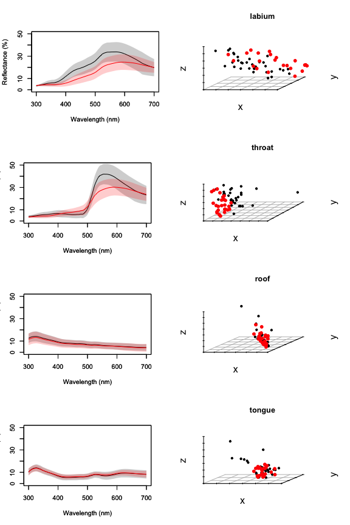

Worked examples
===============

``` r
source('R/bootstrapcentroiddS.R')
source('R/trispace.R')

# Distance matrix generator
distmat <- function(x){
  dmat <- matrix(0, nrow=length(unique(x$patch1)), ncol=length(unique(x$patch1)))
  rownames(dmat) <- colnames(dmat) <- as.character(unique(x$patch1))
  
  for(i in rownames(dmat))
    for(j in colnames(dmat))
      if(length(x$dS[x$patch1 == i & x$patch2 == j]) != 0)
      dmat[i,j] <- dmat[j,i] <- x$dS[x$patch1 == i & x$patch2 == j]
  
  dmat
  
}
```

Example 1: Dichromatism.
------------------------

Reflectance data from four body regions of male and female *Ctenophorus ornatus* (Whiting et al. 2015, Biol J Linn Soc). Labium, throat, tongue, and mouth-roof.

**Q:** Which body regions are sexually dichromatic?

Calculate deltaS according to conspecific (tetrachromatic) visual system

``` r
specs <- list(all = as.rspec(read.csv('data/dichromatism/combined.csv'), interp = FALSE),
              lab = as.rspec(read.csv('data/dichromatism/lab.csv'), interp = FALSE),
              throat = as.rspec(read.csv('data/dichromatism/throat.csv'), interp = FALSE),
              roof = as.rspec(read.csv('data/dichromatism/roof.csv'), interp = FALSE),
              tongue = as.rspec(read.csv('data/dichromatism/tongue.csv'), interp = FALSE))
```

    ## wavelengths found in column 1 
    ## wavelengths found in column 1 
    ## wavelengths found in column 1 
    ## wavelengths found in column 1 
    ## wavelengths found in column 1

``` r
# Ctenophorus ornatus
liz_vis <- sensmodel(c(360, 440, 493, 571)) 
names(liz_vis) <- c('wl', 'u', 's', 'm', 'l')

models <- lapply(specs, function(x) vismodel(x, visual = liz_vis, relative = FALSE, 
                                             qcatch = "fi", scale = 10000))  # deltaS
models_rel <- lapply(specs, function(x) vismodel(x, visual = liz_vis, relative = TRUE, 
                                                 qcatch = "fi", scale = 10000))  # tcs 

deltaS <- lapply(models, function(x) coldist(x, achro = FALSE, n1 = 1, n2 = 1, 
                                             n3 = 3.5, n4 = 6, v = 0.10, noise = 'neural'))

# Add group labels
liz_lab <- function(x){
  x$comparison[grepl('F', x$patch1) & grepl('F', x$patch2)] <- 'intra.F'
  x$comparison[grepl('M', x$patch1) & grepl('M', x$patch2)] <- 'intra.M'
  x$comparison[grepl('M', x$patch1) & grepl('F', x$patch2)] <- 'inter'
  x$comparison[grepl('F', x$patch1) & grepl('M', x$patch2)] <- 'inter'
  x
}

# ew
deltaS$all <- liz_lab(deltaS$all)
deltaS$lab <- liz_lab(deltaS$lab)
deltaS$throat <- liz_lab(deltaS$throat)
deltaS$roof <- liz_lab(deltaS$roof)
deltaS$tongue <- liz_lab(deltaS$tongue)
```

Visualise

``` r
layout(matrix(c(1, 2, 3, 4, 5, 6, 7, 8), 4, 2, byrow = TRUE))

aggplot(as.rspec(cbind(specs$lab$wl, specs$lab[grepl("M", colnames(specs$lab))])), ylim = c(0, 50), lcol = 'black', shadecol = 'black')
```

    ## wavelengths found in column 1

``` r
par(new = TRUE)
aggplot(as.rspec(cbind(specs$lab$wl, specs$lab[grepl("F", colnames(specs$lab))])), ylim = c(0, 50), lcol = 'red', shadecol = 'red')
```

    ## wavelengths found in column 1

``` r
sp3d <- scatterplot3d(suppressWarnings(tcs(models_rel$lab[grepl("M", rownames(models_rel$lab)), ])
                                       [, c('x','y','z')]), pch=19, box=F, main = 'labium', label.tick.marks = FALSE)
sp3d$points3d(suppressWarnings(tcs(models_rel$lab[grepl("F", rownames(models_rel$lab)), ])
                               [, c('x','y','z')]), col='red',pch=19)

aggplot(as.rspec(cbind(specs$throat$wl, specs$throat[grepl("M", colnames(specs$throat))])), ylim = c(0, 50), lcol = 'black', shadecol = 'black')
```

    ## wavelengths found in column 1

``` r
par(new = TRUE)
aggplot(as.rspec(cbind(specs$throat$wl, specs$throat[grepl("F", colnames(specs$throat))])), ylim = c(0, 50), lcol = 'red', shadecol = 'red')
```

    ## wavelengths found in column 1

``` r
sp3d <- scatterplot3d(suppressWarnings(tcs(models_rel$throat[grepl("M", rownames(models_rel$throat)), ])
                                       [, c('x','y','z')]), pch=19, box=F, main = 'throat', label.tick.marks = FALSE)
sp3d$points3d(suppressWarnings(tcs(models_rel$throat[grepl("F", rownames(models_rel$throat)), ])
                               [, c('x','y','z')]), col='red',pch=19)

aggplot(as.rspec(cbind(specs$roof$wl, specs$roof[grepl("M", colnames(specs$roof))])), ylim = c(0, 50), lcol = 'black', shadecol = 'black')
```

    ## wavelengths found in column 1

``` r
par(new = TRUE)
aggplot(as.rspec(cbind(specs$roof$wl, specs$roof[grepl("F", colnames(specs$roof))])), ylim = c(0, 50), lcol = 'red', shadecol = 'red')
```

    ## wavelengths found in column 1

``` r
sp3d <- scatterplot3d(suppressWarnings(tcs(models_rel$roof[grepl("M", rownames(models_rel$roof)), ])
                                       [, c('x','y','z')]), pch=19, box=F, main = 'roof', label.tick.marks = FALSE)
sp3d$points3d(suppressWarnings(tcs(models_rel$roof[grepl("F", rownames(models_rel$roof)), ])
                               [, c('x','y','z')]), col='red',pch=19)

aggplot(as.rspec(cbind(specs$tongue$wl, specs$tongue[grepl("M", colnames(specs$tongue))])), ylim = c(0, 50), lcol = 'black', shadecol = 'black')
```

    ## wavelengths found in column 1

``` r
par(new = TRUE)
aggplot(as.rspec(cbind(specs$tongue$wl, specs$tongue[grepl("F", colnames(specs$tongue))])), ylim = c(0, 50), lcol = 'red', shadecol = 'red')
```

    ## wavelengths found in column 1

``` r
sp3d <- scatterplot3d(suppressWarnings(tcs(models_rel$tongue[grepl("M", rownames(models_rel$tongue)), ])
                                       [, c('x','y','z')]), pch=19, box=F, main = 'tongue', label.tick.marks = FALSE)
sp3d$points3d(suppressWarnings(tcs(models_rel$tongue[grepl("F", rownames(models_rel$tongue)), ])
                               [, c('x','y','z')]), col='red',pch=19)
```



``` r
p1 <- ggplot(deltaS$lab, aes(x=dS, fill=comparison)) + geom_histogram(bins=50) + 
        facet_grid(comparison~., scales='free_y') + geom_vline(xintercept=1) +
        ggtitle('labial') + theme(legend.position="none")

p2 <- ggplot(deltaS$throat, aes(x=dS, fill=comparison)) + geom_histogram(bins=50) + 
        facet_grid(comparison~., scales='free_y') + geom_vline(xintercept=1) +
        ggtitle('throat') + theme(legend.position="none")

p3 <- ggplot(deltaS$roof, aes(x=dS, fill=comparison)) + geom_histogram(bins=50) + 
        facet_grid(comparison~., scales='free_y') + geom_vline(xintercept=1) +
        ggtitle('roof') + theme(legend.position="none")

p4 <- ggplot(deltaS$tongue, aes(x=dS, fill=comparison)) + geom_histogram(bins=50) + 
        facet_grid(comparison~., scales='free_y') + geom_vline(xintercept=1) +
        ggtitle('tongue') + theme(legend.position="none")

grid.arrange(p1, p2, p3, p4, ncol=2)
```


**Step 1:** PERMANOVAs

``` r
# Setup distance matrices & groupings for each body part
mat <- list(all = distmat(deltaS$all),
            lab = distmat(deltaS$lab),
            throat = distmat(deltaS$throat),
            roof = distmat(deltaS$roof),
            tongue = distmat(deltaS$tongue))
group <- list(all = paste0(substring(rownames(mat$all), nchar(rownames(mat$all))), substring(rownames(mat$all), 1, 1)),
              lab = substring(rownames(mat$lab), 1, 1),
              throat = substring(rownames(mat$throat), 1, 1),
              roof = substring(rownames(mat$roof), 1, 1),
              tongue = substring(rownames(mat$tongue), 1, 1))

# Labium
adonis(mat$lab ~ group$lab)
```

    ## 
    ## Call:
    ## adonis(formula = mat$lab ~ group$lab) 
    ## 
    ## Permutation: free
    ## Number of permutations: 999
    ## 
    ## Terms added sequentially (first to last)
    ## 
    ##           Df SumsOfSqs MeanSqs F.Model      R2 Pr(>F)    
    ## group$lab  1    150.12 150.119  14.117 0.20134  0.001 ***
    ## Residuals 56    595.50  10.634         0.79866           
    ## Total     57    745.62                 1.00000           
    ## ---
    ## Signif. codes:  0 '***' 0.001 '**' 0.01 '*' 0.05 '.' 0.1 ' ' 1

``` r
# Mouth-roof
adonis(mat$roof ~ group$roof)
```

    ## 
    ## Call:
    ## adonis(formula = mat$roof ~ group$roof) 
    ## 
    ## Permutation: free
    ## Number of permutations: 999
    ## 
    ## Terms added sequentially (first to last)
    ## 
    ##            Df SumsOfSqs MeanSqs F.Model    R2 Pr(>F)
    ## group$roof  1      3.22  3.2242 0.49025 0.009  0.477
    ## Residuals  54    355.14  6.5766         0.991       
    ## Total      55    358.36                 1.000

``` r
# Throat
adonis(mat$throat ~ group$throat)
```

    ## 
    ## Call:
    ## adonis(formula = mat$throat ~ group$throat) 
    ## 
    ## Permutation: free
    ## Number of permutations: 999
    ## 
    ## Terms added sequentially (first to last)
    ## 
    ##              Df SumsOfSqs MeanSqs F.Model      R2 Pr(>F)    
    ## group$throat  1    202.58 202.583  14.978 0.20809  0.001 ***
    ## Residuals    57    770.97  13.526         0.79191           
    ## Total        58    973.55                 1.00000           
    ## ---
    ## Signif. codes:  0 '***' 0.001 '**' 0.01 '*' 0.05 '.' 0.1 ' ' 1

``` r
# Tongue
adonis(mat$tongue ~ group$tongue)
```

    ## 
    ## Call:
    ## adonis(formula = mat$tongue ~ group$tongue) 
    ## 
    ## Permutation: free
    ## Number of permutations: 999
    ## 
    ## Terms added sequentially (first to last)
    ## 
    ##              Df SumsOfSqs MeanSqs F.Model      R2 Pr(>F)
    ## group$tongue  1     12.17 12.1726  1.6766 0.02857  0.199
    ## Residuals    57    413.82  7.2601         0.97143       
    ## Total        58    426.00                 1.00000

**LESS SHITTY ALTERNATIVE?**

Combine all tests into one using sliding contrasts

``` r
# Planned contrasts
cpatch <- factor(group$all)

levels(cpatch)  # First letter indicates body region, second indicates sex (see below for key)
```

    ## [1] "HF" "HM" "LF" "LM" "RF" "RM" "TF" "TM"

``` r
contrasts(cpatch) <- contr.sdif(8)  # Sliding contrasts

# Design matrix without intercept
cgmmat <- model.matrix(~cpatch)[,-1]

# Run the model testing only contrasts of interest (m vs f body regions) i.e:
# HF vs HM (2-1), throat
# LM vs LF (4-3), labium
# RF vs RM (6-5), mouth-roof
# TF vs TM (8-7), tongue
adonis2(mat$all ~ cgmmat[,'cpatch2-1'] + cgmmat[,'cpatch4-3'] + 
          cgmmat[,'cpatch6-5'] + cgmmat[,'cpatch8-7'] , by = 'margin')
```

    ## Permutation test for adonis under reduced model
    ## Marginal effects of terms
    ## Permutation: free
    ## Number of permutations: 999
    ## 
    ## adonis2(formula = mat$all ~ cgmmat[, "cpatch2-1"] + cgmmat[, "cpatch4-3"] + cgmmat[, "cpatch6-5"] + cgmmat[, "cpatch8-7"], by = "margin")
    ##                        Df SumOfSqs        F Pr(>F)    
    ## cgmmat[, "cpatch2-1"]   1     19.8   0.4802  0.528    
    ## cgmmat[, "cpatch4-3"]   1   5394.6 130.6531  0.001 ***
    ## cgmmat[, "cpatch6-5"]   1   2481.6  60.1032  0.001 ***
    ## cgmmat[, "cpatch8-7"]   1    114.9   2.7832  0.098 .  
    ## Residual              230   9496.7                    
    ## ---
    ## Signif. codes:  0 '***' 0.001 '**' 0.01 '*' 0.05 '.' 0.1 ' ' 1

TW: Yeah that's not right - see individual tests above. Should be labium (4-3) = distinct, throat (2-1) = distinct, mouth (6-5) = nope, tongue (8-7) = nope.

**Step 2:** Effect sizes.

Add grouping variable to raw models, then bootstrap centroids for statistically distinct patches, as identified in step 1 (labium & throat).

``` r
# Groups
models$lab$group <- substring(rownames(models$lab), 1, 1)
models$throat$group <- substring(rownames(models$throat), 1, 1)

# labium
bootcentroidDS(models$lab[,1:4], models$lab$group, n1 = 1, n2 = 1, n3 = 3.5, n4 = 6, v = 0.10)
```

    ##     measured.dS    CI.lwr    CI.upr
    ## F-M   0.4650257 0.3226078 0.6210183

``` r
# throat
bootcentroidDS(models$throat[,1:4], models$throat$group, n1 = 1, n2 = 1, n3 = 3.5, n4 = 6, v = 0.10)
```

    ##     measured.dS    CI.lwr    CI.upr
    ## F-M   0.5703535 0.3582032 0.8545805

So lab's & throats are statistically distinct, but fall below threshold.

``` r
rm(list = setdiff(ls(), lsf.str()))
```

Example 2: Mimicry.
-------------------

Reflectance data from colour-polymorphic female spiders *Gasteracantha fornicata*, and sympatic flowers from Qld, Australia. (W = white morph, Y = yellow morph, F = flowers)

So three groups, with **two Q's:**

**(1)** Are spiders actually polymorphic (to prey), as naively seems to be the case (for humans)?

**(2)** Do spiders (of each morph) resemble sympatric flowers?

Calculate deltaS (JNDs) according to a honeybee

``` r
specs <- as.rspec(read.csv('data/mimicry/flowers_spiders.csv'), interp = FALSE)
```

    ## wavelengths found in column 1

``` r
# Honeybee
bee_vis <- sensmodel(c(344, 436, 556), beta = FALSE) 
names(bee_vis) <- c('wl','s', 'm', 'l')

# Receptor-noise
models <- vismodel(specs, visual = bee_vis, relative = FALSE,
                                                 qcatch = "fi", scale = 10000)  # rn
models_rel <- vismodel(specs, visual = bee_vis, relative = TRUE,
                                                 qcatch = "fi", scale = 10000)  # for plotting
models_tri <- trispace(models_rel)

deltaS <- coldist(models, achro = FALSE, n1 = 1, n2 = 0.471, n3 = 4.412, v = 0.13)

models$group <- substring(rownames(models), 1, 1)
bootcentroidDS(models[, 1:3], models$group, vis = 'tri', n1 = 1, n2 = 0.471, n3 = 4.412, v = 0.13)
```

    ##     measured.dS    CI.lwr    CI.upr
    ## F-W   0.9156266 0.4453148 1.4327545
    ## F-Y   1.3789736 0.9846338 1.8300857
    ## W-Y   0.7111240 0.6493600 0.8088297

``` r
# Contrast labels
deltaS$comparison[grepl('W_', deltaS$patch1) & grepl('W_', deltaS$patch2)] <- 'intra.W'
deltaS$comparison[grepl('Y_', deltaS$patch1) & grepl('Y_', deltaS$patch2)] <- 'intra.Y'
deltaS$comparison[grepl('F_', deltaS$patch1) & grepl('F_', deltaS$patch2)] <- 'intra.F'
deltaS$comparison[grepl('Y_', deltaS$patch1) & grepl('W_', deltaS$patch2)] <- 'inter.WY'
deltaS$comparison[grepl('W_', deltaS$patch1) & grepl('F_', deltaS$patch2)] <- 'inter.WF'
deltaS$comparison[grepl('Y_', deltaS$patch1) & grepl('F_', deltaS$patch2)] <- 'inter.YF'
```

Visualise.

``` r
# Max triangle
triplot(models_tri[grepl("F_", rownames(models_tri)), ], col = 'black', bg = 'forestgreen', cex = 1.3, pch = 21, achro = FALSE)
points(models_tri[grepl("Y_", rownames(models_tri)), ][c('x', 'y')], pch = 21, col = 'black', bg = 'darkgoldenrod1', cex = 1.3)
points(models_tri[grepl("W_", rownames(models_tri)), ][c('x', 'y')], pch = 21, col = 'black', bg = 'darkgrey', cex = 1.3)
```


``` r
ggplot(deltaS, aes(x=dS, fill=comparison)) + geom_histogram(bins=50) + 
        facet_grid(comparison~., scales='free_y') + geom_vline(xintercept=1) +
        theme(legend.position="none")
```


**PERMANOVA**

``` r
# Set up distance matrices & groupings for focal comparisons 
mat <- list(all = distmat(deltaS),
            WY = distmat(subset(deltaS, !(comparison %in% c('intra.F', 'inter.WF', 'inter.YF')))),
            WF = distmat(subset(deltaS, !(comparison %in% c('intra.Y', 'inter.WY', 'inter.YF')))),
            YF = distmat(subset(deltaS, !(comparison %in% c('intra.W', 'inter.WY', 'inter.WF'))))
            )
group <- list(all = substring(rownames(mat$all), 1, 1),
              WY = substring(rownames(mat$WY), 1, 1),
              WF = substring(rownames(mat$WF), 1, 1),
              YF = substring(rownames(mat$YF), 1, 1))

# Use customized contrasts to test a priori hypotheses together
cgroups <- factor(group$all)

# Create the contrasts we want
contrasts(cgroups) <- cbind(
  c(-1, 0.5, 0.5), # compare F vs. W&Y, will be named "cgroups1"
  c(0, -0.5, 0.5)  # compare W vs Y, will be named "cgroups2"
  )

# Create design matrix, without intercept
cgmmat <- model.matrix(~cgroups)[,-1]

# Run the model testing only specified contrasts
adonis2(mat$all ~ cgmmat[, 'cgroups1'] + cgmmat[, 'cgroups2'], by='margin')
```

    ## Permutation test for adonis under reduced model
    ## Marginal effects of terms
    ## Permutation: free
    ## Number of permutations: 999
    ## 
    ## adonis2(formula = mat$all ~ cgmmat[, "cgroups1"] + cgmmat[, "cgroups2"], by = "margin")
    ##                       Df SumOfSqs       F Pr(>F)    
    ## cgmmat[, "cgroups1"]   1   1267.2 13.2141  0.001 ***
    ## cgmmat[, "cgroups2"]   1    382.0  3.9833  0.028 *  
    ## Residual             133  12754.1                   
    ## ---
    ## Signif. codes:  0 '***' 0.001 '**' 0.01 '*' 0.05 '.' 0.1 ' ' 1

Note that the degrees of freedom, sums of squares, and R2 are the same between the two "full" models, but the specified contrasts let us test both hypotheses together. They would also be the same if you did adonis(mat$all ~ cgroups) (but you'd only get one P value and R2 representing the combined effects of both sets of contrasts)

**Effect sizes**

``` r
models$group <- substring(rownames(models), 1, 1)
bootcentroidDS(models[, 1:3], models$group, vis = 'tri', n1 = 1, n2 = 0.471, n3 = 4.412, v = 0.13)
```

    ##     measured.dS    CI.lwr    CI.upr
    ## F-W   0.9156266 0.4660120 1.4409984
    ## F-Y   1.3789736 1.0105452 1.8356093
    ## W-Y   0.7111240 0.6410475 0.8119342

So the RN threshold for honeybees can be pretty damn low (0.3 JNDs, Dyer & Neumeyer 2005), but is variable depending on testing conditions, past experience etc. These would suggest that everying's (on average) perceptably distinct, but probably tough (depending on experience etc.).

``` r
rm(list = setdiff(ls(), lsf.str()))
```

Example 3: Crypsis.
-------------------

Reflectance data from various body regions (H = head, L = left arm, R = right arm, P = prothorax, W = wing) of 27 female and 7 male mantids *Pseudomantis albofimbriata* and 50 background samples (*Lomandra longifolia*, which they pretty much exclusively hang on).

So six groups, a couple of **Q's:** Are mantids cryptic? i.e. are all body regions chromaticically indistinguishable from their background? And are they any sex differences ('hidden' UV sexual signals perhaps)?

Calculate deltaS according to blue tits

``` r
specs <- as.rspec(read.csv('data/crypsis/mantids_bkgs.csv'), lim = c(300, 700))
```

    ## wavelengths found in column 1

``` r
models <- vismodel(specs, visual = 'bluetit', relative = FALSE, qcatch = "fi", scale = 10000)  # deltaS
models_rel <- vismodel(specs, visual = 'bluetit', relative = TRUE, qcatch = "fi", scale = 10000)  # tcs

deltaS <- coldist(models, achro = FALSE)

# Contrast labels. 

# Intragroup
deltaS$comparison[grepl('H_', deltaS$patch1) & grepl('H_', deltaS$patch2)] <- 'intra.H'
deltaS$comparison[grepl('L_', deltaS$patch1) & grepl('L_', deltaS$patch2)] <- 'intra.L'
deltaS$comparison[grepl('R_', deltaS$patch1) & grepl('R_', deltaS$patch2)] <- 'intra.R'
deltaS$comparison[grepl('P_', deltaS$patch1) & grepl('P_', deltaS$patch2)] <- 'intra.P'
deltaS$comparison[grepl('A_', deltaS$patch1) & grepl('A_', deltaS$patch2)] <- 'intra.A'
deltaS$comparison[grepl('W_', deltaS$patch1) & grepl('W_', deltaS$patch2)] <- 'intra.W'

# Intergroup
deltaS$comparison[grepl('H_', deltaS$patch1) & grepl('B_', deltaS$patch2)] <- 'inter.HB'
deltaS$comparison[grepl('L_', deltaS$patch1) & grepl('B_', deltaS$patch2)] <- 'inter.LB'
deltaS$comparison[grepl('R_', deltaS$patch1) & grepl('B_', deltaS$patch2)] <- 'inter.RB'
deltaS$comparison[grepl('P_', deltaS$patch1) & grepl('B_', deltaS$patch2)] <- 'inter.PB'
deltaS$comparison[grepl('A_', deltaS$patch1) & grepl('B_', deltaS$patch2)] <- 'inter.AB'
deltaS$comparison[grepl('W_', deltaS$patch1) & grepl('B_', deltaS$patch2)] <- 'inter.WB'

deltaS_plot <- deltaS[complete.cases(deltaS),]  # comparisons of interest (for plotting only you fool of a Took)
```

Visualise

``` r
sp3d <- scatterplot3d(suppressWarnings(tcs(models_rel[grepl("B_", rownames(models_rel)), ])
                                       [, c('x','y','z')]), xlim=c(-0.02,0.02), ylim=c(-0.01,0.028), zlim=c(-0.06,0.01), 
                                        pch=19, box=F, color = 'forestgreen')
sp3d$points3d(suppressWarnings(tcs(models_rel[grepl("H_", rownames(models_rel)), ])
                               [, c('x','y','z')]), col='darkgoldenrod',pch=19)
sp3d$points3d(suppressWarnings(tcs(models_rel[grepl("L_", rownames(models_rel)), ])
                               [, c('x','y','z')]), col='darkgoldenrod1',pch=19)
sp3d$points3d(suppressWarnings(tcs(models_rel[grepl("R_", rownames(models_rel)), ])
                               [, c('x','y','z')]), col='darkgoldenrod2',pch=19)
sp3d$points3d(suppressWarnings(tcs(models_rel[grepl("P_", rownames(models_rel)), ])
                               [, c('x','y','z')]), col='darkgoldenrod3',pch=19)
sp3d$points3d(suppressWarnings(tcs(models_rel[grepl("W_", rownames(models_rel)), ])
                               [, c('x','y','z')]), col='darkgoldenrod4',pch=19)
sp3d$points3d(suppressWarnings(tcs(models_rel[grepl("A_", rownames(models_rel)), ])
                               [, c('x','y','z')]), col='gold1',pch=19)
```


``` r
ggplot(deltaS_plot, aes(x=dS, fill=comparison)) + geom_histogram(bins=50) + 
        facet_grid(comparison~., scales='free_y') + geom_vline(xintercept=1) +
        theme(legend.position="none")
```


**Step 1:** PERMANOVA all the things

``` r
# Set up distance matrices & groupings for focal comparisons 
mat <- distmat(deltaS)
patch <- substring(rownames(mat), 1, 1)  # body part
sex <- substring(rownames(mat), nchar(rownames(mat)))  # sex (Male, Female, None (bkg))  

adonis(mat ~ patch * sex)
```

    ## 
    ## Call:
    ## adonis(formula = mat ~ patch * sex) 
    ## 
    ## Permutation: free
    ## Number of permutations: 999
    ## 
    ## Terms added sequentially (first to last)
    ## 
    ##            Df SumsOfSqs MeanSqs F.Model      R2 Pr(>F)    
    ## patch       5    543.19 108.637  39.672 0.42482  0.001 ***
    ## sex         1     35.47  35.471  12.953 0.02774  0.001 ***
    ## patch:sex   4    130.37  32.593  11.902 0.10196  0.001 ***
    ## Residuals 208    569.59   2.738         0.44547           
    ## Total     218   1278.62                 1.00000           
    ## ---
    ## Signif. codes:  0 '***' 0.001 '**' 0.01 '*' 0.05 '.' 0.1 ' ' 1

Large patch effect, minor sex \* patch interaction.

**Alternatively:** This formula definition might be problematic though - what if there is no sex difference but there's "None" x (both sexes) differences and these are enough to render that comparison significant? let's specify contrasts based on the questions:

``` r
# contrasts for patch
cpatch <- factor(patch)
contrasts(cpatch) <- cbind(c(-1, 0.2, 0.2, 0.2, 0.2, 0.2), # B vs HLPRW
                           rep(0, 6), rep(0,6), rep(0,6), rep(0,6))

# we don't really care about HxLxPxRxW right? so that should do it
csex <- factor(sex)
contrasts(csex) <- cbind(
                        c(-1,1,0), # M vs F
                        rep(0,3) # we don't care about comparisons with N
                        )

# without interaction
adonis2(mat~cpatch+csex, by='margin')
```

    ## Permutation test for adonis under reduced model
    ## Marginal effects of terms
    ## Permutation: free
    ## Number of permutations: 999
    ## 
    ## adonis2(formula = mat ~ cpatch + csex, by = "margin")
    ##           Df SumOfSqs       F Pr(>F)    
    ## cpatch     1   226.74 49.9730  0.001 ***
    ## csex       1    35.47  7.8178  0.001 ***
    ## Residual 216   980.03                   
    ## ---
    ## Signif. codes:  0 '***' 0.001 '**' 0.01 '*' 0.05 '.' 0.1 ' ' 1

**note reduced degrees of freedom**

also note that in this scenario, the "interaction" becomes nonsingular and unidentifiable - since all patches are treated as one group and the background as another, and the background is ignored in the sex variable, then the interaction and the sex align perfectly:

(HLPRW):F == F (HLPRW):M == M (HLPRW):B == 0

We can show that there are no degrees of freedom for this comparison:

``` r
# get model matrix 
modmat <- model.matrix(~cpatch*csex)

# only columns that interest us:
# cpatch1: B vs HLPRW
# csex1: M vs F, ignore N
# cpatch1:csex1: their interaction

modmat <- modmat[,c("cpatch1", "csex1", "cpatch1:csex1")]

adonis2(mat~modmat, by='margin')
```

    ## Permutation test for adonis under NA model
    ## Marginal effects of terms
    ## Permutation: free
    ## Number of permutations: 999
    ## 
    ## adonis2(formula = mat ~ modmat, by = "margin")
    ##           Df SumOfSqs      F Pr(>F)    
    ## modmat     2   298.59 32.905  0.001 ***
    ## Residual 216   980.03                  
    ## ---
    ## Signif. codes:  0 '***' 0.001 '**' 0.01 '*' 0.05 '.' 0.1 ' ' 1

We can change the contrasts to show an interaction in the form of a sex-by-patch effect, but since we are ignoring the patch differences when testing for crypsis, maybe we shouldn't?

ALSO, note that the contrasts I designed are testing the hypothesis: "are males different from females?" We could also change the contrasts to test MxB x FxB (that is, do the sexes contrast with the background differently) - but given the threshold results that might not even be worth it!

**Step 2:** Effect sizes

``` r
# Splitting up by sex. Need to tidy this up.
models$patch <- substring(rownames(models), 1, 1)
models$sex <- substring(rownames(models), nchar(rownames(models)))

models_m <- subset(models, sex != 'F')
models_f <- subset(models, sex != 'M')

cents_m <- bootcentroidDS(models_m[,1:4], models_m$patch)
cents_f <- bootcentroidDS(models_f[,1:4], models_f$patch)

cents_m <- as.data.frame(cents_m[grep("B", rownames(cents_m)), ])  # Mantid-background contrasts only
cents_f <- as.data.frame(cents_f[grep("B", rownames(cents_f)), ])

cents_m$sex <- 'M'
cents_f$sex <- 'F'
cents_m$comp <- rownames(cents_m)
cents_f$comp <- rownames(cents_f)

cents <- rbind(cents_m, cents_f)
```

Plot (patch \* sex)-versus-bkg bootstrapped centroid distances

``` r
  pd <- position_dodge(.5)
  ggplot(cents, aes(x = sex, y = measured.dS, colour = comp, group = comp)) + 
    geom_errorbar(aes(ymin = CI.lwr, ymax = CI.upr), colour = "black", width = .2, position = pd) +
    geom_point(aes(fill = comp), position = pd, size = 3, shape = 21, colour = 'black') + 
    geom_hline(yintercept = 1, linetype = 2) +
    scale_y_continuous(limits = c(0, 1.2)) +
    ylab("dS") +
    theme(legend.position = 'none')  
```


So all patches are below threshold (i.e. cryptic), and there are some very minor, imperceptible differences between sexes. There's a ton of variance in males due to relatively low sample size.

``` r
sessionInfo()
```

    ## R version 3.3.1 (2016-06-21)
    ## Platform: x86_64-apple-darwin13.4.0 (64-bit)
    ## Running under: OS X 10.11.6 (El Capitan)
    ## 
    ## locale:
    ## [1] en_AU.UTF-8/en_AU.UTF-8/en_AU.UTF-8/C/en_AU.UTF-8/en_AU.UTF-8
    ## 
    ## attached base packages:
    ## [1] stats     graphics  grDevices utils     datasets  methods   base     
    ## 
    ## other attached packages:
    ## [1] MASS_7.3-45          vegan_2.4-0          lattice_0.20-33     
    ## [4] permute_0.9-0        gridExtra_2.2.1      ggplot2_2.1.0       
    ## [7] scatterplot3d_0.3-37 pavo_0.5-5           rgl_0.95.1441       
    ## 
    ## loaded via a namespace (and not attached):
    ##  [1] Rcpp_0.12.5      cluster_2.0.4    knitr_1.13       magrittr_1.5    
    ##  [5] maps_3.1.0       magic_1.5-6      munsell_0.4.3    colorspace_1.2-6
    ##  [9] geometry_0.3-6   plyr_1.8.4       stringr_1.0.0    tools_3.3.1     
    ## [13] parallel_3.3.1   grid_3.3.1       nlme_3.1-128     gtable_0.2.0    
    ## [17] mgcv_1.8-12      htmltools_0.3.5  yaml_2.1.13      digest_0.6.9    
    ## [21] Matrix_1.2-6     reshape2_1.4.1   mapproj_1.2-4    formatR_1.4     
    ## [25] rcdd_1.1-10      evaluate_0.9     rmarkdown_0.9.6  labeling_0.3    
    ## [29] stringi_1.1.1    scales_0.4.0
