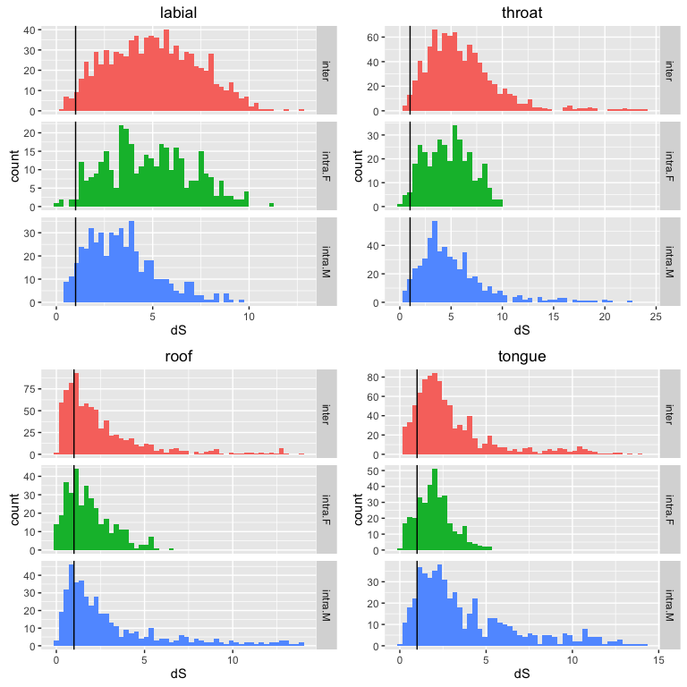
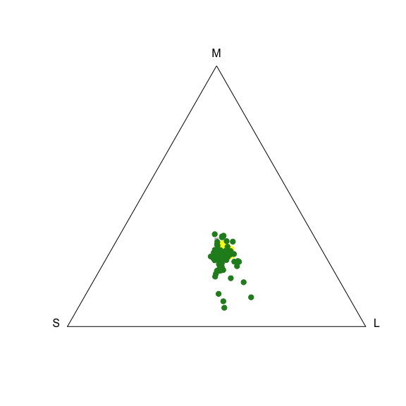
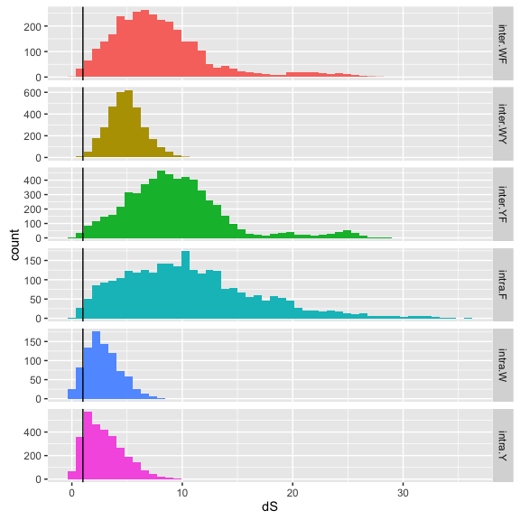
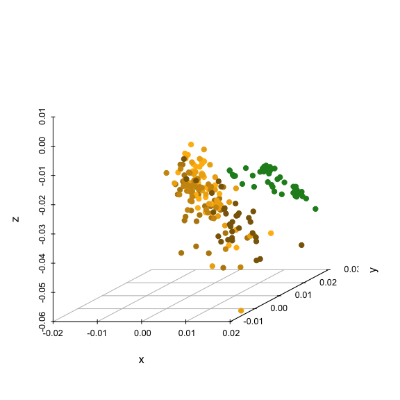
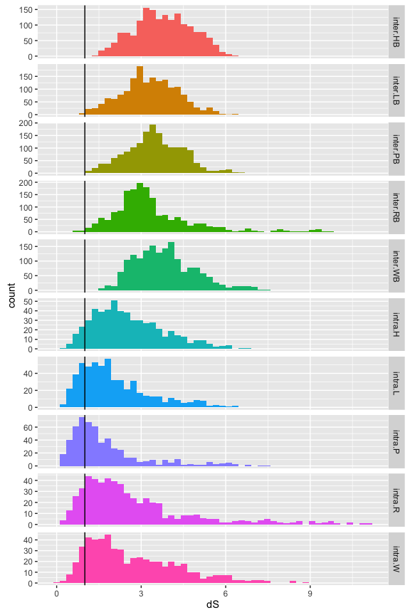
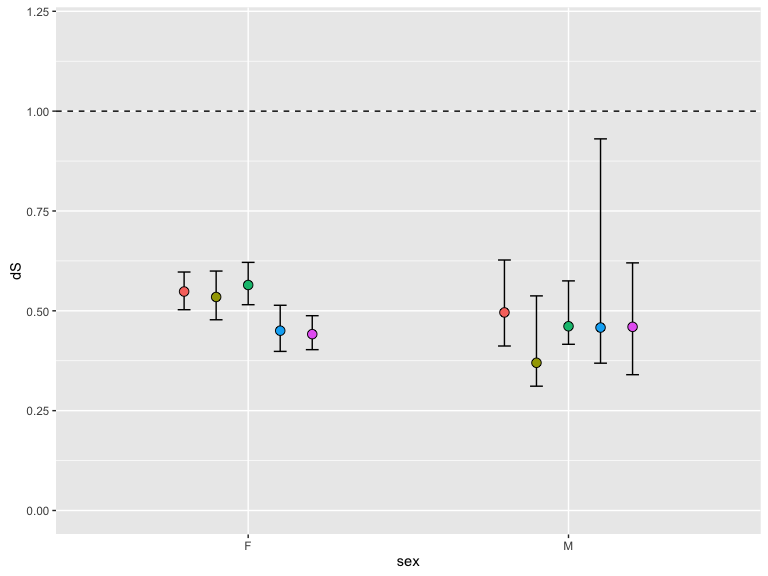

Worked examples
===============

``` r
source('R/bootstrapcentroiddS.R')
source('R/trispace.R')

# Distance matrix generator
distmat <- function(x){
  dmat <- matrix(0, nrow=length(unique(x$patch1)), ncol=length(unique(x$patch1)))
  rownames(dmat) <- colnames(dmat) <- as.character(unique(x$patch1))
  
  for(i in rownames(dmat))
    for(j in colnames(dmat))
      if(length(x$dS[x$patch1 == i & x$patch2 == j]) != 0)
      dmat[i,j] <- dmat[j,i] <- x$dS[x$patch1 == i & x$patch2 == j]
  
  dmat
  
}
```

Example 1: Dichromatism.
------------------------

Reflectance data from four body regions of male and female *Ctenophorus ornatus* (Whiting et al. 2015, Biol J Linn Soc). Labium, throat, tongue, and mouth-roof.

**Q:** Which body regions are sexually dichromatic?

Calculate deltaS according to conspecific (tetrachromatic) visual system

``` r
specs <- list(lab = as.rspec(read.csv('data/dichromatism/lab.csv'), interp = FALSE),
              throat = as.rspec(read.csv('data/dichromatism/throat.csv'), interp = FALSE),
              roof = as.rspec(read.csv('data/dichromatism/roof.csv'), interp = FALSE),
              tongue = as.rspec(read.csv('data/dichromatism/tongue.csv'), interp = FALSE))
```

    ## wavelengths found in column 1 
    ## wavelengths found in column 1 
    ## wavelengths found in column 1 
    ## wavelengths found in column 1

``` r
# Ctenophorus ornatus
liz_vis <- sensmodel(c(360, 440, 493, 571)) 
names(liz_vis) <- c('wl', 'u', 's', 'm', 'l')

models <- lapply(specs, function(x) vismodel(x, visual = liz_vis, relative = FALSE, 
                                             qcatch = "fi", scale = 10000))  # deltaS
models_rel <- lapply(specs, function(x) vismodel(x, visual = liz_vis, relative = TRUE, 
                                                 qcatch = "fi", scale = 10000))  # tcs 

deltaS <- lapply(models, function(x) coldist(x, achro = FALSE, n1 = 1, n2 = 1, 
                                             n3 = 3.5, n4 = 6, v = 0.10, noise = 'neural'))

# Add group labels
liz_lab <- function(x){
  x$comparison[grepl('F', x$patch1) & grepl('F', x$patch2)] <- 'intra.F'
  x$comparison[grepl('M', x$patch1) & grepl('M', x$patch2)] <- 'intra.M'
  x$comparison[grepl('M', x$patch1) & grepl('F', x$patch2)] <- 'inter'
  x$comparison[grepl('F', x$patch1) & grepl('M', x$patch2)] <- 'inter'
  x
}

# ew
deltaS$lab <- liz_lab(deltaS$lab)
deltaS$throat <- liz_lab(deltaS$throat)
deltaS$roof <- liz_lab(deltaS$roof)
deltaS$tongue <- liz_lab(deltaS$tongue)
```

Visualise

``` r
par(pty="s", mfrow = c(2, 2))

sp3d <- scatterplot3d(suppressWarnings(tcs(models_rel$lab[grepl("M", rownames(models_rel$lab)), ])
                                       [, c('x','y','z')]), pch=19, box=F, main = 'labium')
sp3d$points3d(suppressWarnings(tcs(models_rel$lab[grepl("F", rownames(models_rel$lab)), ])
                               [, c('x','y','z')]), col='red',pch=19)

sp3d <- scatterplot3d(suppressWarnings(tcs(models_rel$throat[grepl("M", rownames(models_rel$throat)), ])
                                       [, c('x','y','z')]), pch=19, box=F, main = 'throat')
sp3d$points3d(suppressWarnings(tcs(models_rel$throat[grepl("F", rownames(models_rel$throat)), ])
                               [, c('x','y','z')]), col='red',pch=19)

sp3d <- scatterplot3d(suppressWarnings(tcs(models_rel$roof[grepl("M", rownames(models_rel$roof)), ])
                                       [, c('x','y','z')]), pch=19, box=F, main = 'roof')
sp3d$points3d(suppressWarnings(tcs(models_rel$roof[grepl("F", rownames(models_rel$roof)), ])
                               [, c('x','y','z')]), col='red',pch=19)

sp3d <- scatterplot3d(suppressWarnings(tcs(models_rel$tongue[grepl("M", rownames(models_rel$tongue)), ])
                                       [, c('x','y','z')]), pch=19, box=F, main = 'tongue')
sp3d$points3d(suppressWarnings(tcs(models_rel$tongue[grepl("F", rownames(models_rel$tongue)), ])
                               [, c('x','y','z')]), col='red',pch=19)
```


``` r
p1 <- ggplot(deltaS$lab, aes(x=dS, fill=comparison)) + geom_histogram(bins=50) + 
        facet_grid(comparison~., scales='free_y') + geom_vline(xintercept=1) +
        ggtitle('labial') + theme(legend.position="none")

p2 <- ggplot(deltaS$throat, aes(x=dS, fill=comparison)) + geom_histogram(bins=50) + 
        facet_grid(comparison~., scales='free_y') + geom_vline(xintercept=1) +
        ggtitle('throat') + theme(legend.position="none")

p3 <- ggplot(deltaS$roof, aes(x=dS, fill=comparison)) + geom_histogram(bins=50) + 
        facet_grid(comparison~., scales='free_y') + geom_vline(xintercept=1) +
        ggtitle('roof') + theme(legend.position="none")

p4 <- ggplot(deltaS$tongue, aes(x=dS, fill=comparison)) + geom_histogram(bins=50) + 
        facet_grid(comparison~., scales='free_y') + geom_vline(xintercept=1) +
        ggtitle('tongue') + theme(legend.position="none")

grid.arrange(p1, p2, p3, p4, ncol=2)
```



**Step 1:** PERMANOVAs

``` r
# Setup distance matrices & groupings for each body part
mat <- list(lab = distmat(deltaS$lab),
             throat = distmat(deltaS$throat),
             roof = distmat(deltaS$roof),
             tongue = distmat(deltaS$tongue))
group <- list(lab = substring(rownames(mat$lab), 1, 1),
             throat = substring(rownames(mat$throat), 1, 1),
             roof = substring(rownames(mat$roof), 1, 1),
             tongue = substring(rownames(mat$tongue), 1, 1))

# Labium
adonis(mat$lab ~ group$lab)
```

    ## 
    ## Call:
    ## adonis(formula = mat$lab ~ group$lab) 
    ## 
    ## Permutation: free
    ## Number of permutations: 999
    ## 
    ## Terms added sequentially (first to last)
    ## 
    ##           Df SumsOfSqs MeanSqs F.Model      R2 Pr(>F)    
    ## group$lab  1    150.12 150.119  14.117 0.20134  0.001 ***
    ## Residuals 56    595.50  10.634         0.79866           
    ## Total     57    745.62                 1.00000           
    ## ---
    ## Signif. codes:  0 '***' 0.001 '**' 0.01 '*' 0.05 '.' 0.1 ' ' 1

``` r
# Mouth-roof
adonis(mat$roof ~ group$roof)
```

    ## 
    ## Call:
    ## adonis(formula = mat$roof ~ group$roof) 
    ## 
    ## Permutation: free
    ## Number of permutations: 999
    ## 
    ## Terms added sequentially (first to last)
    ## 
    ##            Df SumsOfSqs MeanSqs F.Model    R2 Pr(>F)
    ## group$roof  1      3.22  3.2242 0.49025 0.009  0.495
    ## Residuals  54    355.14  6.5766         0.991       
    ## Total      55    358.36                 1.000

``` r
# Throat
adonis(mat$throat ~ group$throat)
```

    ## 
    ## Call:
    ## adonis(formula = mat$throat ~ group$throat) 
    ## 
    ## Permutation: free
    ## Number of permutations: 999
    ## 
    ## Terms added sequentially (first to last)
    ## 
    ##              Df SumsOfSqs MeanSqs F.Model      R2 Pr(>F)    
    ## group$throat  1    202.58 202.583  14.978 0.20809  0.001 ***
    ## Residuals    57    770.97  13.526         0.79191           
    ## Total        58    973.55                 1.00000           
    ## ---
    ## Signif. codes:  0 '***' 0.001 '**' 0.01 '*' 0.05 '.' 0.1 ' ' 1

``` r
# Tongue
adonis(mat$tongue ~ group$tongue)
```

    ## 
    ## Call:
    ## adonis(formula = mat$tongue ~ group$tongue) 
    ## 
    ## Permutation: free
    ## Number of permutations: 999
    ## 
    ## Terms added sequentially (first to last)
    ## 
    ##              Df SumsOfSqs MeanSqs F.Model      R2 Pr(>F)
    ## group$tongue  1     12.17 12.1726  1.6766 0.02857  0.199
    ## Residuals    57    413.82  7.2601         0.97143       
    ## Total        58    426.00                 1.00000

**Conclusion**: labium = distinct, throat = distinct, mouth = nope, tongue = nope.

**Step 2:** Effect sizes.

Add grouping variable to raw models, then bootstrap centroids for different patches, as identified in step 1 (labium & throat).

``` r
# Groups
models$lab$group <- substring(rownames(models$lab), 1, 1)
models$throat$group <- substring(rownames(models$throat), 1, 1)
models$roof$group <- substring(rownames(models$roof), 1, 1)
models$tongue$group <- substring(rownames(models$tongue), 1, 1)

# labium
bootcentroidDS(models$lab[,1:4], models$lab$group, n1 = 1, n2 = 1, n3 = 3.5, n4 = 6, v = 0.10)
```

    ##     measured.dS    CI.lwr    CI.upr
    ## F-M   0.4650257 0.3143062 0.6348654

``` r
# throat
bootcentroidDS(models$throat[,1:4], models$throat$group, n1 = 1, n2 = 1, n3 = 3.5, n4 = 6, v = 0.10)
```

    ##     measured.dS    CI.lwr    CI.upr
    ## F-M   0.5703535 0.3591093 0.8313688

So lab's & throats are statistically distinct, but fall below threshold on average.

``` r
rm(deltaS, models, models_rel, specs, liz_vis, liz_lab, mat, group)
```

Example 2: Mimicry.
-------------------

Reflectance data from colour-polymorphic female spiders *Gasteracantha fornicata*, and sympatic flowers from Qld, Australia. (W = white morph, Y = yellow morph, F = flowers)

So three groups, with **two Q's:**

**(1)** Are spiders actually polymorphic (to prey), as naively seems to be the case (for humans)?

**(2)** Do spiders (of each morph) resemble sympatric flowers?

Calculate deltaS (JNDs) according to a honeybee

``` r
specs <- as.rspec(read.csv('data/mimicry/flowers_spiders.csv'), interp = FALSE)
```

    ## wavelengths found in column 1

``` r
# Honeybee
bee_vis <- sensmodel(c(350, 440, 540)) 
names(bee_vis) <- c('wl','s', 'm', 'l')

# Receptor-noise
models <- vismodel(specs, visual = bee_vis, relative = FALSE,
                                                 qcatch = "fi", scale = 10000)  # rn
models_rel <- vismodel(specs, visual = bee_vis, relative = TRUE,
                                                 qcatch = "Qi", scale = 10000)  # for plotting
models_tri <- trispace(models_rel)

deltaS <- coldist(models, achro = FALSE, n1 = 1, n2 = 0.471, n3 = 4.412, v = 0.13)

# Contrast labels
deltaS$comparison[grepl('W_', deltaS$patch1) & grepl('W_', deltaS$patch2)] <- 'intra.W'
deltaS$comparison[grepl('Y_', deltaS$patch1) & grepl('Y_', deltaS$patch2)] <- 'intra.Y'
deltaS$comparison[grepl('F_', deltaS$patch1) & grepl('F_', deltaS$patch2)] <- 'intra.F'
deltaS$comparison[grepl('Y_', deltaS$patch1) & grepl('W_', deltaS$patch2)] <- 'inter.WY'
deltaS$comparison[grepl('W_', deltaS$patch1) & grepl('F_', deltaS$patch2)] <- 'inter.WF'
deltaS$comparison[grepl('Y_', deltaS$patch1) & grepl('F_', deltaS$patch2)] <- 'inter.YF'
```

Visualise.

``` r
# Max triangle
triplot(models_tri[grepl("F_", rownames(models_tri)), ], col = 'forestgreen')
points(models_tri[grepl("Y_", rownames(models_tri)), ][c('x', 'y')], pch = 19, col = 'darkgoldenrod1')
points(models_tri[grepl("W_", rownames(models_tri)), ][c('x', 'y')], pch = 19, col = 'darkgrey')
```



``` r
ggplot(deltaS, aes(x=dS, fill=comparison)) + geom_histogram(bins=50) + 
        facet_grid(comparison~., scales='free_y') + geom_vline(xintercept=1) +
        theme(legend.position="none")
```



**Step 1:** PERMANOVA

``` r
# Set up distance matrices & groupings for focal comparisons 
mat <- list(all = distmat(deltaS),
            WY = distmat(subset(deltaS, !(comparison %in% c('intra.F', 'inter.WF', 'inter.YF')))),
            WF = distmat(subset(deltaS, !(comparison %in% c('intra.Y', 'inter.WY', 'inter.YF')))),
            YF = distmat(subset(deltaS, !(comparison %in% c('intra.W', 'inter.WY', 'inter.WF'))))
            )
group <- list(all = substring(rownames(mat$all), 1, 1),
              WY = substring(rownames(mat$WY), 1, 1),
              WF = substring(rownames(mat$WF), 1, 1),
              YF = substring(rownames(mat$YF), 1, 1))
```

Everything combined. Not really required in this situation since we have *a priori* planned tests.

``` r
adonis(mat$all ~ group$all)
```

    ## 
    ## Call:
    ## adonis(formula = mat$all ~ group$all) 
    ## 
    ## Permutation: free
    ## Number of permutations: 999
    ## 
    ## Terms added sequentially (first to last)
    ## 
    ##            Df SumsOfSqs MeanSqs F.Model      R2 Pr(>F)    
    ## group$all   2    1583.5  791.74   13.03 0.12006  0.001 ***
    ## Residuals 191   11606.0   60.76         0.87994           
    ## Total     193   13189.5                 1.00000           
    ## ---
    ## Signif. codes:  0 '***' 0.001 '**' 0.01 '*' 0.05 '.' 0.1 ' ' 1

So differences exist.

**Q1:** Are spiders polymorphic?

``` r
# Spiders only
adonis(mat$WY ~ group$WY)
```

    ## 
    ## Call:
    ## adonis(formula = mat$WY ~ group$WY) 
    ## 
    ## Permutation: free
    ## Number of permutations: 999
    ## 
    ## Terms added sequentially (first to last)
    ## 
    ##            Df SumsOfSqs MeanSqs F.Model      R2 Pr(>F)    
    ## group$WY    1    390.28  390.28  37.744 0.24391  0.001 ***
    ## Residuals 117   1209.78   10.34         0.75609           
    ## Total     118   1600.06                 1.00000           
    ## ---
    ## Signif. codes:  0 '***' 0.001 '**' 0.01 '*' 0.05 '.' 0.1 ' ' 1

Yep

**Q2:** Are they distinguishable from sympatric flowers?

``` r
# White morph-vs-flowers
adonis(mat$WF ~ group$WF)
```

    ## 
    ## Call:
    ## adonis(formula = mat$WF ~ group$WF) 
    ## 
    ## Permutation: free
    ## Number of permutations: 999
    ## 
    ## Terms added sequentially (first to last)
    ## 
    ##            Df SumsOfSqs MeanSqs F.Model      R2 Pr(>F)
    ## group$WF    1       256 256.033  2.6981 0.02312  0.109
    ## Residuals 114     10818  94.894         0.97688       
    ## Total     115     11074                 1.00000

``` r
# Yellow morph-vs-flowers
adonis(mat$YF ~ group$YF)
```

    ## 
    ## Call:
    ## adonis(formula = mat$YF ~ group$YF) 
    ## 
    ## Permutation: free
    ## Number of permutations: 999
    ## 
    ## Terms added sequentially (first to last)
    ## 
    ##            Df SumsOfSqs MeanSqs F.Model      R2 Pr(>F)    
    ## group$YF    1    1519.1 1519.14  20.383 0.11963  0.001 ***
    ## Residuals 150   11179.7   74.53         0.88037           
    ## Total     151   12698.8                 1.00000           
    ## ---
    ## Signif. codes:  0 '***' 0.001 '**' 0.01 '*' 0.05 '.' 0.1 ' ' 1

White = distinct, yellow = indistinct. Really? That's....unexpected.

**Effect sizes**

``` r
models$group <- substring(rownames(models), 1, 1)
bootcentroidDS(models[,1:3], models$group, vis = 'tri', n1 = 1, n2 = 0.471, n3 = 4.412, v = 0.13)
```

    ##     measured.dS    CI.lwr    CI.upr
    ## F-W   0.6307334 0.2154213 1.1062694
    ## F-Y   1.0915541 0.7529778 1.5295851
    ## W-Y   0.5420380 0.4643210 0.6477248

So white-vs-flowers are statistically distinct but below threshold.

And white-versus-yellow are imperceptable (i.e. not polymorphic)? I know, empirically, that that's bullshit, so maybe I messed up the modelling somewhere.

``` r
rm(deltaS, models, specs, mat, group)
```

Example 3: Crypsis.
-------------------

Reflectance data from various body regions (H = head, L = left arm, R = right arm, P = prothorax, W = wing, A = abdomen) of 27 female mantids *Pseudomantis albofimbriata* and 50 background samples (*Lomandra longifolia*, which they pretty much exclusively hang on).

So six groups, one **Q:** Are mantids cryptic? i.e. are all body regions chromaticically indistinguishable from their background?

Calculate deltaS according to blue tits

``` r
specs <- as.rspec(read.csv('data/crypsis/mantids_bkgs.csv'), lim = c(300, 700))
```

    ## wavelengths found in column 1

``` r
models <- vismodel(specs, visual = 'bluetit', relative = FALSE, qcatch = "fi", scale = 10000)  # deltaS
models_rel <- vismodel(specs, visual = 'bluetit', relative = TRUE, qcatch = "fi", scale = 10000)  # tcs

deltaS <- coldist(models, achro = FALSE)

# Contrast labels. 

# Intragroup
deltaS$comparison[grepl('H_', deltaS$patch1) & grepl('H_', deltaS$patch2)] <- 'intra.H'
deltaS$comparison[grepl('L_', deltaS$patch1) & grepl('L_', deltaS$patch2)] <- 'intra.L'
deltaS$comparison[grepl('R_', deltaS$patch1) & grepl('R_', deltaS$patch2)] <- 'intra.R'
deltaS$comparison[grepl('P_', deltaS$patch1) & grepl('P_', deltaS$patch2)] <- 'intra.P'
deltaS$comparison[grepl('A_', deltaS$patch1) & grepl('A_', deltaS$patch2)] <- 'intra.A'
deltaS$comparison[grepl('W_', deltaS$patch1) & grepl('W_', deltaS$patch2)] <- 'intra.W'

# Intergroup
deltaS$comparison[grepl('H_', deltaS$patch1) & grepl('B_', deltaS$patch2)] <- 'inter.HB'
deltaS$comparison[grepl('L_', deltaS$patch1) & grepl('B_', deltaS$patch2)] <- 'inter.LB'
deltaS$comparison[grepl('R_', deltaS$patch1) & grepl('B_', deltaS$patch2)] <- 'inter.RB'
deltaS$comparison[grepl('P_', deltaS$patch1) & grepl('B_', deltaS$patch2)] <- 'inter.PB'
deltaS$comparison[grepl('A_', deltaS$patch1) & grepl('B_', deltaS$patch2)] <- 'inter.AB'
deltaS$comparison[grepl('W_', deltaS$patch1) & grepl('B_', deltaS$patch2)] <- 'inter.WB'

deltaS_plot <- deltaS[complete.cases(deltaS),]  # comparisons of interest (for plotting only you fool of a Took)
```

Visualise

``` r
sp3d <- scatterplot3d(suppressWarnings(tcs(models_rel[grepl("B_", rownames(models_rel)), ])
                                       [, c('x','y','z')]), xlim=c(-0.02,0.02), ylim=c(-0.01,0.028), zlim=c(-0.06,0.01), 
                                        pch=19, box=F, color = 'forestgreen')
sp3d$points3d(suppressWarnings(tcs(models_rel[grepl("H_", rownames(models_rel)), ])
                               [, c('x','y','z')]), col='darkgoldenrod',pch=19)
sp3d$points3d(suppressWarnings(tcs(models_rel[grepl("L_", rownames(models_rel)), ])
                               [, c('x','y','z')]), col='darkgoldenrod1',pch=19)
sp3d$points3d(suppressWarnings(tcs(models_rel[grepl("R_", rownames(models_rel)), ])
                               [, c('x','y','z')]), col='darkgoldenrod2',pch=19)
sp3d$points3d(suppressWarnings(tcs(models_rel[grepl("P_", rownames(models_rel)), ])
                               [, c('x','y','z')]), col='darkgoldenrod3',pch=19)
sp3d$points3d(suppressWarnings(tcs(models_rel[grepl("W_", rownames(models_rel)), ])
                               [, c('x','y','z')]), col='darkgoldenrod4',pch=19)
sp3d$points3d(suppressWarnings(tcs(models_rel[grepl("A_", rownames(models_rel)), ])
                               [, c('x','y','z')]), col='gold1',pch=19)
```



``` r
ggplot(deltaS_plot, aes(x=dS, fill=comparison)) + geom_histogram(bins=50) + 
        facet_grid(comparison~., scales='free_y') + geom_vline(xintercept=1) +
        theme(legend.position="none")
```



**Step 1:** PERMANOVA all the things

``` r
# Set up distance matrices & groupings for focal comparisons 
mat <- distmat(deltaS)
patch <- substring(rownames(mat), 1, 1)  # body part
sex <- substring(rownames(mat), nchar(rownames(mat)))  # sex (Male, Female, None (bkg))  

adonis(mat ~ patch * sex)
```

    ## 
    ## Call:
    ## adonis(formula = mat ~ patch * sex) 
    ## 
    ## Permutation: free
    ## Number of permutations: 999
    ## 
    ## Terms added sequentially (first to last)
    ## 
    ##            Df SumsOfSqs MeanSqs F.Model      R2 Pr(>F)    
    ## patch       5    543.19 108.637  39.672 0.42482  0.001 ***
    ## sex         1     35.47  35.471  12.953 0.02774  0.001 ***
    ## patch:sex   4    130.37  32.593  11.902 0.10196  0.001 ***
    ## Residuals 208    569.59   2.738         0.44547           
    ## Total     218   1278.62                 1.00000           
    ## ---
    ## Signif. codes:  0 '***' 0.001 '**' 0.01 '*' 0.05 '.' 0.1 ' ' 1

Yep, differences exist...

**Step 2:** Effect sizes

``` r
# Splitting up by sex. Need to tidy this up.
models$patch <- substring(rownames(models), 1, 1)
models$sex <- substring(rownames(models), nchar(rownames(models)))

models_m <- subset(models, sex != 'F')
models_f <- subset(models, sex != 'M')

cents_m <- bootcentroidDS(models_m[,1:4], models_m$patch)
cents_f <- bootcentroidDS(models_f[,1:4], models_f$patch)

cents_m <- as.data.frame(cents_m[grep("B", rownames(cents_m)), ])  # Mantid-background contrasts only
cents_f <- as.data.frame(cents_f[grep("B", rownames(cents_f)), ])

cents_m$sex <- 'M'
cents_f$sex <- 'F'
cents_m$comp <- rownames(cents_m)
cents_f$comp <- rownames(cents_f)

cents <- rbind(cents_m, cents_f)
```

Plot (patch \* sex)-vs-bkg

``` r
  pd <- position_dodge(.5)
  ggplot(cents, aes(x = sex, y = measured.dS, colour = comp, group = comp)) + 
    geom_errorbar(aes(ymin = CI.lwr, ymax = CI.upr), colour = "black", width = .2, position = pd) +
    geom_point(aes(fill = comp), position = pd, size = 3, shape = 21, colour = 'black') + 
    geom_hline(yintercept = 1, linetype = 2) +
    scale_y_continuous(limits = c(0, 1.2)) +
    ylab("dS") +
    theme(axis.line = element_line(colour = 'black'),
          axis.text = element_text(colour = 'black'),
          text = element_text(size = 18),
          axis.title.x = element_text(vjust = -0.5),
          axis.title.y = element_text(vjust = 1.2),
          panel.grid.major = element_blank(),
          panel.grid.minor = element_blank(),
          panel.border = element_blank(),
          legend.position = 'none')  
```



``` r
sessionInfo()
```

    ## R version 3.3.1 (2016-06-21)
    ## Platform: x86_64-apple-darwin13.4.0 (64-bit)
    ## Running under: OS X 10.11.5 (El Capitan)
    ## 
    ## locale:
    ## [1] en_AU.UTF-8/en_AU.UTF-8/en_AU.UTF-8/C/en_AU.UTF-8/en_AU.UTF-8
    ## 
    ## attached base packages:
    ## [1] stats     graphics  grDevices utils     datasets  methods   base     
    ## 
    ## other attached packages:
    ##  [1] lme4_1.1-12          Matrix_1.2-6         vegan_2.4-0         
    ##  [4] lattice_0.20-33      permute_0.9-0        gridExtra_2.2.1     
    ##  [7] ggplot2_2.1.0        scatterplot3d_0.3-37 pavo_0.5-5          
    ## [10] rgl_0.95.1441       
    ## 
    ## loaded via a namespace (and not attached):
    ##  [1] Rcpp_0.12.5      nloptr_1.0.4     formatR_1.4      plyr_1.8.4      
    ##  [5] tools_3.3.1      magic_1.5-6      digest_0.6.9     evaluate_0.9    
    ##  [9] gtable_0.2.0     nlme_3.1-128     mgcv_1.8-12      mapproj_1.2-4   
    ## [13] yaml_2.1.13      parallel_3.3.1   stringr_1.0.0    knitr_1.13      
    ## [17] cluster_2.0.4    maps_3.1.0       rcdd_1.1-10      grid_3.3.1      
    ## [21] rmarkdown_0.9.6  minqa_1.2.4      reshape2_1.4.1   magrittr_1.5    
    ## [25] scales_0.4.0     htmltools_0.3.5  MASS_7.3-45      splines_3.3.1   
    ## [29] colorspace_1.2-6 labeling_0.3     stringi_1.1.1    geometry_0.3-6  
    ## [33] munsell_0.4.3
