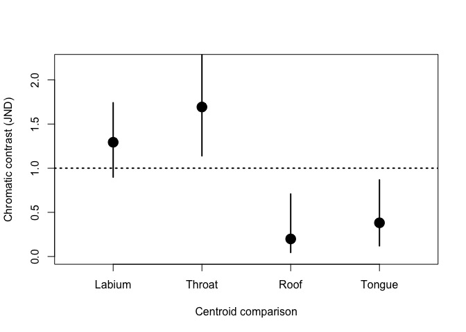
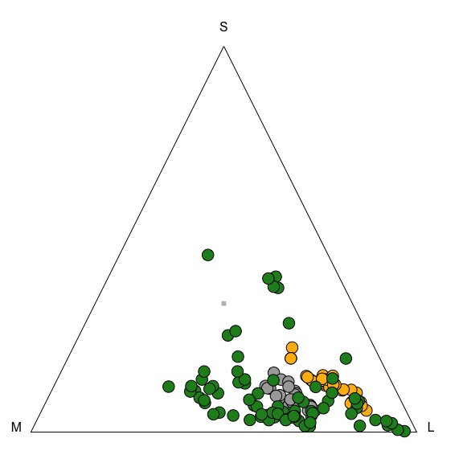

Worked examples
================

-   [Worked examples](#worked-examples)
    -   [Example 1: Dichromatism.](#example-1-dichromatism.)
    -   [Example 2: Mimicry.](#example-2-mimicry.)

Worked examples
===============

``` r
require(pavo)
require(scatterplot3d)
require(gridExtra)
require(vegan)
require(MASS)
require(RColorBrewer)

# load aesthetic functions (plot, make colors transparent)
source('R/aesthetic.R')

# load function to convert JND to cartesian coordinates
source('R/jnd2xyz.R')

# load function for bootstrap
source('R/bootstrapcentroiddS.R')

# Distance matrix generator
distmat <- function(x){
  coldistres <- as.matrix(rbind(x[ ,c(1,2,3)], x[ ,c(2,1,3)]))
  uniquepatches <-  unique(c(coldistres[,1], coldistres[,2]))
  
  M <- matrix(nrow=length(uniquepatches), ncol=length(uniquepatches))
  
  rownames(M) <- colnames(M) <- uniquepatches
  
  M[coldistres[,1:2] ] <- coldistres[,3]
  M[coldistres[,2:1] ] <- coldistres[,3]
  
  class(M) <- 'numeric'
  M[is.na(M)] <- 0
  
  grouping <- as.factor(gsub('[0-9]','', rownames(M)))
  
  M <- as.dist(M)
  M
  }

#color palette
palette <- rcbalpha(0.8, 4, 'Set1')
```

Example 1: Dichromatism.
------------------------

Reflectance data from four body regions of male and female *Ctenophorus ornatus* (Whiting et al. 2015, Biol J Linn Soc). Labium, throat, tongue, and mouth-roof.

**Q:** Which body regions are sexually dichromatic?

Calculate deltaS according to conspecific (tetrachromatic) visual system

``` r
specs <- list(all = as.rspec(read.csv('data/dichromatism/combined.csv'), interp = FALSE),
              lab = as.rspec(read.csv('data/dichromatism/lab.csv'), interp = FALSE),
              throat = as.rspec(read.csv('data/dichromatism/throat.csv'), interp = FALSE),
              roof = as.rspec(read.csv('data/dichromatism/roof.csv'), interp = FALSE),
              tongue = as.rspec(read.csv('data/dichromatism/tongue.csv'), interp = FALSE))

# Ctenophorus ornatus
liz_vis <- sensmodel(c(360, 440, 493, 571)) 
names(liz_vis) <- c('wl', 'u', 's', 'm', 'l')

models <- lapply(specs, vismodel, visual = liz_vis, relative = FALSE, qcatch='Qi')

spaces <- lapply(models, colspace)

deltaS <- lapply(models, coldist, achro = FALSE, n = c(1,1,3.5,6), 
                                  weber = 0.1, noise = "neural")
```

Visualise

``` r
layout(matrix(c(1, 2, 3, 4, 5, 6, 7, 8), 4, 2, byrow = TRUE))

aggplot(specs[['lab']], by=gsub("[0-9].*","",names(specs[['lab']])), lwd=3, ylim=c(0,50))

scatterplot3d(spaces[['lab']][,c('x','y','z')],  
      bg=as.character(factor(gsub("[0-9].*","",names(specs[['lab']]))[-1], 
                             labels=palette[1:2])),
      box=FALSE, pch=21, cex.symbols=2, color=NA,
      x.ticklabs='', y.ticklabs='', z.ticklabs='', xlab='', ylab='', zlab='')


aggplot(specs[['throat']], by=gsub("[0-9].*","",names(specs[['throat']])), lwd=3, ylim=c(0,50))

scatterplot3d(spaces[['throat']][,c('x','y','z')],  
      bg=as.character(factor(gsub("[0-9].*","",names(specs[['throat']]))[-1],
                             labels=palette[1:2])),
      box=FALSE, pch=21, cex.symbols=2, color=NA,
      x.ticklabs='', y.ticklabs='', z.ticklabs='', xlab='', ylab='', zlab='')


aggplot(specs[['roof']], by=gsub("[0-9].*","",names(specs[['roof']])), lwd=3, ylim=c(0,50))

scatterplot3d(spaces[['roof']][,c('x','y','z')],  
      bg=as.character(factor(gsub("[0-9].*","",names(specs[['roof']]))[-1],
                             labels=palette[1:2])),
      box=FALSE, pch=21, cex.symbols=2, color=NA,
      x.ticklabs='', y.ticklabs='', z.ticklabs='', xlab='', ylab='', zlab='')


aggplot(specs[['tongue']], by=gsub("[0-9].*","",names(specs[['tongue']])), lwd=3, ylim=c(0,50))

scatterplot3d(spaces[['tongue']][,c('x','y','z')],  
      bg=as.character(factor(gsub("[0-9].*","",names(specs[['tongue']]))[-1],
                             labels=palette[1:2])),
      box=FALSE, pch=21, cex.symbols=2, color=NA,
      x.ticklabs='', y.ticklabs='', z.ticklabs='', xlab='', ylab='', zlab='')
```


**Step 1:** PERMANOVAs

``` r
# Setup distance matrices & groupings for each body part
mat <- list(all = distmat(deltaS$all),
            lab = distmat(deltaS$lab),
            throat = distmat(deltaS$throat),
            roof = distmat(deltaS$roof),
            tongue = distmat(deltaS$tongue))

group <- list(all = paste0(substring(rownames(as.matrix(mat$all)), nchar(rownames(as.matrix(mat$all)))), substring(rownames(as.matrix(mat$all)), 1, 1)),
              lab = substring(rownames(as.matrix(mat$lab)), 1, 1),
              throat = substring(rownames(as.matrix(mat$throat)), 1, 1),
              roof = substring(rownames(as.matrix(mat$roof)), 1, 1),
              tongue = substring(rownames(as.matrix(mat$tongue)), 1, 1))

# Labium
adonis(mat$lab ~ group$lab)
```

    ## 
    ## Call:
    ## adonis(formula = mat$lab ~ group$lab) 
    ## 
    ## Permutation: free
    ## Number of permutations: 999
    ## 
    ## Terms added sequentially (first to last)
    ## 
    ##           Df SumsOfSqs MeanSqs F.Model      R2 Pr(>F)    
    ## group$lab  1    24.509 24.5094  13.964 0.19678  0.001 ***
    ## Residuals 57   100.042  1.7551         0.80322           
    ## Total     58   124.552                 1.00000           
    ## ---
    ## Signif. codes:  0 '***' 0.001 '**' 0.01 '*' 0.05 '.' 0.1 ' ' 1

``` r
# Mouth-roof
adonis(mat$roof ~ group$roof)
```

    ## 
    ## Call:
    ## adonis(formula = mat$roof ~ group$roof) 
    ## 
    ## Permutation: free
    ## Number of permutations: 999
    ## 
    ## Terms added sequentially (first to last)
    ## 
    ##            Df SumsOfSqs MeanSqs F.Model      R2 Pr(>F)
    ## group$roof  1     0.563 0.56278 0.52282 0.00942  0.498
    ## Residuals  55    59.203 1.07642         0.99058       
    ## Total      56    59.766                 1.00000

``` r
# Throat
adonis(mat$throat ~ group$throat)
```

    ## 
    ## Call:
    ## adonis(formula = mat$throat ~ group$throat) 
    ## 
    ## Permutation: free
    ## Number of permutations: 999
    ## 
    ## Terms added sequentially (first to last)
    ## 
    ##              Df SumsOfSqs MeanSqs F.Model      R2 Pr(>F)    
    ## group$throat  1    42.565  42.565  14.842 0.20376  0.001 ***
    ## Residuals    58   166.335   2.868         0.79624           
    ## Total        59   208.901                 1.00000           
    ## ---
    ## Signif. codes:  0 '***' 0.001 '**' 0.01 '*' 0.05 '.' 0.1 ' ' 1

``` r
# Tongue
adonis(mat$tongue ~ group$tongue)
```

    ## 
    ## Call:
    ## adonis(formula = mat$tongue ~ group$tongue) 
    ## 
    ## Permutation: free
    ## Number of permutations: 999
    ## 
    ## Terms added sequentially (first to last)
    ## 
    ##              Df SumsOfSqs MeanSqs F.Model      R2 Pr(>F)
    ## group$tongue  1     2.162  2.1617  1.6293 0.02732  0.223
    ## Residuals    58    76.953  1.3268         0.97268       
    ## Total        59    79.115                 1.00000

**LESS SHITTY ALTERNATIVE?**

Combine all tests into one using sliding contrasts

``` r
# Planned contrasts
cpatch <- factor(group$all)

levels(cpatch)  # First letter indicates body region, second indicates sex (see below for key)
```

    ## [1] "HF" "HM" "LF" "LM" "RF" "RM" "TF" "TM"

``` r
contrasts(cpatch) <- contr.sdif(8)  # Sliding contrasts

# RM: maybe this works? 

contmat <- matrix(0, nrow=8, ncol=4)
contmat[1,1] <- contmat[3,2] <- contmat[5,3] <- contmat[7,4] <- 0.5
contmat[2,1] <- contmat[4,2] <- contmat[6,3] <- contmat[8,4] <- -0.5

contrasts(cpatch) <- contmat

# Design matrix without intercept
cgmmat <- model.matrix(~cpatch)[,-1]

# Run the model testing only contrasts of interest (m vs f body regions) i.e:
# HF vs HM (2-1), throat
# LM vs LF (4-3), labium
# RF vs RM (6-5), mouth-roof
# TF vs TM (8-7), tongue
#adonis2(mat$all ~ cgmmat[,'cpatch2-1'] + cgmmat[,'cpatch4-3'] + 
#          cgmmat[,'cpatch6-5'] + cgmmat[,'cpatch8-7'] , by = 'margin')

# cpatch1 = H
#       2 = L
#       3 = R
#       4 = T

adonis2(mat$all ~ cgmmat[,'cpatch1'] + cgmmat[,'cpatch2'] +
                  cgmmat[,'cpatch3'] + cgmmat[,'cpatch4'], by='margin')
```

    ## Permutation test for adonis under reduced model
    ## Marginal effects of terms
    ## Permutation: free
    ## Number of permutations: 999
    ## 
    ## adonis2(formula = mat$all ~ cgmmat[, "cpatch1"] + cgmmat[, "cpatch2"] + cgmmat[, "cpatch3"] + cgmmat[, "cpatch4"], by = "margin")
    ##                      Df SumOfSqs      F Pr(>F)  
    ## cgmmat[, "cpatch1"]   1     95.1 4.5754  0.030 *
    ## cgmmat[, "cpatch2"]   1     32.4 1.5585  0.225  
    ## cgmmat[, "cpatch3"]   1      7.2 0.3456  0.618  
    ## cgmmat[, "cpatch4"]   1     17.0 0.8172  0.390  
    ## Residual            231   4801.5                
    ## ---
    ## Signif. codes:  0 '***' 0.001 '**' 0.01 '*' 0.05 '.' 0.1 ' ' 1

TW: Yeah that's not right - see individual tests above. Should be labium (4-3) = distinct, throat (2-1) = distinct, mouth (6-5) = nope, tongue (8-7) = nope. Should 'sex' be split off as a factor?...

RM: my re-do results in only throat being significant...

**Step 2:** Effect sizes.

Add grouping variable to raw models, then bootstrap centroids for statistically distinct patches, as identified in step 1 (labium & throat).

``` r
# Groups
models$lab$group <- substring(rownames(models$lab), 1, 1)
models$throat$group <- substring(rownames(models$throat), 1, 1)
models$roof$group <- substring(rownames(models$roof), 1, 1)
models$tongue$group <- substring(rownames(models$tongue), 1, 1)

# labium
laboot <- bootcentroidDS(models$lab[,1:4], models$lab$group, 
                         n=c(1,1,3.5,6), weber=0.1, qcatch='Qi', achro=FALSE)
```

    ## Warning: number of cones not specified; assumed to be 4

``` r
# throat
thboot <- bootcentroidDS(models$throat[,1:4], models$throat$group, 
                         n=c(1,1,3.5,6), weber=0.1, qcatch='Qi', achro=FALSE)
```

    ## Warning: number of cones not specified; assumed to be 4

``` r
# roof
roboot <- bootcentroidDS(models$roof[,1:4], models$roof$group, 
                         n=c(1,1,3.5,6), weber=0.1, qcatch='Qi', achro=FALSE)
```

    ## Warning: number of cones not specified; assumed to be 4

``` r
# tongue
toboot <- bootcentroidDS(models$tongue[,1:4], models$tongue$group, 
                         n=c(1,1,3.5,6), weber=0.1, qcatch='Qi', achro=FALSE)
```

    ## Warning: number of cones not specified; assumed to be 4

``` r
bootres <- rbind(laboot, thboot, roboot, toboot)
rownames(bootres) <- c('Labium', 'Throat', 'Roof', 'Tongue')

bootres
```

    ##        measured.dS     CI.lwr    CI.upr
    ## Labium   1.1788081 0.82117971 1.6630098
    ## Throat   1.5222987 1.00830608 2.1245782
    ## Roof     0.1061599 0.03523353 0.4516327
    ## Tongue   0.2006113 0.05561841 0.5790327

``` r
plot(bootres[,1], xlim=c(0.5, 4.5), ylim=c(0, 2.2), pch=21, bg=1, cex=2, xaxt='n', xlab='Centroid comparison', ylab='Chromatic contrast (JND)')

abline(h=1, lty=3, lwd=2)
segments(1:4, bootres[,2], 1:4, bootres[,3], lwd=2)

axis(1, at=1:4, labels=rownames(bootres))
```



So lab's & throats are statistically distinct, but fall below threshold.

plots for publication:

``` r
pdf(height=10*1.3, width=8*1.3, pointsize = 12*1.3*1.2, file='figures/lizards.pdf')

oma <- par()$mar

oma[3] <- 1.1
oma[1] <- 4.1

layout(cbind(matrix(c(1, 2, 3, 4, 5, 6, 7, 8), 4, 2, byrow = TRUE), rep(9,4)))

par(mar=oma)

aggplot(specs[['lab']], by=gsub("[0-9].*","",names(specs[['lab']])), lwd=3, ylim=c(0,50))

scatterplot3d(spaces[['lab']][,c('x','y','z')],  
      bg=as.character(factor(gsub("[0-9].*","",names(specs[['lab']]))[-1], 
                             labels=palette[1:2])),
      box=FALSE, pch=21, cex.symbols=2, color=NA,
      x.ticklabs='', y.ticklabs='', z.ticklabs='', xlab='', ylab='', zlab='',
      mar=c(4.5,0,0,0))

par(mar=oma)

aggplot(specs[['throat']], by=gsub("[0-9].*","",names(specs[['throat']])), lwd=3, ylim=c(0,50))

scatterplot3d(spaces[['throat']][,c('x','y','z')],  
      bg=as.character(factor(gsub("[0-9].*","",names(specs[['throat']]))[-1],
                             labels=palette[1:2])),
      box=FALSE, pch=21, cex.symbols=2, color=NA,
      x.ticklabs='', y.ticklabs='', z.ticklabs='', xlab='', ylab='', zlab='',
      mar=c(4.5,0,0,0))

par(mar=oma)

aggplot(specs[['roof']], by=gsub("[0-9].*","",names(specs[['roof']])), lwd=3, ylim=c(0,50))

scatterplot3d(spaces[['roof']][,c('x','y','z')],  
      bg=as.character(factor(gsub("[0-9].*","",names(specs[['roof']]))[-1],
                             labels=palette[1:2])),
      box=FALSE, pch=21, cex.symbols=2, color=NA,
      x.ticklabs='', y.ticklabs='', z.ticklabs='', xlab='', ylab='', zlab='',
      mar=c(4.5,0,0,0))

par(mar=oma)

aggplot(specs[['tongue']], by=gsub("[0-9].*","",names(specs[['tongue']])), lwd=3, ylim=c(0,50))

scatterplot3d(spaces[['tongue']][,c('x','y','z')],  
      bg=as.character(factor(gsub("[0-9].*","",names(specs[['tongue']]))[-1],
                             labels=palette[1:2])),
      box=FALSE, pch=21, cex.symbols=2, color=NA,
      x.ticklabs='', y.ticklabs='', z.ticklabs='', xlab='', ylab='', zlab='',
      mar=c(4.5,0,0,0))

par(mar=oma)
par(mar=c(4,4,1,1)+0.1)

plot(rev(bootres[,1]), 1:4, ylim=c(0.8, 4.2), xlim=c(0, 2.2), pch=21, bg=1, cex=2, yaxt='n', ylab='Body patch', xlab='Chromatic contrast (JND)')
axis(2, at=1:4, labels=rev(rownames(bootres)))

abline(v=1, lty=3, lwd=2)
segments(rev(bootres[,2]), 1:4, rev(bootres[,3]), 1:4, lwd=2)

dev.off()
```

    ## pdf 
    ##   2

``` r
rm(list = setdiff(ls(), lsf.str()))
```

Example 2: Mimicry.
-------------------

Reflectance data from colour-polymorphic female spiders *Gasteracantha fornicata*, and sympatic flowers from Qld, Australia. (W = white morph, Y = yellow morph, F = flowers)

So three groups, with **two Q's:**

**(1)** Are spiders actually polymorphic (to prey), as naively seems to be the case (for humans)?

**(2)** Do spiders (of each morph) resemble sympatric flowers?

Calculate deltaS (JNDs) according to a honeybee

``` r
specs <- as.rspec(read.csv('data/mimicry/flowers_spiders.csv'), interp = FALSE)
```

    ## wavelengths found in column 1

``` r
models <- vismodel(specs, visual = 'apis', relative = FALSE)

spaces <- colspace(models)
```

    ## Warning: Quantum catch are not relative, and have been transformed

``` r
#deltaS <- coldist(models, achro = FALSE, n1 = 1, n2 = 0.471, n3 = 4.412, v = 0.13)
deltaS <- coldist(models, achro=FALSE, n=c(1,0.5,4.4), weber=0.13)

models$group <- substring(rownames(models), 1, 1)
bootcentroidDS(models[, 1:3], models$group, n=c(1,0.5,4.4), weber=0.13, achro=FALSE, qcatch='Qi')
```

    ## Warning: number of cones not specified; assumed to be 3

    ##     measured.dS    CI.lwr   CI.upr
    ## F-W    1.111253 0.2520501 2.344860
    ## F-Y    2.034473 1.7203520 2.743678
    ## W-Y    1.879937 1.7076943 2.149129

``` r
# Contrast labels
deltaS$comparison[grepl('W_', deltaS$patch1) & grepl('W_', deltaS$patch2)] <- 'intra.W'
deltaS$comparison[grepl('Y_', deltaS$patch1) & grepl('Y_', deltaS$patch2)] <- 'intra.Y'
deltaS$comparison[grepl('F_', deltaS$patch1) & grepl('F_', deltaS$patch2)] <- 'intra.F'
deltaS$comparison[grepl('Y_', deltaS$patch1) & grepl('W_', deltaS$patch2)] <- 'inter.WY'
deltaS$comparison[grepl('W_', deltaS$patch1) & grepl('F_', deltaS$patch2)] <- 'inter.WF'
deltaS$comparison[grepl('Y_', deltaS$patch1) & grepl('F_', deltaS$patch2)] <- 'inter.YF'
```

Visualise.

``` r
# specs
aggplot(specs, by=substr(names(specs), 1,1)[-1], shadecol=c('darkgoldenrod1', 'darkgrey', 'forestgreen'), alpha=c(0.8,0.8,0.2), lcol=1, lwd=2)
```


``` r
aggplot(specs[,grep('F', names(specs), invert=T)], by=substr(grep('F', names(specs), invert=TRUE, value=TRUE), 1,1)[-1], shadecol=c('goldenrod1', 'darkgrey'), alpha=0.5, lcol=1, lwd=2, ylim=c(0,100))
```


``` r
# Max triangle
plot(spaces, pch=21, cex=2, bg=as.character(factor(substr(rownames(spaces), 1, 1), labels=c('forestgreen', 'darkgrey', 'darkgoldenrod1'))))
```



**PERMANOVA**

``` r
# Set up distance matrices & groupings for focal comparisons 
mat <- list(all = distmat(deltaS),
            WY = distmat(subset(deltaS, !(comparison %in% c('intra.F', 'inter.WF', 'inter.YF')))),
            WF = distmat(subset(deltaS, !(comparison %in% c('intra.Y', 'inter.WY', 'inter.YF')))),
            YF = distmat(subset(deltaS, !(comparison %in% c('intra.W', 'inter.WY', 'inter.WF'))))
            )
group <- list(all = substring(rownames(as.matrix(mat$all)), 1, 1),
              WY = substring(rownames(as.matrix(mat$WY)), 1, 1),
              WF = substring(rownames(as.matrix(mat$WF)), 1, 1),
              YF = substring(rownames(as.matrix(mat$YF)), 1, 1))

# test if W and Y are different
adonis(mat$WY ~ group$WY)
```

    ## 
    ## Call:
    ## adonis(formula = mat$WY ~ group$WY) 
    ## 
    ## Permutation: free
    ## Number of permutations: 999
    ## 
    ## Terms added sequentially (first to last)
    ## 
    ##           Df SumsOfSqs MeanSqs F.Model      R2 Pr(>F)    
    ## group$WY   1    60.286  60.286  32.125 0.34871  0.001 ***
    ## Residuals 60   112.598   1.877         0.65129           
    ## Total     61   172.884                 1.00000           
    ## ---
    ## Signif. codes:  0 '***' 0.001 '**' 0.01 '*' 0.05 '.' 0.1 ' ' 1

``` r
# test if W and Y are different from F
# Use customized contrasts to test a priori hypotheses together
cgroups <- factor(group$all)

contrasts(cgroups) <- contr.treatment(3)

contrasts(cgroups) <- cbind(
  c(-1,1,0),
  c(-1,0,1)
)

# Create design matrix, without intercept
cgmmat <- model.matrix(~cgroups)[,-1]
colnames(cgmmat) <- c('W','Y')

# Run the model testing only specified contrasts
adonis2(mat$all ~ cgmmat[,'W'] + cgmmat[,'Y'], by='margin')
```

    ## Permutation test for adonis under reduced model
    ## Marginal effects of terms
    ## Permutation: free
    ## Number of permutations: 999
    ## 
    ## adonis2(formula = mat$all ~ cgmmat[, "W"] + cgmmat[, "Y"], by = "margin")
    ##                Df SumOfSqs      F Pr(>F)    
    ## cgmmat[, "W"]   1    17.73 1.6070  0.213    
    ## cgmmat[, "Y"]   1   102.65 9.3022  0.001 ***
    ## Residual      134  1478.64                  
    ## ---
    ## Signif. codes:  0 '***' 0.001 '**' 0.01 '*' 0.05 '.' 0.1 ' ' 1

Note that the degrees of freedom, sums of squares, and R2 are the same between the two "full" models, but the specified contrasts let us test both hypotheses together. They would also be the same if you did adonis(mat$all ~ cgroups) (but you'd only get one P value and R2 representing the combined effects of both sets of contrasts)

**Effect sizes**

``` r
models$group <- substring(rownames(models), 1, 1)
spiderboot <- bootcentroidDS(models[, 1:3], models$group, n=c(1, 0.5, 4.4), weber = 0.13, qcatch='Qi', achro=FALSE)
```

    ## Warning: number of cones not specified; assumed to be 3

``` r
spiderboot
```

    ##     measured.dS    CI.lwr   CI.upr
    ## F-W    1.111253 0.2290807 2.312648
    ## F-Y    2.034473 1.7269386 2.752589
    ## W-Y    1.879937 1.7112592 2.147412

``` r
plot(spiderboot[,1], xlim=c(0.5, 3.5), ylim=c(0, 3), pch=21, bg=1, cex=2, xaxt='n', ylab='Chromatic distance (JND)', xlab='Centroid comparison')
axis(1, at=1:3, labels = c('Flower-White', 'Flower-Yellow', 'White-Yellow'))
segments(1:3, spiderboot[,2], 1:3, spiderboot[,3], lwd=2)
abline(h=1, lty=3, lwd=2)
abline(h=0.3, lty=3, lwd=2, col='darkgrey')
```


So the RN threshold for honeybees can be pretty damn low (0.3 JNDs, Dyer & Neumeyer 2005), but is variable depending on testing conditions, past experience etc. These would suggest that everying's (on average) perceptably distinct, but probably tough (depending on experience etc.).

plot for paper:

``` r
# transparent colors
spidercol <- rgb(data.frame(t(col2rgb(c('forestgreen', 'darkgrey', 'darkgoldenrod1'),
                                      alpha=F))/255), alpha=0.8)

pdf(height=8*1.3, width=4*1.3, pointsize = 12, file='figures/spiders1.pdf')

par(mfrow=c(3,1), mar=c(5.1, 4.1, 2.1, 2.1))

aggplot(specs[,grep('F', names(specs), invert=T)], by=substr(grep('F', names(specs), invert=TRUE, value=TRUE), 1,1)[-1], shadecol=c('goldenrod1', 'darkgrey'), alpha=0.5, lcol=1, lwd=2, ylim=c(0,100))

plot(spaces, pch=21, cex=2, 
     margins=c(0,0,3,0),
     bg=as.character(factor(substr(rownames(spaces), 1, 1), labels=spidercol)),
     col=NA, achrocol='black')


plot(spiderboot[,1], xlim=c(0.5, 3.5), ylim=c(0, 3), pch=21, bg=1, cex=2, xaxt='n', ylab='Chromatic distance (JND)', xlab='Centroid comparison')
axis(1, at=1:3, labels = c('Flower-White', 'Flower-Yellow', 'White-Yellow'))
abline(h=1, lty=3, lwd=2)
abline(h=0.3, lty=3, lwd=2, col='darkgrey')
segments(1:3, spiderboot[,2], 1:3, spiderboot[,3], lwd=2)

dev.off()
```

    ## pdf 
    ##   2

``` r
pdf(height=8*1.3, width=4*1.3, pointsize = 12, file='figures/spiders2.pdf')

par(mfrow=c(3,1), mar=c(5.1, 4.1, 2.1, 2.1))

aggplot(specs, by=substr(names(specs), 1,1)[-1], shadecol=c('darkgoldenrod1', 'darkgrey', 'forestgreen'), alpha=c(0.8,0.8,0.2), lcol=1, lwd=2, ylim=c(0,100))

plot(spaces, pch=21, cex=2, 
     margins=c(0,0,3,0),
     bg=as.character(factor(substr(rownames(spaces), 1, 1), labels=spidercol)),
     col=NA, achrocol='black')


plot(spiderboot[,1], xlim=c(0.5, 3.5), ylim=c(0, 3), pch=21, bg=1, cex=2, xaxt='n', ylab='Chromatic contrast (JND)', xlab='Centroid comparison')
axis(1, at=1:3, labels = c('Flower-White', 'Flower-Yellow', 'White-Yellow'))
abline(h=1, lty=3, lwd=2)
abline(h=0.3, lty=3, lwd=2, col='darkgrey')
segments(1:3, spiderboot[,2], 1:3, spiderboot[,3], lwd=2)

dev.off()
```

    ## pdf 
    ##   2

``` r
sessionInfo()
```

    ## R version 3.4.1 (2017-06-30)
    ## Platform: x86_64-apple-darwin15.6.0 (64-bit)
    ## Running under: macOS Sierra 10.12.6
    ## 
    ## Matrix products: default
    ## BLAS: /Library/Frameworks/R.framework/Versions/3.4/Resources/lib/libRblas.0.dylib
    ## LAPACK: /Library/Frameworks/R.framework/Versions/3.4/Resources/lib/libRlapack.dylib
    ## 
    ## locale:
    ## [1] en_US.UTF-8/en_US.UTF-8/en_US.UTF-8/C/en_US.UTF-8/en_US.UTF-8
    ## 
    ## attached base packages:
    ## [1] stats     graphics  grDevices utils     datasets  methods   base     
    ## 
    ## other attached packages:
    ## [1] RColorBrewer_1.1-2   MASS_7.3-47          vegan_2.4-3         
    ## [4] lattice_0.20-35      permute_0.9-4        gridExtra_2.2.1     
    ## [7] scatterplot3d_0.3-40 pavo_1.2.1          
    ## 
    ## loaded via a namespace (and not attached):
    ##  [1] Rcpp_0.12.12    cluster_2.0.6   knitr_1.16      magrittr_1.5   
    ##  [5] maps_3.2.0      magic_1.5-6     geometry_0.3-6  stringr_1.2.0  
    ##  [9] tools_3.4.1     parallel_3.4.1  grid_3.4.1      nlme_3.1-131   
    ## [13] gtable_0.2.0    mgcv_1.8-17     htmltools_0.3.6 yaml_2.1.14    
    ## [17] rprojroot_1.2   digest_0.6.12   Matrix_1.2-10   mapproj_1.2-5  
    ## [21] rcdd_1.2        evaluate_0.10.1 rmarkdown_1.6   stringi_1.1.5  
    ## [25] compiler_3.4.1  backports_1.1.0
