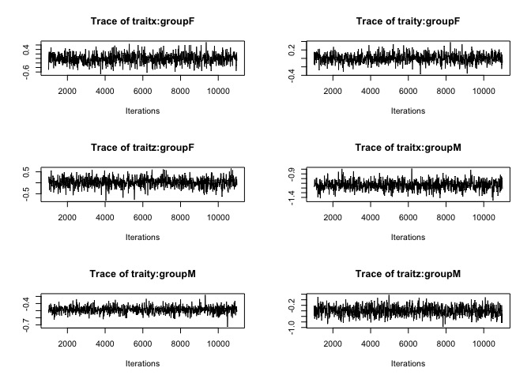
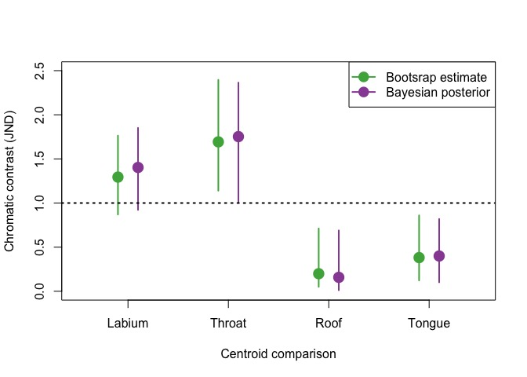

Worked examples and different approaches
================

-   [For a simple example looking at a single patch, [click here](lizardexample-single.md)](#for-a-simple-example-looking-at-a-single-patch-click-here)
-   [The Data](#the-data)
-   [Approach 1: distance-based PERMANOVA](#approach-1-distance-based-permanova)
    -   [Testing for separation among groups](#testing-for-separation-among-groups)
    -   [Testing for above-threshold mean differences between groups](#testing-for-above-threshold-mean-differences-between-groups)
-   [Approach 2: Cartesian MANOVA](#approach-2-cartesian-manova)
    -   [Testing for separation among groups](#testing-for-separation-among-groups-1)
    -   [Testing for above-threshold mean differences between groups](#testing-for-above-threshold-mean-differences-between-groups-1)
-   [Approach 3: Bayesian multi-response model using MCMCglmm](#approach-3-bayesian-multi-response-model-using-mcmcglmm)
    -   [Testing for separation among groups](#testing-for-separation-among-groups-2)
    -   [Testing for above-threshold mean differences between groups](#testing-for-above-threshold-mean-differences-between-groups-2)
-   [Comparing Bayesian vs. Bootstrap mean difference estimates](#comparing-bayesian-vs.-bootstrap-mean-difference-estimates)

#### For a simple example looking at a single patch, [click here](lizardexample-single.md)

First, we need to install the bleeding edge version of pavo:

``` r
devtools::install_github('rmaia/pavo')
```

load the necessary packages and functions:

``` r
require(pavo)
require(MCMCglmm)
require(scatterplot3d)
require(gridExtra)
require(vegan)
require(MASS)
require(pbmcapply)
require(RColorBrewer)

# load aesthetic functions (plot, make colors transparent)
source('R/aesthetic.R')

#color palette
palette <- rcbalpha(0.8, 4, 'Set1')
```

The Data
========

Reflectance data from four body regions of male and female *Ctenophorus ornatus* (Whiting et al. 2015, Biol J Linn Soc). Labium, throat, tongue, and mouth-roof.

**Question:** Which body regions are sexually dichromatic?

Calculate deltaS according to conspecific (tetrachromatic) visual system

``` r
specs <- list(
              lab = as.rspec(read.csv('data/dichromatism/lab.csv'), interp = FALSE),
              throat = as.rspec(read.csv('data/dichromatism/throat.csv'), interp = FALSE),
              roof = as.rspec(read.csv('data/dichromatism/roof.csv'), interp = FALSE),
              tongue = as.rspec(read.csv('data/dichromatism/tongue.csv'), interp = FALSE)
              )

# Ctenophorus ornatus
liz_vis <- sensmodel(c(360, 440, 493, 571)) 
names(liz_vis) <- c('wl', 'u', 's', 'm', 'l')

models <- lapply(specs, vismodel, visual = liz_vis, relative = FALSE, qcatch='Qi')

spaces <- lapply(models, colspace)

deltaS <- lapply(models, coldist, achro = FALSE, n = c(1,1,3.5,6), 
                                  weber = 0.1, noise = "neural")
```

Visualise

``` r
layout(matrix(c(1, 2, 3, 4, 5, 6, 7, 8), 4, 2, byrow = TRUE))

aggplot(specs[['lab']], by=gsub("[0-9].*","",names(specs[['lab']])), lwd=3, ylim=c(0,50))
text(x=grconvertX(0.15,"npc"), y=grconvertY(0.8, "npc"), cex=1.5, pos=3, "Labials") 

scatterplot3d(spaces[['lab']][,c('x','y','z')],  
      bg=as.character(factor(gsub("[0-9].*","",names(specs[['lab']]))[-1], 
                             labels=palette[1:2])),
      box=FALSE, pch=21, cex.symbols=2, color=NA,
      x.ticklabs='', y.ticklabs='', z.ticklabs='', xlab='', ylab='', zlab='')


aggplot(specs[['throat']], by=gsub("[0-9].*","",names(specs[['throat']])), lwd=3, ylim=c(0,50))
text(x=grconvertX(0.15,"npc"), y=grconvertY(0.8, "npc"), cex=1.5, pos=3, "Throat")

scatterplot3d(spaces[['throat']][,c('x','y','z')],  
      bg=as.character(factor(gsub("[0-9].*","",names(specs[['throat']]))[-1],
                             labels=palette[1:2])),
      box=FALSE, pch=21, cex.symbols=2, color=NA,
      x.ticklabs='', y.ticklabs='', z.ticklabs='', xlab='', ylab='', zlab='')


aggplot(specs[['roof']], by=gsub("[0-9].*","",names(specs[['roof']])), lwd=3, ylim=c(0,50))
text(x=grconvertX(0.15,"npc"), y=grconvertY(0.8, "npc"), cex=1.5, pos=3, "Roof")

scatterplot3d(spaces[['roof']][,c('x','y','z')],  
      bg=as.character(factor(gsub("[0-9].*","",names(specs[['roof']]))[-1],
                             labels=palette[1:2])),
      box=FALSE, pch=21, cex.symbols=2, color=NA,
      x.ticklabs='', y.ticklabs='', z.ticklabs='', xlab='', ylab='', zlab='')


aggplot(specs[['tongue']], by=gsub("[0-9].*","",names(specs[['tongue']])), lwd=3, ylim=c(0,50))
text(x=grconvertX(0.15,"npc"), y=grconvertY(0.8, "npc"), cex=1.5, pos=3, "Tongue")

scatterplot3d(spaces[['tongue']][,c('x','y','z')],  
      bg=as.character(factor(gsub("[0-9].*","",names(specs[['tongue']]))[-1],
                             labels=palette[1:2])),
      box=FALSE, pch=21, cex.symbols=2, color=NA,
      x.ticklabs='', y.ticklabs='', z.ticklabs='', xlab='', ylab='', zlab='')
```


Approach 1: distance-based PERMANOVA
====================================

``` r
# Setup distance matrices & groupings for each body part
mat <- list(
            lab = dist(coldist2mat(deltaS$lab)[['dS']]),
            throat = dist(coldist2mat(deltaS$throat)[['dS']]),
            roof = dist(coldist2mat(deltaS$roof)[['dS']]),
            tongue = dist(coldist2mat(deltaS$tongue)[['dS']])
            )

group <- lapply(mat, function(x) substring(rownames(as.matrix(x)), 1, 1))
```

Testing for separation among groups
-----------------------------------

Fist, let's test the assumption of homogeneity of variances

``` r
bdisp <- lapply(names(mat), function(x) betadisper(mat[[x]], group[[x]]))
names(bdisp) <- names(mat)
lapply(bdisp, anova)
```

    ## $lab
    ## Analysis of Variance Table
    ## 
    ## Response: Distances
    ##           Df  Sum Sq Mean Sq F value   Pr(>F)   
    ## Groups     1  48.548  48.548  9.2966 0.003479 **
    ## Residuals 57 297.662   5.222                    
    ## ---
    ## Signif. codes:  0 '***' 0.001 '**' 0.01 '*' 0.05 '.' 0.1 ' ' 1
    ## 
    ## $throat
    ## Analysis of Variance Table
    ## 
    ## Response: Distances
    ##           Df  Sum Sq Mean Sq F value Pr(>F)
    ## Groups     1    7.87  7.8716  0.2857  0.595
    ## Residuals 58 1597.97 27.5512               
    ## 
    ## $roof
    ## Analysis of Variance Table
    ## 
    ## Response: Distances
    ##           Df  Sum Sq Mean Sq F value Pr(>F)
    ## Groups     1   47.07  47.073  1.9366 0.1696
    ## Residuals 55 1336.91  24.307               
    ## 
    ## $tongue
    ## Analysis of Variance Table
    ## 
    ## Response: Distances
    ##           Df  Sum Sq Mean Sq F value  Pr(>F)  
    ## Groups     1  120.44 120.437  5.4805 0.02269 *
    ## Residuals 58 1274.58  21.975                  
    ## ---
    ## Signif. codes:  0 '***' 0.001 '**' 0.01 '*' 0.05 '.' 0.1 ' ' 1

Labials and tongue have unequal variances, which can influence the results of the PERMANOVA. When this assumption is violated but the largest group has the largest variance, it usually isn't a big problem. That is the case for tongue...

``` r
TukeyHSD(bdisp$tongue)
```

    ##   Tukey multiple comparisons of means
    ##     95% family-wise confidence level
    ## 
    ## Fit: aov(formula = distances ~ group, data = df)
    ## 
    ## $group
    ##         diff       lwr    upr     p adj
    ## M-F 2.847844 0.4127879 5.2829 0.0226885

``` r
# Sample sizes
table(group$tongue)
```

    ## 
    ##  F  M 
    ## 27 33

...but not for labials:

``` r
TukeyHSD(bdisp$lab)
```

    ##   Tukey multiple comparisons of means
    ##     95% family-wise confidence level
    ## 
    ## Fit: aov(formula = distances ~ group, data = df)
    ## 
    ## $group
    ##          diff       lwr        upr     p adj
    ## M-F -1.820768 -3.016569 -0.6249679 0.0034787

``` r
# Sample sizes
table(group$lab)
```

    ## 
    ##  F  M 
    ## 27 32

So the latter's PERMANOVA should be treated with caution.

Permutational MANOVA:

``` r
pmanova <- lapply(names(mat), function(x) adonis(mat[[x]] ~ group[[x]]))
names(pmanova) <- names(mat)
pmanova
```

    ## $lab
    ## 
    ## Call:
    ## adonis(formula = mat[[x]] ~ group[[x]]) 
    ## 
    ## Permutation: free
    ## Number of permutations: 999
    ## 
    ## Terms added sequentially (first to last)
    ## 
    ##            Df SumsOfSqs MeanSqs F.Model      R2 Pr(>F)    
    ## group[[x]]  1    455.04  455.04  12.473 0.17954  0.001 ***
    ## Residuals  57   2079.46   36.48         0.82046           
    ## Total      58   2534.50                 1.00000           
    ## ---
    ## Signif. codes:  0 '***' 0.001 '**' 0.01 '*' 0.05 '.' 0.1 ' ' 1
    ## 
    ## $throat
    ## 
    ## Call:
    ## adonis(formula = mat[[x]] ~ group[[x]]) 
    ## 
    ## Permutation: free
    ## Number of permutations: 999
    ## 
    ## Terms added sequentially (first to last)
    ## 
    ##            Df SumsOfSqs MeanSqs F.Model      R2 Pr(>F)    
    ## group[[x]]  1     575.0  575.01  7.6523 0.11656  0.001 ***
    ## Residuals  58    4358.3   75.14         0.88344           
    ## Total      59    4933.3                 1.00000           
    ## ---
    ## Signif. codes:  0 '***' 0.001 '**' 0.01 '*' 0.05 '.' 0.1 ' ' 1
    ## 
    ## $roof
    ## 
    ## Call:
    ## adonis(formula = mat[[x]] ~ group[[x]]) 
    ## 
    ## Permutation: free
    ## Number of permutations: 999
    ## 
    ## Terms added sequentially (first to last)
    ## 
    ##            Df SumsOfSqs MeanSqs F.Model      R2 Pr(>F)
    ## group[[x]]  1     64.41  64.411  1.7091 0.03014  0.205
    ## Residuals  55   2072.85  37.688         0.96986       
    ## Total      56   2137.26                 1.00000       
    ## 
    ## $tongue
    ## 
    ## Call:
    ## adonis(formula = mat[[x]] ~ group[[x]]) 
    ## 
    ## Permutation: free
    ## Number of permutations: 999
    ## 
    ## Terms added sequentially (first to last)
    ## 
    ##            Df SumsOfSqs MeanSqs F.Model      R2 Pr(>F)  
    ## group[[x]]  1    148.29 148.290  3.7639 0.06094  0.033 *
    ## Residuals  58   2285.07  39.398         0.93906         
    ## Total      59   2433.36                 1.00000         
    ## ---
    ## Signif. codes:  0 '***' 0.001 '**' 0.01 '*' 0.05 '.' 0.1 ' ' 1

Testing for above-threshold mean differences between groups
-----------------------------------------------------------

We will use a bootstrap approach to consider the uncertainty on the mean difference between groups when comparing it to a threshold value of 1 JND. Normally it would be unnecessary to do this for Mouth-Roof and Tongue, since the test of separation indicates these are not discriminable. Therefore, even if their mean differences are above 1 JND, males and females would not be considered different, and it would just indicate that within-group variation is also high. But for illustrative purposes, we will analyze all body parts.

``` r
# Groups
groups <- list()

groups$lab <- substring(rownames(models$lab), 1, 1)
groups$throat <- substring(rownames(models$throat), 1, 1)
groups$roof <- substring(rownames(models$roof), 1, 1)
groups$tongue <- substring(rownames(models$tongue), 1, 1)

seqs <- names(groups)

bootds <- lapply(seqs, function(x) bootcoldist(models[[x]], groups[[x]], n=c(1,1,3.5,6), weber=0.1, qcatch='Qi', achro=FALSE))

bootres <- do.call(rbind, bootds) 
rownames(bootres) <- c('Labium', 'Throat', 'Roof', 'Tongue')

bootres
```

    ##          dS.mean     dS.lwr    dS.upr
    ## Labium 1.2937069 0.86590442 1.7519105
    ## Throat 1.6930314 1.13604947 2.3353597
    ## Roof   0.1990052 0.04531405 0.7471887
    ## Tongue 0.3815314 0.13061555 0.8266557

We can see that, though labium is statistically significant, the distance between groups cannot be considered to be above threshold:

``` r
plot(bootres[,1], xlim=c(0.5, 4.5), ylim=c(0, 2.5), pch=21, bg=1, cex=2, xaxt='n', xlab='Centroid comparison', ylab='Chromatic contrast (JND)')

abline(h=1, lty=3, lwd=2)
segments(1:4, bootres[,2], 1:4, bootres[,3], lwd=2)

axis(1, at=1:4, labels=rownames(bootres))
```


Approach 2: Cartesian MANOVA
============================

First, we need to convert our distances into perceptually-proportional cartesian coordinates:

``` r
# get perceptual xyz and group vector
pxyz <- lapply(names(deltaS), function(x) data.frame(
  jnd2xyz(deltaS[[x]]),                           # perceptual xyz
  group = substring(names(specs[[x]]), 1, 1)[-1]) # group vector
  )

names(pxyz) <- names(deltaS)
```

Testing for separation among groups
-----------------------------------

... add test of variances ...

run MANOVA on cartesian coordinates

``` r
lapply(pxyz, function(x) summary(manova(lm(cbind(x,y,z)~group, data = x))))
```

    ## $lab
    ##           Df  Pillai approx F num Df den Df    Pr(>F)    
    ## group      1 0.43847   14.316      3     55 5.201e-07 ***
    ## Residuals 57                                             
    ## ---
    ## Signif. codes:  0 '***' 0.001 '**' 0.01 '*' 0.05 '.' 0.1 ' ' 1
    ## 
    ## $throat
    ##           Df Pillai approx F num Df den Df    Pr(>F)    
    ## group      1 0.4017   12.533      3     56 2.229e-06 ***
    ## Residuals 58                                            
    ## ---
    ## Signif. codes:  0 '***' 0.001 '**' 0.01 '*' 0.05 '.' 0.1 ' ' 1
    ## 
    ## $roof
    ##           Df   Pillai approx F num Df den Df Pr(>F)
    ## group      1 0.049607  0.92214      3     53 0.4365
    ## Residuals 55                                       
    ## 
    ## $tongue
    ##           Df   Pillai approx F num Df den Df Pr(>F)
    ## group      1 0.077482   1.5678      3     56 0.2073
    ## Residuals 58

Testing for above-threshold mean differences between groups
-----------------------------------------------------------

We will use a bootstrap approach to consider the uncertainty on the mean difference between groups when comparing it to a threshold value of 1 JND. Normally it would be unnecessary to do this for Mouth-Roof and Tongue, since the test of separation indicates these are not discriminable. Therefore, even if their mean differences are above 1 JND, males and females would not be considered different, and it would just indicate that within-group variation is also high. But for illustrative purposes, we will analyze all body parts.

``` r
# Groups
groups <- list()

groups$lab <- substring(rownames(models$lab), 1, 1)
groups$throat <- substring(rownames(models$throat), 1, 1)
groups$roof <- substring(rownames(models$roof), 1, 1)
groups$tongue <- substring(rownames(models$tongue), 1, 1)

seqs <- names(groups)

bootds <- lapply(seqs, function(x) bootcoldist(models[[x]], groups[[x]], n=c(1,1,3.5,6), weber=0.1, qcatch='Qi', achro=FALSE))

bootres <- do.call(rbind, bootds) 
rownames(bootres) <- c('Labium', 'Throat', 'Roof', 'Tongue')

bootres
```

    ##          dS.mean     dS.lwr    dS.upr
    ## Labium 1.2937069 0.86977613 1.7635498
    ## Throat 1.6930314 1.14019880 2.3954866
    ## Roof   0.1990052 0.05004628 0.7117269
    ## Tongue 0.3815314 0.12290372 0.8598305

We can see that, though labium is statistically significant, the distance between groups cannot be considered to be above threshold:

``` r
plot(bootres[,1], xlim=c(0.5, 4.5), ylim=c(0, 2.5), pch=21, bg=1, cex=2, xaxt='n', xlab='Centroid comparison', ylab='Chromatic contrast (JND)')

abline(h=1, lty=3, lwd=2)
segments(1:4, bootres[,2], 1:4, bootres[,3], lwd=2)

axis(1, at=1:4, labels=rownames(bootres))
```


Approach 3: Bayesian multi-response model using MCMCglmm
========================================================

we can extract both statistical and perceptual information from the posterior distribution of a bayesian analysis using a multi-response model and the package MCMCglmm. In this analysis, we will estimate the variance-covariance structure, so the assumption of homogeneity of variances is relaxed.

Before we do that, we will center all cartesian variables on the female means --- this way, since the model does not have an intercept, male estimates and pMCMC can be interpreted as the effect of sex on each response (X, Y and Z). **This step is essential if we want to interpret model estimates as difference estimates**:

``` r
# get perceptual xyz and group vector
pxyz <- lapply(names(deltaS), function(x) data.frame(
  jnd2xyz(deltaS[[x]]),                           # perceptual xyz
  group = substring(names(specs[[x]]), 1, 1)[-1]) # group vector
  )

names(pxyz) <- names(deltaS)

# Centering variables to the mean of the first group (in this case, F)
pxyz$lab[, -4] <- sweep(as.matrix(pxyz$lab[,-4]), 2, 
                        as.matrix(aggregate(pxyz$lab[,-4], list(pxyz$lab[,4]), mean)[1,-1]), '-') 

pxyz$throat[, -4] <- sweep(as.matrix(pxyz$throat[,-4]), 2, 
                        as.matrix(aggregate(pxyz$throat[,-4], list(pxyz$throat[,4]), mean)[1,-1]), '-') 

pxyz$roof[, -4] <- sweep(as.matrix(pxyz$roof[,-4]), 2, 
                        as.matrix(aggregate(pxyz$roof[,-4], list(pxyz$roof[,4]), mean)[1,-1]), '-') 

pxyz$tongue[, -4] <- sweep(as.matrix(pxyz$tongue[,-4]), 2, 
                        as.matrix(aggregate(pxyz$tongue[,-4], list(pxyz$tongue[,4]), mean)[1,-1]), '-') 
```

Testing for separation among groups
-----------------------------------

Below we will run the models, but for simplicity we will only show the verbose output for the tests on the labials.

``` r
# Running MCMCglmm models with default priors
mcmcres <- lapply(pxyz, function(x) MCMCglmm(
  fixed = cbind(x,y,z) ~ trait:group - 1,
  rcov = ~us(at.level(group, 'F'):trait):units + us(at.level(group, 'M'):trait):units,
  family = rep('gaussian', 3),
  data = x,
  nit=11000, burnin=1000, thin=10,
  verbose = FALSE
)
)
```

Chains seem to be mixing ok-ish:

``` r
plot(mcmcres[['lab']]$VCV, density = FALSE)
```


``` r
plot(mcmcres[['lab']]$Sol, density = FALSE)
```



We can see that the posterior estimates approximate the data fairly well (though the chain could probably have been run for a little longer):

``` r
# checking if model estimates approximate empirical means
# First column = Females, second column = Males
# (remember: we centered on Female means, so all female estimates should be zero)
round(as.matrix(aggregate(pxyz$lab[,c('x','y','z')], by= list(pxyz$lab[,'group']), mean)[,-1]), 4)
```

    ##            x       y       z
    ## [1,]  0.0000  0.0000  0.0000
    ## [2,] -1.1349 -0.4855 -0.3873

``` r
round(matrix(summary(mcmcres[['lab']]$Sol)$statistics[,'Mean'], nrow=2, byrow=TRUE), 4)
```

    ##         [,1]    [,2]    [,3]
    ## [1,] -0.0051  0.0012  0.0125
    ## [2,] -1.1375 -0.4875 -0.3937

``` r
summary(mcmcres[['lab']])
```

    ## 
    ##  Iterations = 1001:10991
    ##  Thinning interval  = 10
    ##  Sample size  = 1000 
    ## 
    ##  DIC: 270.6962 
    ## 
    ##  R-structure:  ~us(at.level(group, "F"):trait):units
    ## 
    ##                                                               post.mean
    ## at.level(group, "F"):traitx:at.level(group, "F"):traitx.units    1.2383
    ## at.level(group, "F"):traity:at.level(group, "F"):traitx.units    0.4850
    ## at.level(group, "F"):traitz:at.level(group, "F"):traitx.units   -0.2419
    ## at.level(group, "F"):traitx:at.level(group, "F"):traity.units    0.4850
    ## at.level(group, "F"):traity:at.level(group, "F"):traity.units    0.3071
    ## at.level(group, "F"):traitz:at.level(group, "F"):traity.units    0.2009
    ## at.level(group, "F"):traitx:at.level(group, "F"):traitz.units   -0.2419
    ## at.level(group, "F"):traity:at.level(group, "F"):traitz.units    0.2009
    ## at.level(group, "F"):traitz:at.level(group, "F"):traitz.units    1.2522
    ##                                                               l-95% CI
    ## at.level(group, "F"):traitx:at.level(group, "F"):traitx.units  0.59355
    ## at.level(group, "F"):traity:at.level(group, "F"):traitx.units  0.20365
    ## at.level(group, "F"):traitz:at.level(group, "F"):traitx.units -0.76258
    ## at.level(group, "F"):traitx:at.level(group, "F"):traity.units  0.20365
    ## at.level(group, "F"):traity:at.level(group, "F"):traity.units  0.15472
    ## at.level(group, "F"):traitz:at.level(group, "F"):traity.units -0.06655
    ## at.level(group, "F"):traitx:at.level(group, "F"):traitz.units -0.76258
    ## at.level(group, "F"):traity:at.level(group, "F"):traitz.units -0.06655
    ## at.level(group, "F"):traitz:at.level(group, "F"):traitz.units  0.57068
    ##                                                               u-95% CI
    ## at.level(group, "F"):traitx:at.level(group, "F"):traitx.units   1.9289
    ## at.level(group, "F"):traity:at.level(group, "F"):traitx.units   0.8368
    ## at.level(group, "F"):traitz:at.level(group, "F"):traitx.units   0.3457
    ## at.level(group, "F"):traitx:at.level(group, "F"):traity.units   0.8368
    ## at.level(group, "F"):traity:at.level(group, "F"):traity.units   0.5096
    ## at.level(group, "F"):traitz:at.level(group, "F"):traity.units   0.4750
    ## at.level(group, "F"):traitx:at.level(group, "F"):traitz.units   0.3457
    ## at.level(group, "F"):traity:at.level(group, "F"):traitz.units   0.4750
    ## at.level(group, "F"):traitz:at.level(group, "F"):traitz.units   1.9399
    ##                                                               eff.samp
    ## at.level(group, "F"):traitx:at.level(group, "F"):traitx.units     1000
    ## at.level(group, "F"):traity:at.level(group, "F"):traitx.units     1000
    ## at.level(group, "F"):traitz:at.level(group, "F"):traitx.units     1000
    ## at.level(group, "F"):traitx:at.level(group, "F"):traity.units     1000
    ## at.level(group, "F"):traity:at.level(group, "F"):traity.units     1000
    ## at.level(group, "F"):traitz:at.level(group, "F"):traity.units     1000
    ## at.level(group, "F"):traitx:at.level(group, "F"):traitz.units     1000
    ## at.level(group, "F"):traity:at.level(group, "F"):traitz.units     1000
    ## at.level(group, "F"):traitz:at.level(group, "F"):traitz.units     1000
    ## 
    ##                ~us(at.level(group, "M"):trait):units
    ## 
    ##                                                               post.mean
    ## at.level(group, "M"):traitx:at.level(group, "M"):traitx.units   0.31104
    ## at.level(group, "M"):traity:at.level(group, "M"):traitx.units   0.11386
    ## at.level(group, "M"):traitz:at.level(group, "M"):traitx.units  -0.26037
    ## at.level(group, "M"):traitx:at.level(group, "M"):traity.units   0.11386
    ## at.level(group, "M"):traity:at.level(group, "M"):traity.units   0.08334
    ## at.level(group, "M"):traitz:at.level(group, "M"):traity.units   0.01796
    ## at.level(group, "M"):traitx:at.level(group, "M"):traitz.units  -0.26037
    ## at.level(group, "M"):traity:at.level(group, "M"):traitz.units   0.01796
    ## at.level(group, "M"):traitz:at.level(group, "M"):traitz.units   1.03461
    ##                                                               l-95% CI
    ## at.level(group, "M"):traitx:at.level(group, "M"):traitx.units  0.16329
    ## at.level(group, "M"):traity:at.level(group, "M"):traitx.units  0.04965
    ## at.level(group, "M"):traitz:at.level(group, "M"):traitx.units -0.54135
    ## at.level(group, "M"):traitx:at.level(group, "M"):traity.units  0.04965
    ## at.level(group, "M"):traity:at.level(group, "M"):traity.units  0.04566
    ## at.level(group, "M"):traitz:at.level(group, "M"):traity.units -0.10207
    ## at.level(group, "M"):traitx:at.level(group, "M"):traitz.units -0.54135
    ## at.level(group, "M"):traity:at.level(group, "M"):traitz.units -0.10207
    ## at.level(group, "M"):traitz:at.level(group, "M"):traitz.units  0.53934
    ##                                                               u-95% CI
    ## at.level(group, "M"):traitx:at.level(group, "M"):traitx.units   0.4753
    ## at.level(group, "M"):traity:at.level(group, "M"):traitx.units   0.1940
    ## at.level(group, "M"):traitz:at.level(group, "M"):traitx.units  -0.0483
    ## at.level(group, "M"):traitx:at.level(group, "M"):traity.units   0.1940
    ## at.level(group, "M"):traity:at.level(group, "M"):traity.units   0.1309
    ## at.level(group, "M"):traitz:at.level(group, "M"):traity.units   0.1286
    ## at.level(group, "M"):traitx:at.level(group, "M"):traitz.units  -0.0483
    ## at.level(group, "M"):traity:at.level(group, "M"):traitz.units   0.1286
    ## at.level(group, "M"):traitz:at.level(group, "M"):traitz.units   1.5471
    ##                                                               eff.samp
    ## at.level(group, "M"):traitx:at.level(group, "M"):traitx.units   1000.0
    ## at.level(group, "M"):traity:at.level(group, "M"):traitx.units    786.5
    ## at.level(group, "M"):traitz:at.level(group, "M"):traitx.units   1000.0
    ## at.level(group, "M"):traitx:at.level(group, "M"):traity.units    786.5
    ## at.level(group, "M"):traity:at.level(group, "M"):traity.units    838.4
    ## at.level(group, "M"):traitz:at.level(group, "M"):traity.units   1000.0
    ## at.level(group, "M"):traitx:at.level(group, "M"):traitz.units   1000.0
    ## at.level(group, "M"):traity:at.level(group, "M"):traitz.units   1000.0
    ## at.level(group, "M"):traitz:at.level(group, "M"):traitz.units   1000.0
    ## 
    ##  Location effects: cbind(x, y, z) ~ trait:group - 1 
    ## 
    ##               post.mean  l-95% CI  u-95% CI eff.samp  pMCMC    
    ## traitx:groupF -0.005126 -0.449229  0.420892     1000  0.982    
    ## traity:groupF  0.001182 -0.194731  0.216996     1000  0.984    
    ## traitz:groupF  0.012528 -0.402045  0.432113     1000  0.942    
    ## traitx:groupM -1.137540 -1.315630 -0.936004     1000 <0.001 ***
    ## traity:groupM -0.487481 -0.578601 -0.385043     1112 <0.001 ***
    ## traitz:groupM -0.393673 -0.733143 -0.057056     1000  0.016 *  
    ## ---
    ## Signif. codes:  0 '***' 0.001 '**' 0.01 '*' 0.05 '.' 0.1 ' ' 1

The results above already indicate that the groups are statistically different along all of the axes. Some people might consider this to be subject to issues of multiple comparisons, because we are considering groups to be different if they are different in **any** (i.e. at least 1) dimension, not **all** dimensions together.

We don't agree, because the distributions of each response variables are not being calculated independently. Their multivariate nature of the responses is accounted for and the model is estimating their covariances --- so it's **not** the same as, say, testing each of them individually.

Nonetheless, we can obtain an empirical P-value from the MCMC chain that is analogous to a Wald test, that is, testing if **all** responses are **jointly** different than zero, by estimating the ellipsoid representing its joint credible interval and seeing how many iterations of the MCMC chain include zero:

``` r
# function modified from: https://stat.ethz.ch/pipermail/r-help/2006-September/113184.html

multimcmcpval <- function(samp)
{
   ## elementary version that creates an empirical p-value for the
   ## hypothesis that the columns of samp have mean zero versus a
   ## general multivariate distribution with elliptical contours.

   ## differences from the mean standardized by the observed
   ## variance-covariance factor
   std <- backsolve(chol(var(samp)),
                    cbind(0, t(samp)) - colMeans(samp),
                    transpose = TRUE)
   sqdist <- colSums(std * std)
   #sum(sqdist[-1] > sqdist[1])/nrow(samp)
   mean(sqdist[-1] > sqdist[1])
}

lapply(mcmcres, function(x) multimcmcpval(x$Sol[,4:6]))
```

    ## $lab
    ## [1] 0
    ## 
    ## $throat
    ## [1] 0
    ## 
    ## $roof
    ## [1] 0.3
    ## 
    ## $tongue
    ## [1] 0.089

Testing for above-threshold mean differences between groups
-----------------------------------------------------------

We will use the posterior distributions of estimates from male and female xyz values to estimate their mean differences along with the credible intervals along these estimates, comparing them to a threshold value of 1 JND.

``` r
dmcmc <- lapply(mcmcres, function(y) apply(
  y$Sol, 1, function(x) as.numeric(dist(rbind(x[1:3], x[4:6])))
  )
  )


credibleints <- cbind(
do.call(rbind, lapply(dmcmc, function(x) posterior.mode(mcmc(x)))),
do.call(rbind, lapply(dmcmc, function(x) HPDinterval(mcmc(x))))
)

colnames(credibleints)[1] <- 'posteriormode'

credibleints
```

    ##        posteriormode      lower    upper
    ## lab        1.4029871 0.92224538 1.851655
    ## throat     1.7525107 1.00373726 2.364881
    ## roof       0.1577634 0.01181829 0.689535
    ## tongue     0.3996856 0.10141468 0.819378

``` r
par(mfrow=c(2,2))
dplots <- lapply(names(dmcmc), function(x) {plot(density(dmcmc[[x]]), main=x); abline(v=1, lty=3)})
```


Comparing Bayesian vs. Bootstrap mean difference estimates
==========================================================

We can compare what we obtain from the Bayesian approach with the results from the Bootstrap:

``` r
palette <- rcbalpha(1, 4, 'Set1')

plot(y=bootres[,'dS.mean'], x=c(0.9, 1.9, 2.9, 3.9), xlim=c(0.5,4.5), ylim=c(0, 2.5), pch=21, col=NULL, bg=palette[3], cex=2, xaxt='n', xlab='Centroid comparison', ylab='Chromatic contrast (JND)')

segments(c(0.9, 1.9, 2.9, 3.9), bootres[,'dS.lwr'], c(0.9, 1.9, 2.9, 3.9), bootres[,'dS.upr'], lwd=2, col=palette[3])

points(y=credibleints[,'posteriormode'], x=c(1.1, 2.1, 3.1, 4.1), pch=21, bg=palette[4], cex=2, col=NULL)

segments(c(1.1, 2.1, 3.1, 4.1), credibleints[,'lower'], c(1.1, 2.1, 3.1, 4.1), credibleints[,'upper'], lwd=2, col=palette[4])

abline(h=1, lty=3, lwd=2)


axis(1, at=1:4, labels=rownames(bootres))

legend('topright', pch=21, pt.cex=1.6, col=palette[3:4], lwd=2, pt.bg=palette[3:4], legend=c('Bootsrap estimate', 'Bayesian posterior'))
```


