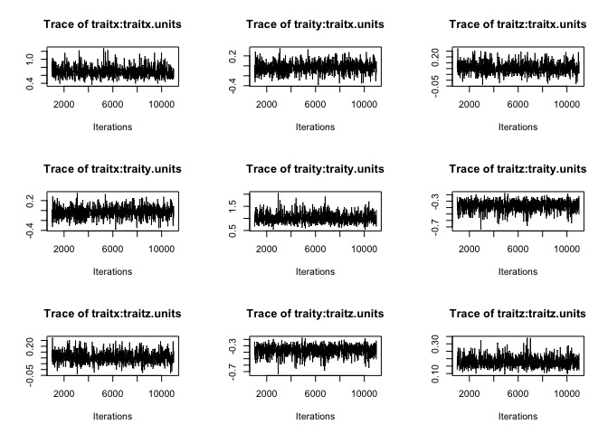

Worked examples
================

-   [Worked example with different approaches](#worked-example-with-different-approaches)
    -   [The Data](#the-data)
    -   [Group separation, approach 1: distance-based PERMANOVA](#group-separation-approach-1-distance-based-permanova)
    -   [Group separation, approach 2: Cartesian MANOVA](#group-separation-approach-2-cartesian-manova)
    -   [Test for above-threshold distance using bootstrap](#test-for-above-threshold-distance-using-bootstrap)
    -   [Bayesian approach using MCMCglmm](#bayesian-approach-using-mcmcglmm)

Worked example with different approaches
========================================

First, we need to install the bleeding edge version of pavo:

``` r
devtools::install_github('rmaia/pavo@jnd2xyz')
```

load the necessary packages and functions:

``` r
require(pavo)
require(MCMCglmm)
require(scatterplot3d)
require(gridExtra)
require(vegan)
require(MASS)
require(RColorBrewer)

# load aesthetic functions (plot, make colors transparent)
source('R/aesthetic.R')

# load function to convert JND to cartesian coordinates
source('R/jnd2xyz.R')

# load function for bootstrap
source('R/bootstrapcentroiddS.R')

# Distance matrix generator
distmat <- function(x){
  coldistres <- as.matrix(rbind(x[ ,c(1,2,3)], x[ ,c(2,1,3)]))
  uniquepatches <-  unique(c(coldistres[,1], coldistres[,2]))
  
  M <- matrix(nrow=length(uniquepatches), ncol=length(uniquepatches))
  
  rownames(M) <- colnames(M) <- uniquepatches
  
  M[coldistres[,1:2] ] <- coldistres[,3]
  M[coldistres[,2:1] ] <- coldistres[,3]
  
  class(M) <- 'numeric'
  M[is.na(M)] <- 0
  
  grouping <- as.factor(gsub('[0-9]','', rownames(M)))
  
  M <- as.dist(M)
  M
  }

#color palette
palette <- rcbalpha(0.8, 4, 'Set1')
```

The Data
--------

Reflectance data from four body regions of male and female *Ctenophorus ornatus* (Whiting et al. 2015, Biol J Linn Soc). Labium, throat, tongue, and mouth-roof.

**Question:** Which body regions are sexually dichromatic?

Calculate deltaS according to conspecific (tetrachromatic) visual system

``` r
specs <- list(all = as.rspec(read.csv('data/dichromatism/combined.csv'), interp = FALSE),
              lab = as.rspec(read.csv('data/dichromatism/lab.csv'), interp = FALSE),
              throat = as.rspec(read.csv('data/dichromatism/throat.csv'), interp = FALSE),
              roof = as.rspec(read.csv('data/dichromatism/roof.csv'), interp = FALSE),
              tongue = as.rspec(read.csv('data/dichromatism/tongue.csv'), interp = FALSE))

# Ctenophorus ornatus
liz_vis <- sensmodel(c(360, 440, 493, 571)) 
names(liz_vis) <- c('wl', 'u', 's', 'm', 'l')

models <- lapply(specs, vismodel, visual = liz_vis, relative = FALSE, qcatch='Qi')

spaces <- lapply(models, colspace)

deltaS <- lapply(models, coldist, achro = FALSE, n = c(1,1,3.5,6), 
                                  weber = 0.1, noise = "neural")
```

Visualise

``` r
layout(matrix(c(1, 2, 3, 4, 5, 6, 7, 8), 4, 2, byrow = TRUE))

aggplot(specs[['lab']], by=gsub("[0-9].*","",names(specs[['lab']])), lwd=3, ylim=c(0,50))
text(x=grconvertX(0.15,"npc"), y=grconvertY(0.8, "npc"), cex=1.5, pos=3, "Labials") 

scatterplot3d(spaces[['lab']][,c('x','y','z')],  
      bg=as.character(factor(gsub("[0-9].*","",names(specs[['lab']]))[-1], 
                             labels=palette[1:2])),
      box=FALSE, pch=21, cex.symbols=2, color=NA,
      x.ticklabs='', y.ticklabs='', z.ticklabs='', xlab='', ylab='', zlab='')


aggplot(specs[['throat']], by=gsub("[0-9].*","",names(specs[['throat']])), lwd=3, ylim=c(0,50))
text(x=grconvertX(0.15,"npc"), y=grconvertY(0.8, "npc"), cex=1.5, pos=3, "Throat")

scatterplot3d(spaces[['throat']][,c('x','y','z')],  
      bg=as.character(factor(gsub("[0-9].*","",names(specs[['throat']]))[-1],
                             labels=palette[1:2])),
      box=FALSE, pch=21, cex.symbols=2, color=NA,
      x.ticklabs='', y.ticklabs='', z.ticklabs='', xlab='', ylab='', zlab='')


aggplot(specs[['roof']], by=gsub("[0-9].*","",names(specs[['roof']])), lwd=3, ylim=c(0,50))
text(x=grconvertX(0.15,"npc"), y=grconvertY(0.8, "npc"), cex=1.5, pos=3, "Roof")

scatterplot3d(spaces[['roof']][,c('x','y','z')],  
      bg=as.character(factor(gsub("[0-9].*","",names(specs[['roof']]))[-1],
                             labels=palette[1:2])),
      box=FALSE, pch=21, cex.symbols=2, color=NA,
      x.ticklabs='', y.ticklabs='', z.ticklabs='', xlab='', ylab='', zlab='')


aggplot(specs[['tongue']], by=gsub("[0-9].*","",names(specs[['tongue']])), lwd=3, ylim=c(0,50))
text(x=grconvertX(0.15,"npc"), y=grconvertY(0.8, "npc"), cex=1.5, pos=3, "Tongue")

scatterplot3d(spaces[['tongue']][,c('x','y','z')],  
      bg=as.character(factor(gsub("[0-9].*","",names(specs[['tongue']]))[-1],
                             labels=palette[1:2])),
      box=FALSE, pch=21, cex.symbols=2, color=NA,
      x.ticklabs='', y.ticklabs='', z.ticklabs='', xlab='', ylab='', zlab='')
```


Group separation, approach 1: distance-based PERMANOVA
------------------------------------------------------

``` r
# Setup distance matrices & groupings for each body part
mat <- list(all = distmat(deltaS$all),
            lab = distmat(deltaS$lab),
            throat = distmat(deltaS$throat),
            roof = distmat(deltaS$roof),
            tongue = distmat(deltaS$tongue))

group <- list(all = paste0(substring(rownames(as.matrix(mat$all)), nchar(rownames(as.matrix(mat$all)))), substring(rownames(as.matrix(mat$all)), 1, 1)),
              lab = substring(rownames(as.matrix(mat$lab)), 1, 1),
              throat = substring(rownames(as.matrix(mat$throat)), 1, 1),
              roof = substring(rownames(as.matrix(mat$roof)), 1, 1),
              tongue = substring(rownames(as.matrix(mat$tongue)), 1, 1))
```

Fist, let's test the assumption of homogeneity of variances

``` r
anova(betadisper(mat$lab, group$lab))
```

    ## Analysis of Variance Table
    ## 
    ## Response: Distances
    ##           Df  Sum Sq Mean Sq F value   Pr(>F)   
    ## Groups     1  2.7904 2.79044  8.1507 0.005993 **
    ## Residuals 57 19.5143 0.34236                    
    ## ---
    ## Signif. codes:  0 '***' 0.001 '**' 0.01 '*' 0.05 '.' 0.1 ' ' 1

``` r
anova(betadisper(mat$throat, group$throat))
```

    ## Analysis of Variance Table
    ## 
    ## Response: Distances
    ##           Df Sum Sq Mean Sq F value Pr(>F)
    ## Groups     1  0.031 0.03125   0.037 0.8482
    ## Residuals 58 49.040 0.84552

``` r
anova(betadisper(mat$roof, group$roof))
```

    ## Analysis of Variance Table
    ## 
    ## Response: Distances
    ##           Df Sum Sq Mean Sq F value Pr(>F)
    ## Groups     1  1.363 1.36296  2.1709 0.1463
    ## Residuals 55 34.531 0.62784

``` r
anova(betadisper(mat$tongue, group$tongue))
```

    ## Analysis of Variance Table
    ## 
    ## Response: Distances
    ##           Df Sum Sq Mean Sq F value  Pr(>F)  
    ## Groups     1    3.1 3.10022  5.0227 0.02886 *
    ## Residuals 58   35.8 0.61724                  
    ## ---
    ## Signif. codes:  0 '***' 0.001 '**' 0.01 '*' 0.05 '.' 0.1 ' ' 1

Throat has unequal variances, with female variances being larger than male variances --- which can be a problem, since femals also have the smallest sample size of the two groups. When this assumption is violated but the largest group has the largest variance, it usually isn't a big problem. But in this case, those results should be treated with caution.

``` r
TukeyHSD(betadisper(mat$lab, group$lab))
```

    ##   Tukey multiple comparisons of means
    ##     95% family-wise confidence level
    ## 
    ## Fit: aov(formula = distances ~ group, data = df)
    ## 
    ## $group
    ##           diff        lwr        upr     p adj
    ## M-F -0.4365211 -0.7426987 -0.1303434 0.0059932

``` r
cat('Sample sizes: \n')
```

    ## Sample sizes:

``` r
table(group$lab)
```

    ## 
    ##  F  M 
    ## 27 32

Permutational MANOVA:

``` r
# Labium
adonis(mat$lab ~ group$lab)
```

    ## 
    ## Call:
    ## adonis(formula = mat$lab ~ group$lab) 
    ## 
    ## Permutation: free
    ## Number of permutations: 999
    ## 
    ## Terms added sequentially (first to last)
    ## 
    ##           Df SumsOfSqs MeanSqs F.Model      R2 Pr(>F)    
    ## group$lab  1    24.509 24.5094  13.964 0.19678  0.001 ***
    ## Residuals 57   100.042  1.7551         0.80322           
    ## Total     58   124.552                 1.00000           
    ## ---
    ## Signif. codes:  0 '***' 0.001 '**' 0.01 '*' 0.05 '.' 0.1 ' ' 1

``` r
# Throat
adonis(mat$throat ~ group$throat)
```

    ## 
    ## Call:
    ## adonis(formula = mat$throat ~ group$throat) 
    ## 
    ## Permutation: free
    ## Number of permutations: 999
    ## 
    ## Terms added sequentially (first to last)
    ## 
    ##              Df SumsOfSqs MeanSqs F.Model      R2 Pr(>F)    
    ## group$throat  1    42.565  42.565  14.842 0.20376  0.001 ***
    ## Residuals    58   166.335   2.868         0.79624           
    ## Total        59   208.901                 1.00000           
    ## ---
    ## Signif. codes:  0 '***' 0.001 '**' 0.01 '*' 0.05 '.' 0.1 ' ' 1

``` r
# Mouth-roof
adonis(mat$roof ~ group$roof)
```

    ## 
    ## Call:
    ## adonis(formula = mat$roof ~ group$roof) 
    ## 
    ## Permutation: free
    ## Number of permutations: 999
    ## 
    ## Terms added sequentially (first to last)
    ## 
    ##            Df SumsOfSqs MeanSqs F.Model      R2 Pr(>F)
    ## group$roof  1     0.563 0.56278 0.52282 0.00942  0.495
    ## Residuals  55    59.203 1.07642         0.99058       
    ## Total      56    59.766                 1.00000

``` r
# Tongue
adonis(mat$tongue ~ group$tongue)
```

    ## 
    ## Call:
    ## adonis(formula = mat$tongue ~ group$tongue) 
    ## 
    ## Permutation: free
    ## Number of permutations: 999
    ## 
    ## Terms added sequentially (first to last)
    ## 
    ##              Df SumsOfSqs MeanSqs F.Model      R2 Pr(>F)
    ## group$tongue  1     2.162  2.1617  1.6293 0.02732  0.223
    ## Residuals    58    76.953  1.3268         0.97268       
    ## Total        59    79.115                 1.00000

Group separation, approach 2: Cartesian MANOVA
----------------------------------------------

First, we need to convert our distances into perceptually-proportional cartesian coordinates:

``` r
pxyz <- list(
    lab = data.frame(jnd2xyz(deltaS$lab), group=substring(names(specs$lab), 1, 1)[-1]),
    throat = data.frame(jnd2xyz(deltaS$throat), group=substring(names(specs$throat), 1, 1)[-1]),
    roof = data.frame(jnd2xyz(deltaS$roof), group=substring(names(specs$roof), 1, 1)[-1]),
    tongue = data.frame(jnd2xyz(deltaS$tongue), group=substring(names(specs$tongue), 1, 1)[-1])
    )
```

... add test of variances ...

run MANOVA on cartesian coordinates

``` r
summary(manova(lm(cbind(x,y,z)~group, data = pxyz$lab)))
```

    ##           Df  Pillai approx F num Df den Df    Pr(>F)    
    ## group      1 0.43847   14.316      3     55 5.201e-07 ***
    ## Residuals 57                                             
    ## ---
    ## Signif. codes:  0 '***' 0.001 '**' 0.01 '*' 0.05 '.' 0.1 ' ' 1

``` r
summary(manova(lm(cbind(x,y,z)~group, data = pxyz$throat)))
```

    ##           Df Pillai approx F num Df den Df    Pr(>F)    
    ## group      1 0.4017   12.533      3     56 2.229e-06 ***
    ## Residuals 58                                            
    ## ---
    ## Signif. codes:  0 '***' 0.001 '**' 0.01 '*' 0.05 '.' 0.1 ' ' 1

``` r
summary(manova(lm(cbind(x,y,z)~group, data = pxyz$roof)))
```

    ##           Df   Pillai approx F num Df den Df Pr(>F)
    ## group      1 0.049607  0.92213      3     53 0.4365
    ## Residuals 55

``` r
summary(manova(lm(cbind(x,y,z)~group, data = pxyz$tongue)))
```

    ##           Df   Pillai approx F num Df den Df Pr(>F)
    ## group      1 0.077482   1.5678      3     56 0.2073
    ## Residuals 58

Test for above-threshold distance using bootstrap
-------------------------------------------------

Add grouping variable to raw models, then bootstrap centroids:

``` r
# Groups
models$lab$group <- substring(rownames(models$lab), 1, 1)
models$throat$group <- substring(rownames(models$throat), 1, 1)
models$roof$group <- substring(rownames(models$roof), 1, 1)
models$tongue$group <- substring(rownames(models$tongue), 1, 1)

# labium
laboot <- bootcentroidDS(models$lab[,1:4], models$lab$group, 
                         n=c(1,1,3.5,6), weber=0.1, qcatch='Qi', achro=FALSE)
```

    ## Warning: number of cones not specified; assumed to be 4

``` r
# throat
thboot <- bootcentroidDS(models$throat[,1:4], models$throat$group, 
                         n=c(1,1,3.5,6), weber=0.1, qcatch='Qi', achro=FALSE)
```

    ## Warning: number of cones not specified; assumed to be 4

``` r
# roof
roboot <- bootcentroidDS(models$roof[,1:4], models$roof$group, 
                         n=c(1,1,3.5,6), weber=0.1, qcatch='Qi', achro=FALSE)
```

    ## Warning: number of cones not specified; assumed to be 4

``` r
# tongue
toboot <- bootcentroidDS(models$tongue[,1:4], models$tongue$group, 
                         n=c(1,1,3.5,6), weber=0.1, qcatch='Qi', achro=FALSE)
```

    ## Warning: number of cones not specified; assumed to be 4

We can see that, though labium is statistically significant, the distance between groups cannot be considered to be above threshold:

``` r
bootres <- rbind(laboot, thboot, roboot, toboot)
rownames(bootres) <- c('Labium', 'Throat', 'Roof', 'Tongue')

bootres
```

    ##        measured.dS     CI.lwr    CI.upr
    ## Labium   1.2937069 0.87274158 1.7437687
    ## Throat   1.6930314 1.11914831 2.3273433
    ## Roof     0.1990052 0.04603181 0.7221358
    ## Tongue   0.3815314 0.12808035 0.8118222

``` r
plot(bootres[,1], xlim=c(0.5, 4.5), ylim=c(0, 2.5), pch=21, bg=1, cex=2, xaxt='n', xlab='Centroid comparison', ylab='Chromatic contrast (JND)')

abline(h=1, lty=3, lwd=2)
segments(1:4, bootres[,2], 1:4, bootres[,3], lwd=2)

axis(1, at=1:4, labels=rownames(bootres))
```


Bayesian approach using MCMCglmm
--------------------------------

we can extract both statistical and perceptual information from the posterior distribution of a bayesian analysis using a multi-response model and the package MCMCglmm. In this analysis, we will estimate the variance-covariance structure, so the assumption of homogeneity of variances is relaxed.

Below we will run the models (we will only show the verbose output for the tests on the labials, but the code below will obtain the information for all body parts). Before we do that, we will center all cartesian variables on the female means --- this way, male estimates and pMCMC can be interpreted as being different from zero:

``` r
pxyz$lab[, -4] <- sweep(as.matrix(pxyz$lab[,-4]), 2, 
                        as.matrix(aggregate(pxyz$lab[,-4], list(pxyz$lab[,4]), mean)[1,-1]), '-') 

pxyz$throat[, -4] <- sweep(as.matrix(pxyz$throat[,-4]), 2, 
                        as.matrix(aggregate(pxyz$throat[,-4], list(pxyz$throat[,4]), mean)[1,-1]), '-') 

pxyz$roof[, -4] <- sweep(as.matrix(pxyz$roof[,-4]), 2, 
                        as.matrix(aggregate(pxyz$roof[,-4], list(pxyz$roof[,4]), mean)[1,-1]), '-') 

pxyz$tongue[, -4] <- sweep(as.matrix(pxyz$tongue[,-4]), 2, 
                        as.matrix(aggregate(pxyz$tongue[,-4], list(pxyz$tongue[,4]), mean)[1,-1]), '-') 

mcmclab <- MCMCglmm(
  fixed = cbind(x,y,z) ~ trait:group - 1,
  rcov = ~us(trait):units,
  family = rep('gaussian', 3),
  data = pxyz$lab,
  nit=11000, burnin=1000, thin=10,
  verbose = FALSE
)

mcmcthroat <- MCMCglmm(
  fixed = cbind(x,y,z) ~ trait:group - 1,
  rcov = ~us(trait):units,
  family = rep('gaussian', 3),
  data = pxyz$throat,
  nit=11000, burnin=1000, thin=10,
  verbose = FALSE
)

mcmcroof <- MCMCglmm(
  fixed = cbind(x,y,z) ~ trait:group - 1,
  rcov = ~us(trait):units,
  family = rep('gaussian', 3),
  data = pxyz$roof,
  nit=11000, burnin=1000, thin=10,
  verbose = FALSE
)

mcmctongue <- MCMCglmm(
  fixed = cbind(x,y,z) ~ trait:group - 1,
  rcov = ~us(trait):units,
  family = rep('gaussian', 3),
  data = pxyz$tongue,
  nit=11000, burnin=1000, thin=10,
  verbose = FALSE
)
```

Chains seem to be mixing ok-ish:

``` r
plot(mcmclab$VCV, density = FALSE)
```



``` r
plot(mcmclab$Sol, density = FALSE)
```


We can see that the posterior estimates approximate the data well:

``` r
summary(mcmclab)
```

    ## 
    ##  Iterations = 1001:10991
    ##  Thinning interval  = 10
    ##  Sample size  = 1000 
    ## 
    ##  DIC: 284.3258 
    ## 
    ##  R-structure:  ~us(trait):units
    ## 
    ##                     post.mean l-95% CI u-95% CI eff.samp
    ## traitx:traitx.units   0.69302  0.46541   0.9586     1000
    ## traity:traitx.units  -0.02898 -0.25192   0.1855     1098
    ## traitz:traitx.units   0.10559  0.01851   0.2022     1000
    ## traitx:traity.units  -0.02898 -0.25192   0.1855     1098
    ## traity:traity.units   1.01421  0.64427   1.4276     1000
    ## traitz:traity.units  -0.36847 -0.54010  -0.2324     1000
    ## traitx:traitz.units   0.10559  0.01851   0.2022     1000
    ## traity:traitz.units  -0.36847 -0.54010  -0.2324     1000
    ## traitz:traitz.units   0.17910  0.11690   0.2511     1000
    ## 
    ##  Location effects: cbind(x, y, z) ~ trait:group - 1 
    ## 
    ##               post.mean  l-95% CI  u-95% CI eff.samp  pMCMC    
    ## traitx:groupF  0.005192 -0.311053  0.298257     1000  0.970    
    ## traity:groupF  0.007171 -0.369177  0.406511     1000  0.930    
    ## traitz:groupF -0.001778 -0.159220  0.173656     1000  0.972    
    ## traitx:groupM -1.246883 -1.532629 -0.964482      726 <0.001 ***
    ## traity:groupM -0.327334 -0.663511  0.013412     1000  0.064 .  
    ## traitz:groupM  0.065786 -0.075763  0.217307     1000  0.350    
    ## ---
    ## Signif. codes:  0 '***' 0.001 '**' 0.01 '*' 0.05 '.' 0.1 ' ' 1

``` r
aggregate(pxyz$lab[,c('x','y','z')], by= list(pxyz$lab[,'group']), mean)
```

    ##   Group.1             x             y             z
    ## 1       F -2.648616e-17 -3.618846e-16 -9.870969e-17
    ## 2       M -1.249001e+00 -3.305950e-01  6.618880e-02

``` r
matrix(summary(mcmclab$Sol)$statistics[,'Mean'], nrow=2, byrow=TRUE)
```

    ##              [,1]         [,2]         [,3]
    ## [1,]  0.005192422  0.007171317 -0.001778172
    ## [2,] -1.246883273 -0.327334010  0.065786102

The results above already indicate that the groups are statistically different along one of the axes (x). Some people might consider this to still be subject to multiple comparisons, because we are considering groups to be different if they are different in at least one dimension. We don't agree, because the distributions of each response variables are being calculated while taking into consideration their covariances --- so it's not the same as, say, testing each of them individually. Nonetheless, we can conduct a test analogous to a Wald test, and test if **ALL** responses are different than zero, by estimating an hyperdimensional ellipsoid representing its joint credible interval:

``` r
# function modified from: https://stat.ethz.ch/pipermail/r-help/2006-September/113184.html

multimcmcpval <- function(samp)
{
   ## elementary version that creates an empirical p-value for the
   ## hypothesis that the columns of samp have mean zero versus a
   ## general multivariate distribution with elliptical contours.

   ## differences from the mean standardized by the observed
   ## variance-covariance factor
   std <- backsolve(chol(var(samp)),
                    cbind(0, t(samp)) - colMeans(samp),
                    transpose = TRUE)
   sqdist <- colSums(std * std)
   sum(sqdist[-1] > sqdist[1])/nrow(samp)
}

multimcmcpval(mcmclab$Sol[,4:6])
```

    ## [1] 0

``` r
multimcmcpval(mcmcthroat$Sol[,4:6])
```

    ## [1] 0

``` r
multimcmcpval(mcmcroof$Sol[,4:6])
```

    ## [1] 0.137

``` r
multimcmcpval(mcmctongue$Sol[,4:6])
```

    ## [1] 0.033

Now we can test if the posterior distances between centroids are larger than 1JND

``` r
dmcmclab <- apply(mcmclab$Sol, 1, function(x) as.numeric(dist(rbind(x[1:3], x[4:6]))))
dmcmcthroat <- apply(mcmcthroat$Sol, 1, function(x) as.numeric(dist(rbind(x[1:3], x[4:6]))))
dmcmcroof <- apply(mcmcroof$Sol, 1, function(x) as.numeric(dist(rbind(x[1:3], x[4:6]))))
dmcmctongue <- apply(mcmctongue$Sol, 1, function(x) as.numeric(dist(rbind(x[1:3], x[4:6]))))

par(mfrow=c(2,2))
plot(density(dmcmclab), main='Labials'); abline(v=1, lty=3, lwd=2)
plot(density(dmcmcthroat), main='Throat'); abline(v=1, lty=3, lwd=2)
plot(density(dmcmcroof), main='Mouth Roof'); abline(v=1, lty=3, lwd=2)
plot(density(dmcmctongue), main='Tongue'); abline(v=1, lty=3, lwd=2)
```


We can compare what we obtain from the Bayesian approach with the results from the Bootstrap:

``` r
credibleints <- data.frame(rbind(
                      HPDinterval(mcmc(dmcmclab)),
                      HPDinterval(mcmc(dmcmcthroat)),
                      HPDinterval(mcmc(dmcmcroof)),
                      HPDinterval(mcmc(dmcmctongue))
                      ))
```

    ## Warning in data.row.names(row.names, rowsi, i): some row.names duplicated:
    ## 2,3,4 --> row.names NOT used

``` r
credibleints$posteriormode <- c(posterior.mode(mcmc(dmcmclab)), 
                                posterior.mode(mcmc(dmcmcthroat)),
                                posterior.mode(mcmc(dmcmcroof)),
                                posterior.mode(mcmc(dmcmctongue))
                                )
row.names(credibleints) <- c("Labium", "Throat", "Roof", "Tongue")


palette <- rcbalpha(1, 4, 'Set1')

plot(y=bootres[,1], x=c(0.8, 1.8, 2.8, 3.8), xlim=c(0.5,4.5), ylim=c(0, 2.5), pch=21, col=NULL, bg=palette[3], cex=2, xaxt='n', xlab='Centroid comparison', ylab='Chromatic contrast (JND)')

segments(c(0.8, 1.8, 2.8, 3.8), bootres[,2], c(0.8, 1.8, 2.8, 3.8), bootres[,3], lwd=2, col=palette[3])

points(y=credibleints[,3], x=c(1.2, 2.2, 3.2, 4.2), pch=21, bg=palette[4], cex=2, col=NULL)

segments(c(1.2, 2.2, 3.2, 4.2), credibleints[,1], c(1.2, 2.2, 3.2, 4.2), credibleints[,2], lwd=2, col=palette[4])

abline(h=1, lty=3, lwd=2)


axis(1, at=1:4, labels=rownames(bootres))

legend('topright', pch=21, pt.cex=1.6, col=palette[3:4], lwd=2, pt.bg=palette[3:4], legend=c('Bootsrap', 'Bayesian posterior'))
```


