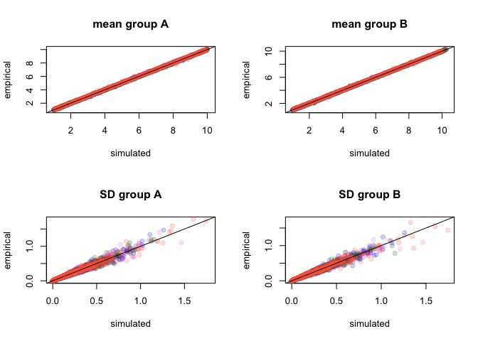

Simulations - threshold
================

-   [Threshold scenario: high within-group variability, centroid distance ~1JND](#threshold-scenario-high-within-group-variability-centroid-distance-1jnd)
    -   [Running analyses](#running-analyses)
    -   [Visualizing results](#visualizing-results)

``` r
require(pavo)
```

    ## Loading required package: pavo

``` r
require(vegan)
```

    ## Loading required package: vegan

    ## Loading required package: permute

    ## Loading required package: lattice

    ## This is vegan 2.4-3

``` r
require(RColorBrewer)
```

    ## Loading required package: RColorBrewer

``` r
# load aesthetic functions (plot, make colors transparent)
source('R/aesthetic.R')

# load function to convert JND to cartesian coordinates
source('R/jnd2xyz.R')

# load simulation and analysis functions
source('R/simfoos.R')
source('R/simanalysis.R')
source('R/pausemcl.R')
```

Threshold scenario: high within-group variability, centroid distance ~1JND
==========================================================================

Generate data

``` r
simN <- 50

simulatedata3a <- replicate(500, 
# this gave some interesting results we might want to revisit.
#                  simdich(N=simN, sgsqsrate=1, sdmeanratio=FALSE, multiplier=c(0.95, 1.05)), 
                  simdich(N=simN, sgsqsrate=5, sdmeanratio=FALSE, multiplier=c(0.97, 1.03)),
                  simplify=FALSE)

simulatedata3b <- replicate(500, 
                  simdich(N=simN, sgsqsrate=5, sdmeanratio=FALSE, multiplier=c(0.97, 1.03)),
                  simplify=FALSE)

simulatedata3 <- c(simulatedata3a, simulatedata3b)
rm(simulatedata3a, simulatedata3b)
# we need to add the reference points since we didn't run vismodel()
#apply(do.call(rbind, lapply(simulatedata, function(x) apply(x, 2, max))), 2, max)
#data(sicalis)
#rfs <- attr(vismodel(sicalis, visual='star',relative=FALSE), 'resrefs')

rfs <- 
matrix(c(100,01,01,01,
         01,100,01,01,
         01,01,100,01,
         01,01,01,100,
         50,50,50,50
         ), ncol=4, byrow=TRUE)
rownames(rfs) <- c('refforjnd2xyz.u','refforjnd2xyz.s','refforjnd2xyz.m','refforjnd2xyz.l', 'refforjnd2xyz.acent')
colnames(rfs) <- c('u','s','m','l')

simulatedata3 <- lapply(simulatedata3, 'attr<-', which='resrefs', value=rfs)


simulatecoldist3a <- pausemcl(simulatedata3[1:500], function(x) {
  Y <- suppressWarnings(coldist(x, achro=FALSE, qcatch='Qi'))
  Y$comparison <- NA
  Y$comparison[grepl('A', Y$patch1) & grepl('A', Y$patch2)] <- 'intra.A'
  Y$comparison[grepl('B', Y$patch1) & grepl('B', Y$patch2)] <- 'intra.B'
  Y$comparison[grepl('A', Y$patch1) & grepl('B', Y$patch2)] <- 'inter'
  Y
  } )

simulatecoldist3b <- pausemcl(simulatedata3[501:1000], function(x) {
  Y <- suppressWarnings(coldist(x, achro=FALSE, qcatch='Qi'))
  Y$comparison <- NA
  Y$comparison[grepl('A', Y$patch1) & grepl('A', Y$patch2)] <- 'intra.A'
  Y$comparison[grepl('B', Y$patch1) & grepl('B', Y$patch2)] <- 'intra.B'
  Y$comparison[grepl('A', Y$patch1) & grepl('B', Y$patch2)] <- 'inter'
  Y
  } )

simulatecoldist3 <- c(simulatecoldist3a, simulatecoldist3b)
rm(simulatecoldist3a, simulatecoldist3b)
```

Validating simulations:



Verifying that values obtained in the simulation (empirical) are close to what we wanted to simulate (simulated) for the four cones (violet, blue, green, red)


mean centroid distance of 0.2625012, quantiles of 0.0695082, 0.6383982

Running analyses
----------------

``` r
adonissim3a <- pausemcl(simulatecoldist3[1:500], adoniscoldist )
Sys.sleep(10)
adonissim3b <- pausemcl(simulatecoldist3[501:1000], adoniscoldist )
adonissim3 <- c(adonissim3a, adonissim3b)
vovsim3 <- pausemcl(simulatedata3, voloverlaptest )

scd23 <- lapply(simulatecoldist3,'[', ,1:3, drop=FALSE)
for(i in 1:length(scd23)){
  attr(scd23[[i]], 'resrefs') <- attr(simulatecoldist3[[i]],'resrefs')
  attr(scd23[[i]], 'conenumb') <- attr(simulatecoldist3[[i]],'conenumb')
  }
```

``` r
pykesim3 <- lapply(scd23, jnd2xyz)
pykelm3 <- lapply(pykesim3, function(x) lm(as.matrix(x) ~ rep(c('gA','gB'), each=50)))
pykemanova3 <- lapply(pykelm3, function(x) summary(manova(x)))
vovpyke3 <- pausemcl(pykesim3, function(x)
  voloverlap(x[1:simN,], x[(simN+1):(simN*2), ]) )

gc(verbose=FALSE)
```

    ##             used  (Mb) gc trigger   (Mb)  max used   (Mb)
    ## Ncells   6933208 370.3   12002346  641.0   9968622  532.4
    ## Vcells 113927904 869.3  188561891 1438.7 188508752 1438.3

Visualizing results
-------------------

color legend:

-   dark colors: methods disagree (BAD)
-   light colors: methods agree (GOOD)

-   light blue: adonis and centroid distance &gt; 1 (GOOD)
-   dark blue: adonis significant, centroid distance &lt; 1 (BAD)
-   dark red: adonis non-significant, centroid distance &gt; 1 (BAD)
-   light red: adonis and centroid distance &lt; 1 (GOOD) 

``` r
sessionInfo()
```

    ## R version 3.4.1 (2017-06-30)
    ## Platform: x86_64-apple-darwin15.6.0 (64-bit)
    ## Running under: macOS Sierra 10.12.6
    ## 
    ## Matrix products: default
    ## BLAS: /Library/Frameworks/R.framework/Versions/3.4/Resources/lib/libRblas.0.dylib
    ## LAPACK: /Library/Frameworks/R.framework/Versions/3.4/Resources/lib/libRlapack.dylib
    ## 
    ## locale:
    ## [1] en_US.UTF-8/en_US.UTF-8/en_US.UTF-8/C/en_US.UTF-8/en_US.UTF-8
    ## 
    ## attached base packages:
    ## [1] stats     graphics  grDevices utils     datasets  methods   base     
    ## 
    ## other attached packages:
    ## [1] RColorBrewer_1.1-2 vegan_2.4-3        lattice_0.20-35   
    ## [4] permute_0.9-4      pavo_1.2.1        
    ## 
    ## loaded via a namespace (and not attached):
    ##  [1] Rcpp_0.12.12         cluster_2.0.6        knitr_1.16          
    ##  [4] magrittr_1.5         maps_3.2.0           magic_1.5-6         
    ##  [7] MASS_7.3-47          scatterplot3d_0.3-40 geometry_0.3-6      
    ## [10] stringr_1.2.0        tools_3.4.1          parallel_3.4.1      
    ## [13] grid_3.4.1           nlme_3.1-131         mgcv_1.8-17         
    ## [16] htmltools_0.3.6      yaml_2.1.14          rprojroot_1.2       
    ## [19] digest_0.6.12        Matrix_1.2-10        mapproj_1.2-5       
    ## [22] codetools_0.2-15     rcdd_1.2             evaluate_0.10.1     
    ## [25] rmarkdown_1.6        stringi_1.1.5        compiler_3.4.1      
    ## [28] backports_1.1.0

plots for publication:

``` r
plotrange <- function(x, log=TRUE){
  res <- range(x)
  res[1] <- floor(res[1])
  res[2] <- ceiling(res[2])
  if(log && res[1] == 0)
    res[1] <- range(x)[1]*0.8
  
  if(log && res[2] < 10)
    res[2] <- 10
  
  res
}

######################
# RESULTS FROM SIM 2 #
######################
pdf(height=4*1.3, width=7*1.3, file='figures/threshold_1.pdf')
par(mfrow=c(2,3), mar=c(4,5,1,1))

plot(centdistT~intradistT, 
     xlab='mean within-group distance (JND)\n ', ylab=' \ncentroid distance (JND)', 
     ylim=plotrange(c(intradistT,centdistT)), xlim=plotrange(c(intradistT,centdistT)), 
     pch=21, bg=sigpalT, col=NA, log='xy', yaxt='n', xaxt='n')
axis(1, at=c(0.1, 1, 10), labels=c(0.1, 1, 10))
axis(1, at=c(seq(0.2,0.9, by=0.1), seq(2,9, by=1)), tcl=par("tcl")*0.5, labels=FALSE)
axis(2, at=c(0.1, 1, 10), labels=c(0.1, 1, 10))
axis(2, at=c(seq(0.2,0.9, by=0.1), seq(2,9, by=1)), tcl=par("tcl")*0.5, labels=FALSE)

abline(0,1, lty=2)
abline(h=1, lty=3)
abline(v=1, lty=3)
abline(-0.5, 1, lty=5, col='grey')

#the grey line represents an intercept of 1/sqrt(4) so MahD = 1

legend('topleft', pch=21, cex=0.9, bty='n', col=NA, pt.bg=rcbalpha(1, 6, 'RdBu')[c(1,3,6,4)],
       legend=c('p > 0.05, JND > 1',
                'p > 0.05, JND < 1',
                'p < 0.05, JND < 1',
                'p < 0.05, JND > 1'))

plot(adonisR2T~centdistT, 
     ylab=expression(paste(R^2,' (%)')), xlab='centroid distance (JND)\n ', 
     ylim=plotrange(adonisR2T), xlim=plotrange(centdistT),
     pch=21, bg=sigpalT, col=NA, log='xy', yaxt='n', xaxt='n')
#axis(2, at=c(0.05, 0.5, 5, 50), labels=c(0.05, 0.5, 5, 50))
axis(2, at=c(0.01, 0.1, 1, 10,100), labels=c(0.01, 0.1, 1, 10,100))
#axis(2, at=c(0.06,0.07,0.08,0.09, 0.2, 0.3, 0.4, 0.6, 0.7, 0.8, 0.9, 2, 3, 4, 6, 7, 8, 9, 20, 30, 40), tcl=par("tcl")*0.5, labels=FALSE)
axis(2, at=c(seq(0.02,0.09,by=0.01), seq(0.2,0.9,by=0.1), seq(2,9,by=1), seq(20,90,by=10)), tcl=par("tcl")*0.5, labels=FALSE)
#axis(2, at=c(0.1, 1, 10), tcl=par("tcl")*1, labels=FALSE)
axis(1, at=c(0.1, 1, 10), labels=c(0.1, 1, 10))
axis(1, at=c(seq(0.2,0.9, by=0.1), seq(2,9, by=1)), tcl=par("tcl")*0.5, labels=FALSE)

abline(v=1, lty=3)
abline(h=3, lty=3)

plot(adonisR2T~overlapT, 
     ylab=expression(paste(R^2,' (%)')), xlab='color volume overlap (%)\n ',  
     ylim=c(0.01, 100), xlim=plotrange(overlapT, log=FALSE),
     pch=21, bg=sigpalT, col=NA, log='y', yaxt='n', xaxt='n')
axis(1, at=c(0,20,40,60))
#axis(2, at=c(0.05, 0.5, 5, 50), labels=c(0.05, 0.5, 5, 50))
axis(2, at=c(0.01, 0.1, 1, 10,100), labels=c(0.01, 0.1, 1, 10,100))
#axis(2, at=c(0.06,0.07,0.08,0.09, 0.2, 0.3, 0.4, 0.6, 0.7, 0.8, 0.9, 2, 3, 4, 6, 7, 8, 9, 20, 30, 40), tcl=par("tcl")*0.5, labels=FALSE)
axis(2, at=c(seq(0.02,0.09,by=0.01), seq(0.2,0.9,by=0.1), seq(2,9,by=1), seq(20,90,by=10)), tcl=par("tcl")*0.5, labels=FALSE)
#axis(2, at=c(0.1, 1, 10), tcl=par("tcl")*1, labels=FALSE)

plot(overlapykeT~overlapT, 
     ylab="color volume overlap \n(perceptually-corrected, %)", 
     xlab="color volume overlap (%)\n ",
     ylim=plotrange(c(overlapykeT,overlapT), log=FALSE), xlim=plotrange(c(overlapykeT,overlapT), log=FALSE), 
     pch=21, bg=sigpalT, col=NA)
abline(0,1, lty=2)

plot(centdistT~overlapT,
     ylab=' \ncentroid distance (JND)', xlab='color volume overlap (%)\n ',
     ylim=plotrange(centdistT), xlim=plotrange(overlapT, log=FALSE),
     pch=21, bg=sigpalT, col=NA, log='y', yaxt='n', xaxt='n')
axis(1, at=c(0,20,40,60))
axis(2, at=c(0.1, 1, 10), labels=c(0.1, 1, 10))
axis(2, at=c(seq(0.2,0.9, by=0.1), seq(2,9, by=1)), tcl=par("tcl")*0.5, labels=FALSE)
abline(h=1, lty=3)


plot(centdistT~overlapykeT,
     ylab='centroid distance (JND)', xlab='color volume overlap \n(perceptually-corrected, %)',
     ylim=plotrange(centdistT), xlim=plotrange(overlapykeT, log=FALSE),
     pch=21, bg=sigpalT, col=NA, log='y', yaxt='n')
axis(2, at=c(0.1, 1, 10), labels=c(0.1, 1, 10))
axis(2, at=c(seq(0.2,0.9, by=0.1), seq(2,9, by=1)), tcl=par("tcl")*0.5, labels=FALSE)
abline(h=1, lty=3)
dev.off()
```

    ## pdf 
    ##   2
