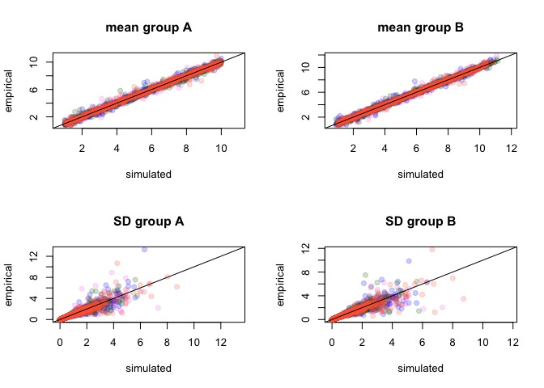
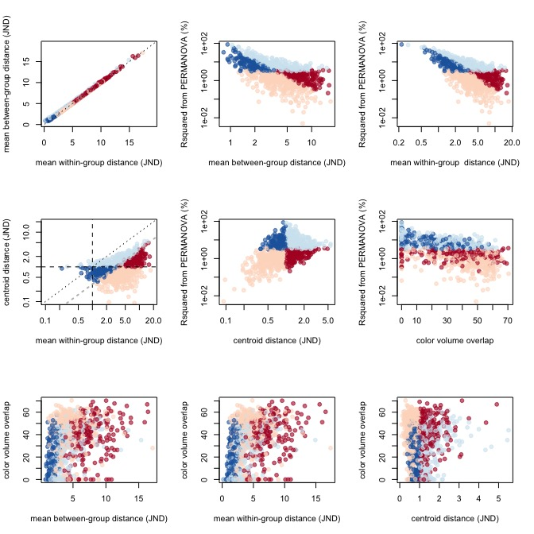

Simulations - threshold
================

-   [Threshold scenario: high within-group variability, centroid distance ~1JND](#threshold-scenario-high-within-group-variability-centroid-distance-1jnd)
    -   [Running Analysis](#running-analysis)
    -   [Visualizing Results](#visualizing-results)

``` r
require(pavo)
```

    ## Loading required package: pavo

``` r
require(vegan)
```

    ## Loading required package: vegan

    ## Loading required package: permute

    ## Loading required package: lattice

    ## This is vegan 2.4-3

``` r
require(RColorBrewer)
```

    ## Loading required package: RColorBrewer

``` r
# load aesthetic functions (plot, make colors transparent)
source('R/aesthetic.R')

# load simulation and analysis functions
source('R/simfoos.R')
source('R/simanalysis.R')
source('R/pausemcl.R')
source('R/mahalanobis.R')
```

Threshold scenario: high within-group variability, centroid distance ~1JND
==========================================================================

Generate data

``` r
reps <- 1000
simN <- 50
multfact <- c(0.88, 1.12)
ssqr <- 1

simulatedata3 <- replicate(reps, 
                  simdich(N=simN, sgsqsrate=ssqr, multiplier=multfact,
                  sdmeanratio=FALSE), simplify=FALSE)

simulatecoldist3 <- pausemcl(simulatedata3, function(x) {
  Y <- suppressWarnings(coldist(x, achro=FALSE, qcatch='Qi'))
  Y$comparison <- NA
  Y$comparison[grepl('A', Y$patch1) & grepl('A', Y$patch2)] <- 'intra.A'
  Y$comparison[grepl('B', Y$patch1) & grepl('B', Y$patch2)] <- 'intra.B'
  Y$comparison[grepl('A', Y$patch1) & grepl('B', Y$patch2)] <- 'inter'
  Y
  } )
```

Validating simulations:



Verifying that values obtained in the simulation (empirical) are close to what we wanted to simulate (simulated) for the four cones (violet, blue, green, red)

mean centroid distance of 1.1005591, quantiles of 0.2809619, 2.7206821

mean within group distance of 4.4508855, quantiles of 1.0316793, 11.0989034

Running Analysis
----------------

``` r
adonissim3 <- pausemcl(simulatecoldist3, adoniscoldist )
vovsim3 <- pausemcl(simulatedata3, voloverlaptest )
```

``` r
scd23 <- lapply(simulatecoldist3,'[', ,1:3, drop=FALSE)
for(i in 1:length(scd23)){
  attributes(scd23[[i]])[
    grep('name', names(attributes(simulatecoldist3[[i]])), invert=TRUE, value=TRUE)] <-
    attributes(simulatecoldist3[[i]])[
    grep('name', names(attributes(simulatecoldist3[[i]])), invert=TRUE, value=TRUE)]
}

pykesim3 <- lapply(scd23, jnd2xyz, rotate=FALSE)
pykelm3 <- lapply(pykesim3, function(x) lm(as.matrix(x) ~ rep(c('gA','gB'), each=50)))
pykemanova3 <- lapply(pykelm3, function(x) summary(manova(x)))
vovpyke3 <- pausemcl(pykesim3, function(x)
  voloverlap(x[1:simN,], x[(simN+1):(simN*2), ]) )

gc(verbose=FALSE)
```

    ##            used  (Mb) gc trigger  (Mb) max used  (Mb)
    ## Ncells  2026635 108.3    3205452 171.2  3205452 171.2
    ## Vcells 53495851 408.2   77230057 589.3 87709106 669.2

``` r
table(as.character(factor(paste(adonisPT, centroidPT), 
          levels=c("FALSE FALSE", "FALSE TRUE", "TRUE FALSE", "TRUE TRUE")))
      ) / length(factor(paste(adonisPT, centroidPT)))
```

    ## 
    ## FALSE FALSE  FALSE TRUE  TRUE FALSE   TRUE TRUE 
    ##       0.375       0.202       0.151       0.272

``` r
# TRUE TRUE: P < 5  JND > 1
```

Visualizing Results
-------------------

color legend:

-   dark colors: methods disagree (BAD)
-   light colors: methods agree (GOOD)

-   light blue: adonis and centroid distance &gt; 1 (GOOD)
-   dark blue: adonis significant, centroid distance &lt; 1 (BAD)
-   dark red: adonis non-significant, centroid distance &gt; 1 (BAD)
-   light red: adonis and centroid distance &lt; 1 (GOOD) 

``` r
sessionInfo()
```

    ## R version 3.4.2 (2017-09-28)
    ## Platform: x86_64-apple-darwin15.6.0 (64-bit)
    ## Running under: macOS High Sierra 10.13.2
    ## 
    ## Matrix products: default
    ## BLAS: /Library/Frameworks/R.framework/Versions/3.4/Resources/lib/libRblas.0.dylib
    ## LAPACK: /Library/Frameworks/R.framework/Versions/3.4/Resources/lib/libRlapack.dylib
    ## 
    ## locale:
    ## [1] en_US.UTF-8/en_US.UTF-8/en_US.UTF-8/C/en_US.UTF-8/en_US.UTF-8
    ## 
    ## attached base packages:
    ## [1] stats     graphics  grDevices utils     datasets  methods   base     
    ## 
    ## other attached packages:
    ## [1] RColorBrewer_1.1-2 vegan_2.4-3        lattice_0.20-35   
    ## [4] permute_0.9-4      pavo_1.3.1        
    ## 
    ## loaded via a namespace (and not attached):
    ##  [1] Rcpp_0.12.13     cluster_2.0.6    knitr_1.16       magrittr_1.5    
    ##  [5] MASS_7.3-47      maps_3.2.0       magic_1.5-6      geometry_0.3-6  
    ##  [9] stringr_1.2.0    globals_0.10.2   tools_3.4.2      grid_3.4.2      
    ## [13] parallel_3.4.2   nlme_3.1-131     mgcv_1.8-20      htmltools_0.3.6 
    ## [17] yaml_2.1.14      rprojroot_1.2    digest_0.6.12    Matrix_1.2-11   
    ## [21] pbmcapply_1.2.4  mapproj_1.2-5    codetools_0.2-15 rcdd_1.2        
    ## [25] evaluate_0.10.1  rmarkdown_1.6    stringi_1.1.5    compiler_3.4.2  
    ## [29] backports_1.1.0  future_1.6.1     listenv_0.6.0

plots for publication:

``` r
#pdf(height=8*1.3, width=7*1.3, file='figures/threshold_1.pdf')
cairo_ps(height=8*1.3, width=7*1.3, file='figures/threshold_1.ps')
par(mfrow=c(2,2), cex=1, cex.lab=1.3, cex.axis=1.15, mar=c(4.2,4.5,2.3,1)+0.1)

plot(centdistT~intradistT, 
     xlab='Mean within-group distance (JND)', ylab='Mean distance (JND)', 
     ylim=plotrange(c(intradistT,centdistT)), xlim=plotrange(c(intradistT,centdistT)), 
     pch=21, bg=sigpalT, col=NA, log='xy', yaxt='n', xaxt='n')
axis(1, at=c(0.1, 1, 10), labels=c(0.1, 1, 10))
axis(1, at=c(seq(0.2,0.9, by=0.1), seq(2,9, by=1)), tcl=par("tcl")*0.5, labels=FALSE)
axis(2, at=c(0.1, 1, 10), labels=c(0.1, 1, 10))
axis(2, at=c(seq(0.2,0.9, by=0.1), seq(2,9, by=1)), tcl=par("tcl")*0.5, labels=FALSE)

abline(0,1, lty=2)
abline(h=1, lty=3)
abline(v=1, lty=3)
abline(-0.5, 1, lty=5, col='grey')

#legend('topleft', 
legend(x=grconvertX(-0.01,"npc"), y=grconvertY(0.91, "npc"),
       pch=21, cex=1, bty='n', col=NA, pt.bg=rcbalpha(1, 6, 'RdBu')[c(1,3,6,4)],
       legend=c('p > 0.05, JND > 1',
                'p > 0.05, JND < 1',
                'p < 0.05, JND < 1',
                'p < 0.05, JND > 1'))

text(x=grconvertX(0.05,"npc"), y=grconvertY(0.95, "npc"), cex=1.5, "A") 

plot(adonisR2T~centdistT, 
     ylab=expression(paste(R^2,' (%)')), xlab='Mean distance (JND)', 
     ylim=plotrange(adonisR2T), xlim=plotrange(centdistT),
     pch=21, bg=sigpalT, col=NA, log='xy', yaxt='n', xaxt='n')
#axis(2, at=c(0.05, 0.5, 5, 50), labels=c(0.05, 0.5, 5, 50))
axis(2, at=c(0.01, 0.1, 1, 10,100), labels=c(0.01, 0.1, 1, 10,100))
#axis(2, at=c(0.06,0.07,0.08,0.09, 0.2, 0.3, 0.4, 0.6, 0.7, 0.8, 0.9, 2, 3, 4, 6, 7, 8, 9, 20, 30, 40), tcl=par("tcl")*0.5, labels=FALSE)
axis(2, at=c(seq(0.02,0.09,by=0.01), seq(0.2,0.9,by=0.1), seq(2,9,by=1), seq(20,90,by=10)), tcl=par("tcl")*0.5, labels=FALSE)
#axis(2, at=c(0.1, 1, 10), tcl=par("tcl")*1, labels=FALSE)
axis(1, at=c(0.1, 1, 10), labels=c(0.1, 1, 10))
axis(1, at=c(seq(0.2,0.9, by=0.1), seq(2,9, by=1)), tcl=par("tcl")*0.5, labels=FALSE)

abline(v=1, lty=3)
abline(h=3, lty=3)

text(x=grconvertX(0.05,"npc"), y=grconvertY(0.95, "npc"), cex=1.5, "B") 

plot(adonisR2T~overlapT, 
     ylab=expression(paste(R^2,' (%)')), xlab='Colour volume overlap (%)',  
     ylim=c(0.01, 200), xlim=plotrange(overlapT, log=FALSE),
     pch=21, bg=sigpalT, col=NA, log='y', yaxt='n', xaxt='n')
axis(1, at=c(0,20,40,60))
#axis(2, at=c(0.05, 0.5, 5, 50), labels=c(0.05, 0.5, 5, 50))
axis(2, at=c(0.01, 0.1, 1, 10,100), labels=c(0.01, 0.1, 1, 10,100))
#axis(2, at=c(0.06,0.07,0.08,0.09, 0.2, 0.3, 0.4, 0.6, 0.7, 0.8, 0.9, 2, 3, 4, 6, 7, 8, 9, 20, 30, 40), tcl=par("tcl")*0.5, labels=FALSE)
axis(2, at=c(seq(0.02,0.09,by=0.01), seq(0.2,0.9,by=0.1), seq(2,9,by=1), seq(20,90,by=10)), tcl=par("tcl")*0.5, labels=FALSE)
#axis(2, at=c(0.1, 1, 10), tcl=par("tcl")*1, labels=FALSE)

text(x=grconvertX(0.05,"npc"), y=grconvertY(0.95, "npc"), cex=1.5, "C") 

plot(centdistT~overlapT,
     ylab='Mean distance (JND)', xlab='Color volume overlap (%)',
     ylim=plotrange(centdistT), xlim=plotrange(overlapT, log=FALSE),
     pch=21, bg=sigpalT, col=NA, log='y', yaxt='n', xaxt='n')
axis(1, at=c(0,20,40,60))
axis(2, at=c(0.1, 1, 10), labels=c(0.1, 1, 10))
axis(2, at=c(seq(0.2,0.9, by=0.1), seq(2,9, by=1)), tcl=par("tcl")*0.5, labels=FALSE)
abline(h=1, lty=3)

text(x=grconvertX(0.05,"npc"), y=grconvertY(0.95, "npc"), cex=1.5, "D") 

dev.off()
```

    ## pdf 
    ##   2

``` r
#pdf(height=4*1.3, width=7*1.3, file='figures/threshold_ESM.pdf')
cairo_ps(height=4*1.3, width=7*1.3, file='figures/threshold_ESM.ps')
par(mfrow=c(1,2), cex=1, cex.lab=1.3, cex.axis=1.15, mar=c(5.2,5.5,1.3,0)+0.1)


plot(overlapykeT~overlapT, 
     ylab="Color volume overlap \n(receptor noise-corrected, %)", 
     xlab="Color volume overlap (%)",
     ylim=plotrange(c(overlapykeT,overlapT), log=FALSE), xlim=plotrange(c(overlapykeT,overlapT), log=FALSE), 
     pch=21, bg=sigpalT, col=NA)
abline(0,1, lty=2)

text(x=grconvertX(0.05,"npc"), y=grconvertY(0.95, "npc"), cex=1.5, "A") 

plot(centdistT~overlapykeT,
     ylab='Mean distance (JND)', 
     xlab='', 
     ylim=plotrange(centdistT), xlim=plotrange(overlapykeT, log=FALSE),
     pch=21, bg=sigpalT, col=NA, log='y', yaxt='n', xaxt='n')
axis(1, at=c(0,20,40,60))
axis(2, at=c(0.1, 1, 10), labels=c(0.1, 1, 10))
axis(2, at=c(seq(0.2,0.9, by=0.1), seq(2,9, by=1)), tcl=par("tcl")*0.5, labels=FALSE)
abline(h=1, lty=3)
title(xlab='Color volume overlap \n(receptor noise-corrected, %)', line=4)

text(x=grconvertX(0.05,"npc"), y=grconvertY(0.95, "npc"), cex=1.5, "B") 


dev.off()
```

    ## pdf 
    ##   2
