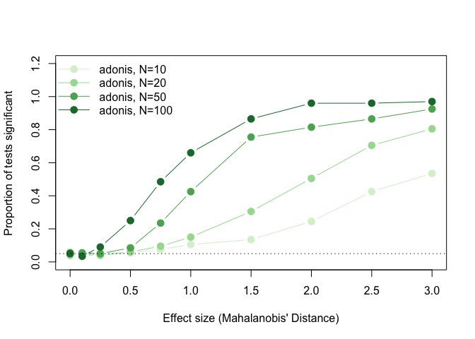
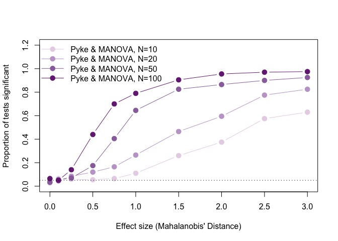
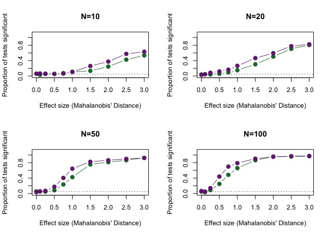
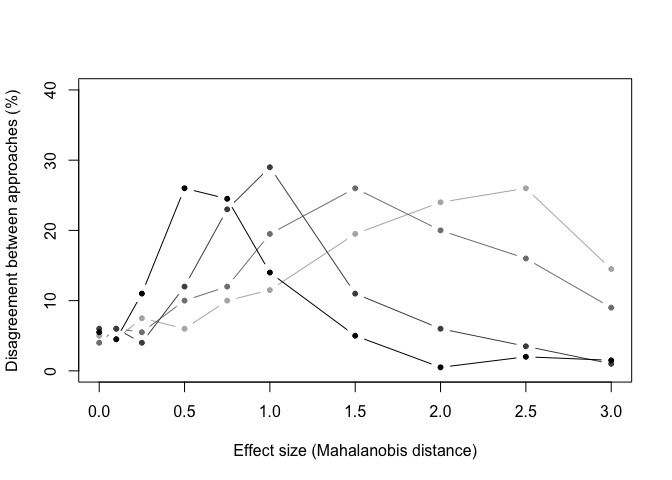
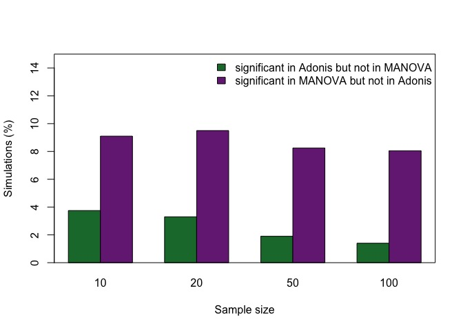

Sample size simulations
================

-   [Power and sample size](#power-and-sample-size)
-   [Running Analysis](#running-analysis)

``` r
require(pavo)
require(vegan)
require(RColorBrewer)

# load aesthetic functions (plot, make colors transparent)
source('R/aesthetic.R')

# load simulation and analysis functions
source('R/simfoos.R')
source('R/simanalysis.R')
source('R/pausemcl.R')

# define simulation parameters
effs <- c(0, 0.1, 0.25, 0.5, 0.75, 1, 1.5, 2, 2.5, 3)
timeseach <- 200
effsims <- rep(effs, each=timeseach)
```

Power and sample size
=====================

N = 100
-------

``` r
simN <- 100
simulatedata.n100 <- lapply(effsims,
                           function(x)
                             simdich(N=simN, sgsqsrate=0.5, multiplier=NULL, effsize=x)
)

simulatecoldist.n100 <- pausemcl(simulatedata.n100, function(x) {
  Y <- suppressWarnings(coldist(x, achro=FALSE, qcatch='Qi'))
  Y$comparison <- NA
  Y$comparison[grepl('A', Y$patch1) & grepl('A', Y$patch2)] <- 'intra.A'
  Y$comparison[grepl('B', Y$patch1) & grepl('B', Y$patch2)] <- 'intra.B'
  Y$comparison[grepl('A', Y$patch1) & grepl('B', Y$patch2)] <- 'inter'
  Y
})
```

``` r
gc(verbose=FALSE)
adonissim.n100 <- pausemcl(simulatecoldist.n100, adoniscoldist)
#adonissim.n100 <- lapply(simulatecoldist.n100, adoniscoldist)
gc(verbose=FALSE)

scd2.n100 <- lapply(simulatecoldist.n100,'[', ,1:3, drop=FALSE)
for(i in 1:length(scd2.n100)){
  attributes(scd2.n100[[i]])[
    grep('name', names(attributes(simulatecoldist.n100[[i]])), invert=TRUE, value=TRUE)] <-
    attributes(simulatecoldist.n100[[i]])[
    grep('name', names(attributes(simulatecoldist.n100[[i]])), invert=TRUE, value=TRUE)]
}
pykesim.n100 <- pausemcl(scd2.n100, function(x) jnd2xyz(x, rotate=FALSE))
pykelm.n100 <- pausemcl(pykesim.n100, function(x) lm(as.matrix(x) ~ rep(c('gA','gB'), each=simN)))
pykemanova.n100 <- pausemcl(pykelm.n100, function(x) summary(manova(x)))
```

N = 20
------

``` r
simN <- 20
simulatedata.n20 <- lapply(effsims,
                           function(x)
                             simdich(N=simN, sgsqsrate=0.5, multiplier=NULL, effsize=x)
)
simulatedata.n20 <- lapply(simulatedata.n20, 'attr<-', which='resrefs', value=rfs)

simulatecoldist.n20 <- pausemcl(simulatedata.n20, function(x) {
  Y <- suppressWarnings(coldist(x, achro=FALSE, qcatch='Qi'))
  Y$comparison <- NA
  Y$comparison[grepl('A', Y$patch1) & grepl('A', Y$patch2)] <- 'intra.A'
  Y$comparison[grepl('B', Y$patch1) & grepl('B', Y$patch2)] <- 'intra.B'
  Y$comparison[grepl('A', Y$patch1) & grepl('B', Y$patch2)] <- 'inter'
  Y
})
```

``` r
gc(verbose=FALSE)
adonissim.n20 <- pausemcl(simulatecoldist.n20, adoniscoldist)
Sys.sleep(5)
gc(verbose=FALSE)

scd2.n20 <- lapply(simulatecoldist.n20,'[', ,1:3, drop=FALSE)
for(i in 1:length(scd2.n20)){
  attributes(scd2.n20[[i]])[
    grep('name', names(attributes(simulatecoldist.n20[[i]])), invert=TRUE, value=TRUE)] <-
    attributes(simulatecoldist.n20[[i]])[
    grep('name', names(attributes(simulatecoldist.n20[[i]])), invert=TRUE, value=TRUE)]
}
pykesim.n20 <- lapply(scd2.n20, function(x) jnd2xyz(x, rotate=FALSE))
pykelm.n20 <- lapply(pykesim.n20, function(x) lm(as.matrix(x) ~ rep(c('gA','gB'), each=simN)))
pykemanova.n20 <- lapply(pykelm.n20, function(x) summary(manova(x)))
```

N = 10
------

``` r
simN <- 10
simulatedata.n10 <- lapply(effsims,
                       function(x)
                       simdich(N=simN, sgsqsrate=0.5, multiplier=NULL, effsize=x)
                       )
simulatedata.n10 <- lapply(simulatedata.n10, 'attr<-', which='resrefs', value=rfs)

simulatecoldist.n10 <- pausemcl(simulatedata.n10, function(x) {
  Y <- suppressWarnings(coldist(x, achro=FALSE, qcatch='Qi'))
  Y$comparison <- NA
  Y$comparison[grepl('A', Y$patch1) & grepl('A', Y$patch2)] <- 'intra.A'
  Y$comparison[grepl('B', Y$patch1) & grepl('B', Y$patch2)] <- 'intra.B'
  Y$comparison[grepl('A', Y$patch1) & grepl('B', Y$patch2)] <- 'inter'
  Y
  })
```

``` r
gc(verbose=FALSE)
adonissim.n10 <- pausemcl(simulatecoldist.n10, adoniscoldist)
Sys.sleep(5)
gc(verbose=FALSE)

scd2.n10 <- lapply(simulatecoldist.n10,'[', ,1:3, drop=FALSE)
for(i in 1:length(scd2.n10)){
  attributes(scd2.n10[[i]])[
    grep('name', names(attributes(simulatecoldist.n10[[i]])), invert=TRUE, value=TRUE)] <-
    attributes(simulatecoldist.n10[[i]])[
    grep('name', names(attributes(simulatecoldist.n10[[i]])), invert=TRUE, value=TRUE)]
}
pykesim.n10 <- lapply(scd2.n10, function(x) jnd2xyz(x, rotate=FALSE))
pykelm.n10 <- lapply(pykesim.n10, function(x) lm(as.matrix(x) ~ rep(c('gA','gB'), each=simN)))
pykemanova.n10 <- lapply(pykelm.n10, function(x) summary(manova(x)))
```

Running Analysis
================

    ## NULL

    ## NULL

Visualizing Results
-------------------









``` r
sessionInfo()
```

    ## R version 3.4.2 (2017-09-28)
    ## Platform: x86_64-apple-darwin15.6.0 (64-bit)
    ## Running under: macOS High Sierra 10.13.2
    ## 
    ## Matrix products: default
    ## BLAS: /Library/Frameworks/R.framework/Versions/3.4/Resources/lib/libRblas.0.dylib
    ## LAPACK: /Library/Frameworks/R.framework/Versions/3.4/Resources/lib/libRlapack.dylib
    ## 
    ## locale:
    ## [1] en_US.UTF-8/en_US.UTF-8/en_US.UTF-8/C/en_US.UTF-8/en_US.UTF-8
    ## 
    ## attached base packages:
    ## [1] stats     graphics  grDevices utils     datasets  methods   base     
    ## 
    ## other attached packages:
    ## [1] RColorBrewer_1.1-2 vegan_2.4-3        lattice_0.20-35   
    ## [4] permute_0.9-4      pavo_1.3.1        
    ## 
    ## loaded via a namespace (and not attached):
    ##  [1] Rcpp_0.12.13     cluster_2.0.6    knitr_1.16       magrittr_1.5    
    ##  [5] MASS_7.3-47      maps_3.2.0       magic_1.5-6      geometry_0.3-6  
    ##  [9] stringr_1.2.0    globals_0.10.2   tools_3.4.2      grid_3.4.2      
    ## [13] parallel_3.4.2   nlme_3.1-131     mgcv_1.8-20      htmltools_0.3.6 
    ## [17] yaml_2.1.14      rprojroot_1.2    digest_0.6.12    Matrix_1.2-11   
    ## [21] pbmcapply_1.2.4  mapproj_1.2-5    codetools_0.2-15 rcdd_1.2        
    ## [25] evaluate_0.10.1  rmarkdown_1.6    stringi_1.1.5    compiler_3.4.2  
    ## [29] backports_1.1.0  future_1.6.1     listenv_0.6.0

Plots for publication:

    ## pdf 
    ##   2

    ## pdf 
    ##   2
