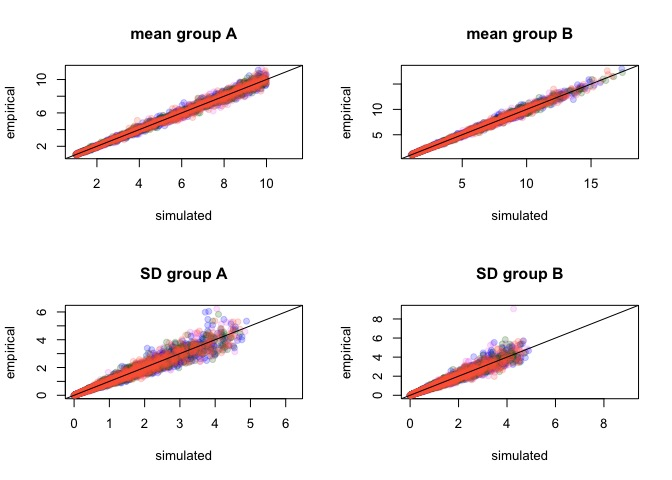
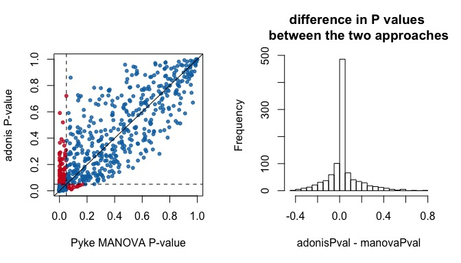

Simulations
================

-   [False positives and power](#false-positives-and-power)
    -   [Running Analysis](#running-analysis)
    -   [Visualizing Results](#visualizing-results)

``` r
source('R/jnd2xyz.R')

# Make RColorBrewer colors transparent
rcbalpha <- function(alpha=1, ...){
  aa <- data.frame(t(col2rgb(brewer.pal(...), alpha=F)))/255
  rgb(aa, alpha=alpha)
}

# significant/not significant histogram 
yesnohist <- function(x, xlab=""){
  bq <- 0.5  
  while(length(seq(0, ceiling(max(x)),by=bq)) < 10) 
    bq <- bq/2

yes <- hist(x[adonisP], breaks=seq(0, ceiling(max(x)),by=bq), plot=F)
no <- hist(x[!adonisP], breaks=seq(0, ceiling(max(x)),by=bq), plot=F)

plot(c(0,yes$breaks), c(0,yes$counts,0), type='s',col=palette[1], lwd=5,
     ylab='Frequency', xlab=xlab,
     ylim=range(c(yes$counts,no$counts))* c(0,1.1),
     xlim=c(0, max(c(yes$breaks, no$breaks)*1.1)))
lines(c(0,no$breaks), c(0,no$counts,0), col=palette[2], type='s', lwd=5)

legend('topright', col=palette[1:2], c('significant  ','not significant  '), 
       pch=15, pt.cex=2.5, bty='n')
}

# simulate lognormal with realized mean and standard deviation on the log scale
actuallognorm <- function(N, amean, asd){
  location <- log(amean^2 / sqrt(asd^2 + amean^2))
  shape <- sqrt(log(1 + (asd^2 / amean^2)))
  rlnorm(n=N, meanlog=location, sdlog=shape)
}

# simulate two groups of data
simdich <- function(N=50, sgsqsrate=1, multiplier=c(0.95, 1.05), effsize=NULL){

  musA <- runif(4, 1, 10) # vector of means for group A
  #sgsqs <- rexp(4, sgsqsrate) # vector of standard deviations
  sgsqs <- runif(4,0,0.5)*musA

  groupA <- matrix(NA, nrow=N, ncol=4)
  groupA[,1] <- actuallognorm(N, amean=musA[1], asd=sgsqs[1])
  groupA[,2] <- actuallognorm(N, amean=musA[2], asd=sgsqs[2])
  groupA[,3] <- actuallognorm(N, amean=musA[3], asd=sgsqs[3])
  groupA[,4] <- actuallognorm(N, amean=musA[4], asd=sgsqs[4])
  
  if(is.null(effsize)){
    musB <- musA * runif(4, multiplier[1], multiplier[2])
  }else{
    # effsize: difference between means in units of standard deviations
    # (mahalanobis distance, approximately)
    # up to 4 dimensions (K), so divide the multivariate effect size by sqrt(K)
    sds <- apply(groupA, 2, sd)
    musB <- (effsize/sqrt(4)*sds) + musA
    }
  
    groupB <- matrix(NA, nrow=N, ncol=4)
    groupB[,1] <- actuallognorm(N, amean=musB[1], asd=sgsqs[1])
    groupB[,2] <- actuallognorm(N, amean=musB[2], asd=sgsqs[2])
    groupB[,3] <- actuallognorm(N, amean=musB[3], asd=sgsqs[3])
    groupB[,4] <- actuallognorm(N, amean=musB[4], asd=sgsqs[4])

  combined <- data.frame(rbind(groupA,groupB))
  
  colnames(combined) <- c('u','s','m', 'l')
  rownames(combined) <- paste(rep(c('gA','gB'), each=N),1:N, sep='')
  
  attr(combined, 'relative') <- FALSE
  
  simpars <- data.frame(rbind(musA, musB, sgsqs))
  colnames(simpars) <- c('u','s','m', 'l')
  rownames(simpars) <- c('muA','muB','ssq')
  attr(combined, 'simpar') <- simpars
  
  combined
  }

# make distance matrix and run adonis
adoniscoldist <- function(x, ...){
  coldistres <- as.matrix(rbind(x[ ,c(1,2,3)], x[ ,c(2,1,3)]))
  uniquepatches <-  unique(c(coldistres[,1], coldistres[,2]))

  M <- matrix(nrow=length(uniquepatches), ncol=length(uniquepatches))

  rownames(M) <- colnames(M) <- uniquepatches

  M[coldistres[,1:2] ] <- coldistres[,3]
  M[coldistres[,2:1] ] <- coldistres[,3]

  class(M) <- 'numeric'
  M[is.na(M)] <- 0
  
  grouping <- as.factor(gsub('[0-9]','', rownames(M)))

  M <- as.dist(M)

  adonis(M~grouping, ...)
  }

# split data and run volume overlap
voloverlaptest <- function(dat){
  tcsdat <- suppressWarnings(colspace(dat, space='tcs'))
  gA <- tcsdat[1:(dim(dat)[1]/2),]
  gB <- tcsdat[(dim(dat)[1]/2+1):(dim(dat)[1]),]
  
  voloverlap(gA, gB)
}

# split data, get centroids, get color distance
centroidist <- function(dat){
  gA.c <- colMeans(dat[1:(dim(dat)[1]/2),])
  gB.c <- colMeans(dat[(dim(dat)[1]/2+1):(dim(dat)[1]),])
  
  suppressWarnings(coldist(rbind(gA.c, gB.c), achro=FALSE, qcatch='Qi'))$dS
}
```

False positives and power
=========================

We will simulate data with varying effect sizes (centroid distance relative to the variance-covariance matrix, or Mahalanobis distance):

``` r
effs <- c(0, 0.1, 0.25, 0.5, 0.75, 1, 1.5, 2, 2.5, 3)
timeseach <- 100
simN <- 50

effsims <- rep(effs, each=timeseach)

simulatedata <- lapply(effsims,
                       function(x)
                       simdich(N=simN, sgsqsrate=0.5, multiplier=NULL, effsize=x)
                       )


# we need to add the reference points since we didn't run vismodel()
#apply(do.call(rbind, lapply(simulatedata, function(x) apply(x, 2, max))), 2, max)
#data(sicalis)
#rfs <- attr(vismodel(sicalis, visual='star',relative=FALSE), 'resrefs')

rfs <- 
matrix(c(100,01,01,01,
         01,100,01,01,
         01,01,100,01,
         01,01,01,100,
         50,50,50,50
         ), ncol=4, byrow=TRUE)
rownames(rfs) <- c('refforjnd2xyz.u','refforjnd2xyz.s','refforjnd2xyz.m','refforjnd2xyz.l', 'refforjnd2xyz.acent')
colnames(rfs) <- c('u','s','m','l')

simulatedata <- lapply(simulatedata, 'attr<-', which='resrefs', value=rfs)


simulatecoldist <- parallel::mclapply(simulatedata, function(x) {
  Y <- suppressWarnings(coldist(x, achro=FALSE, qcatch='Qi'))
  Y$comparison <- NA
  Y$comparison[grepl('A', Y$patch1) & grepl('A', Y$patch2)] <- 'intra.A'
  Y$comparison[grepl('B', Y$patch1) & grepl('B', Y$patch2)] <- 'intra.B'
  Y$comparison[grepl('A', Y$patch1) & grepl('B', Y$patch2)] <- 'inter'
  Y
  }, mc.cores=6)
```

Validating simulations:



Verifying that values obtained in the simulation (empirical) are close to what we wanted to simulate (simulated) for the four cones (violet, blue, green, red)

Running Analysis
----------------

Run adonis, volume overlap, calculate distance between centroids:

``` r
gc(verbose=FALSE)
adonissim <- parallel::mclapply(simulatecoldist, adoniscoldist, mc.cores=6)
vovsim <- parallel::mclapply(simulatedata, voloverlaptest, mc.cores=6)
centdist <- unlist(lapply(simulatedata, centroidist))
gc(verbose=FALSE)
```

Run Pyke MANOVA:

``` r
scd2 <- lapply(simulatecoldist,'[', ,1:3, drop=FALSE)
for(i in 1:length(scd2)){
  attr(scd2[[i]], 'resrefs') <- attr(simulatecoldist[[i]],'resrefs')
  attr(scd2[[i]], 'conenumb') <- attr(simulatecoldist[[i]],'conenumb')
  }

pykesim <- lapply(scd2, jnd2xyz)
pykelm <- lapply(pykesim, function(x) lm(as.matrix(x) ~ rep(c('gA','gB'), each=50)))
pykemanova <- lapply(pykelm, function(x) summary(manova(x)))
```

Calculate statistics of interest:

``` r
# Pyke MANOVA: P-values, which significant
manovaPval <- unlist(lapply(pykemanova, function(x) x$stats[1,'Pr(>F)']))
manovaP <- manovaPval < 0.05

# Adonis: P-values, which significant, R-squared
adonisPval <- unlist(lapply(adonissim, function(x) x$aov.tab$'Pr(>F)'[1]))
adonisP <- adonisPval < 0.05
adonisR2 <- unlist(lapply(adonissim, function(x) x$aov.tab$'R2'[1])) * 100

# Disagreement in significance between Pyke and Adonis
disagreement <- !manovaP == adonisP

# Proportion of tests significant by effect size, according to each method
pvsimsadonis <- tapply(adonisP, effsims, mean)
pvsimsmanova <- tapply(manovaP, effsims, mean)

# Volume overlap
overlap <- unlist(lapply(vovsim, '[','vboth')) * 100

# Centroids: intra-group distances, inter-group distances, which centroid distances > 1
gmeans <- lapply(simulatecoldist, function(x) tapply(x$dS, x$comparison, mean))
gmeans <- do.call(rbind, gmeans)

intradist <- rowMeans(gmeans[, -1])
interdist <- gmeans[,"inter"]

centroidP <- centdist > 1

# Mahalanobis distance between centroids
mahd <- unlist(lapply(simulatedata, function(x) sqrt(mahalanobis(colMeans(x[1:50,]), colMeans(x[51:100,]), cov(x[1:50,]) ))))

# Color palette for plots
palette <- rcbalpha(0.8, 4, 'Set1')

#sigpal <- as.character(factor(adonisP, labels=palette[1:2]))
sigpal <- as.character(factor(paste(adonisP, centroidP), 
          levels=c("FALSE FALSE", "FALSE TRUE", "TRUE FALSE", "TRUE TRUE"), 
          labels=rcbalpha(0.8, 6, 'RdBu')[c(3,1,6,4)] ))
```

Visualizing Results
-------------------


The simulation was successfu in producing samples that had the desired mahalanobis distance. There is some spread because of the small sample size relative to the dimensionality of the dataset, and for that reason the distances between groups asymptotes before zero.


Both tests had similar power. For very low effect sizes, Type-I Error rate is close to the desired 0.05 (dashed line).

Both tests are quite sensitive too, with signifcant results when the distance between centroids is of about the same magnitude as the pooled standard deviations. Further, Pyke-MANOVA seems less conservative overall than Adonis, though they are very close to each other at very small effect sizes.



However, there is some discrepancy in test results. There doesn't seem to be a bias - results are centered around the 1:1 line, difference in P-values from the tests is centered and mostly symmetric around 0. But there are occasions in which results are significant for one test but not the other (red; the space between the dashed lines in the first plot).

So tests have similar power but disagree as to the outcome in terms of what is significant:

    ##        manovaP
    ## adonisP FALSE  TRUE
    ##   FALSE 0.459 0.082
    ##   TRUE  0.015 0.444

About 10% divergence in results, maybe not worth worrying about. Note that most of the discrepancy comes from results that are significant in MANOVA but not in Adonis, suggesting again that MANOVA approach is less conservative.

There is disagreement particularly when the effect size is marginal: 


Even though centroid distance increases with effect size, there's a lot of spread, which is the core of the problem we're trying to address - you can have a huge centroid distance with a small Mahalanobis distance (small separation bewtwen the groups). Note centroid is in log scale.


R2 increases with increasing effect size, which is good. We can also see that even though a lot of the simulations have a distance between centroids greater than 1, they are still not significant (red) according to either approach. Transition from non-siginificant to significant occurs for Mahalanobis Distance between 0.5 and 1.


This just shows the Pyke transformation is working and that the Euclidean distance between the centroids calculated in this transformed space is identical to the distance between the centroids in JNDs.

``` r
sessionInfo()
```

    ## R version 3.4.1 (2017-06-30)
    ## Platform: x86_64-apple-darwin15.6.0 (64-bit)
    ## Running under: macOS Sierra 10.12.4
    ## 
    ## Matrix products: default
    ## BLAS: /Library/Frameworks/R.framework/Versions/3.4/Resources/lib/libRblas.0.dylib
    ## LAPACK: /Library/Frameworks/R.framework/Versions/3.4/Resources/lib/libRlapack.dylib
    ## 
    ## locale:
    ## [1] en_US.UTF-8/en_US.UTF-8/en_US.UTF-8/C/en_US.UTF-8/en_US.UTF-8
    ## 
    ## attached base packages:
    ## [1] stats     graphics  grDevices utils     datasets  methods   base     
    ## 
    ## other attached packages:
    ## [1] RColorBrewer_1.1-2   vegan_2.4-3          lattice_0.20-35     
    ## [4] permute_0.9-4        scatterplot3d_0.3-40 pavo_1.2.1          
    ## 
    ## loaded via a namespace (and not attached):
    ##  [1] Rcpp_0.12.11     cluster_2.0.6    knitr_1.15.1     magrittr_1.5    
    ##  [5] maps_3.2.0       magic_1.5-6      MASS_7.3-47      geometry_0.3-6  
    ##  [9] stringr_1.2.0    tools_3.4.1      parallel_3.4.1   grid_3.4.1      
    ## [13] nlme_3.1-131     mgcv_1.8-17      htmltools_0.3.6  yaml_2.1.14     
    ## [17] rprojroot_1.2    digest_0.6.12    Matrix_1.2-10    mapproj_1.2-5   
    ## [21] codetools_0.2-15 rcdd_1.2         evaluate_0.10    rmarkdown_1.5   
    ## [25] stringi_1.1.5    compiler_3.4.1   backports_1.0.5
