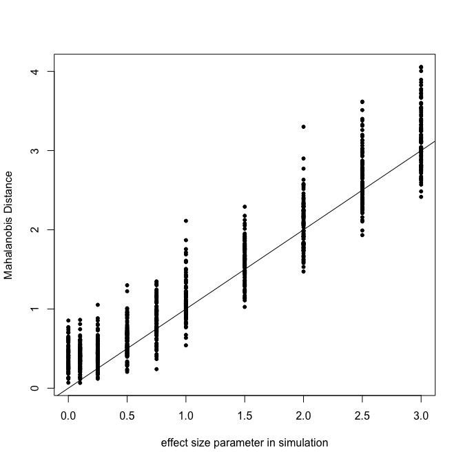
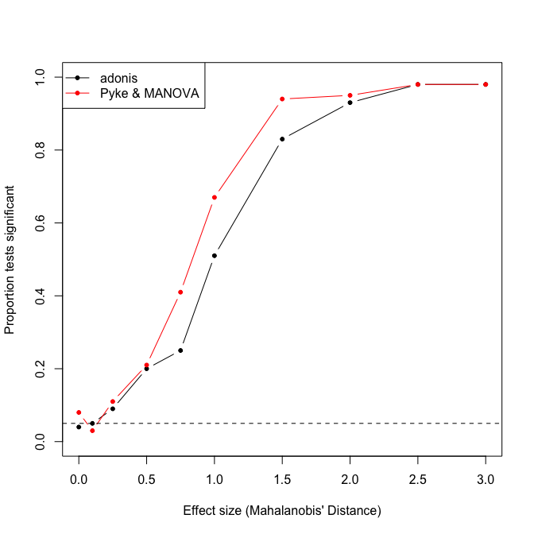
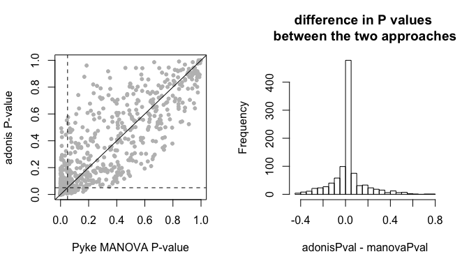
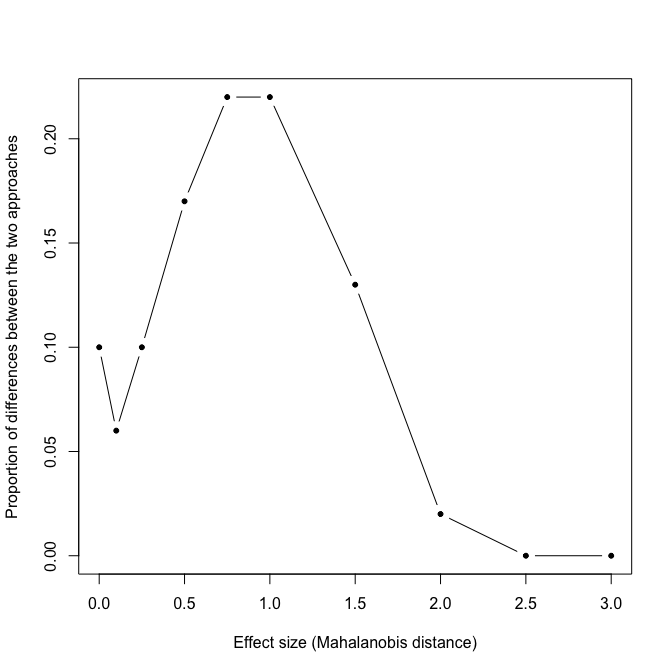
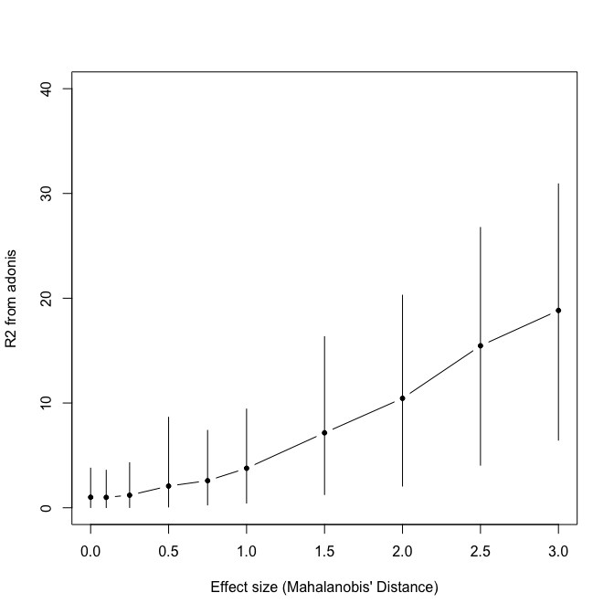
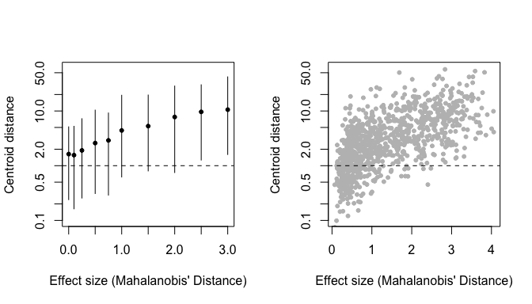

``` r
source('R/pyke.R')

# Make RColorBrewer colors transparent
rcbalpha <- function(alpha=1, ...){
  aa <- data.frame(t(col2rgb(RColorBrewer::brewer.pal(...), alpha=F)))/255
  #aa$alpha <- alpha
  rgb(aa, alpha=alpha)
}

# significant/not significant histogram 
yesnohist <- function(x, xlab=""){
  bq <- 0.5  
  while(length(seq(0, ceiling(max(x)),by=bq)) < 10) 
    bq <- bq/2

yes <- hist(x[adonisP], breaks=seq(0, ceiling(max(x)),by=bq), plot=F)
no <- hist(x[!adonisP], breaks=seq(0, ceiling(max(x)),by=bq), plot=F)

plot(c(0,yes$breaks), c(0,yes$counts,0), type='s',col=palette[1], lwd=5,
     ylab='Frequency', xlab=xlab,
     ylim=range(c(yes$counts,no$counts))* c(0,1.1),
     xlim=c(0, max(c(yes$breaks, no$breaks)*1.1)))
lines(c(0,no$breaks), c(0,no$counts,0), col=palette[2], type='s', lwd=5)

legend('topright', col=palette[1:2], c('significant  ','not significant  '), 
       pch=15, pt.cex=2.5, bty='n')
}

# simulate two groups of data
simdich <- function(N=50, sgsqsrate=10, multiplier=c(0.95, 1.05), effsize=NULL){

  musA <- runif(4, 1, 10) # vector of means for group A
  sgsqs <- rexp(4, sgsqsrate) # vector of standard deviations
  
  groupA <- matrix(NA, nrow=N, ncol=4)
  groupA[,1] <- rlnorm(N, meanlog=log(musA[1]), sdlog=log(sgsqs[1]))
  groupA[,2] <- rlnorm(N, meanlog=log(musA[2]), sdlog=log(sgsqs[2]))
  groupA[,3] <- rlnorm(N, meanlog=log(musA[3]), sdlog=log(sgsqs[3]))
  groupA[,4] <- rlnorm(N, meanlog=log(musA[4]), sdlog=log(sgsqs[4]))
  
  if(is.null(effsize)){
    #musB <- musA*runif(4, .8, 1.2) # vector of means for group B
    musB <- musA * runif(4, multiplier[1], multiplier[2])
  }else{
    # effsize: difference between means in units of standard deviations
    # (mahalanobis distance, approximately)
    # 4 dimensions (K), so divide the multivariate effect size by sqrt(K)
    sds <- apply(groupA, 2, sd)
    musB <- effsize/sqrt(4)*sds + musA
  }
  
  groupB <- matrix(NA, nrow=N, ncol=4)
  groupB[,1] <- rlnorm(N, meanlog=log(musB[1]), sdlog=log(sgsqs[1]))
  groupB[,2] <- rlnorm(N, meanlog=log(musB[2]), sdlog=log(sgsqs[2]))
  groupB[,3] <- rlnorm(N, meanlog=log(musB[3]), sdlog=log(sgsqs[3]))
  groupB[,4] <- rlnorm(N, meanlog=log(musB[4]), sdlog=log(sgsqs[4]))
  
  combined <- data.frame(rbind(groupA,groupB))
  
  colnames(combined) <- c('u','s','m', 'l')
  rownames(combined) <- paste(rep(c('gA','gB'), each=N),1:N, sep='')
  
  attr(combined, 'relative') <- FALSE
  
  simpars <- data.frame(rbind(musA, musB, sgsqs))
  colnames(simpars) <- c('u','s','m', 'l')
  rownames(simpars) <- c('muA','muB','ssq')
  attr(combined, 'simpar') <- simpars
  
  combined
  }

# testing
#simvals <- runif(100,0,10)
#aa <- lapply(simvals, simdich, N=50, sgsqsrate=10)
#mahd <- unlist(lapply(aa, function(x) sqrt(mahalanobis(colMeans(x[1:50,]), colMeans(x[51:100,]), cov(x[1:50,])) )) )
#plot(simvals~mahd)

# make distance matrix and run adonis
adoniscoldist <- function(x, ...){
  coldistres <- as.matrix(rbind(x[ ,c(1,2,3)], x[ ,c(2,1,3)]))
  uniquepatches <-  unique(c(coldistres[,1], coldistres[,2]))

  M <- matrix(nrow=length(uniquepatches), ncol=length(uniquepatches))

  rownames(M) <- colnames(M) <- uniquepatches

  M[coldistres[,1:2] ] <- coldistres[,3]
  M[coldistres[,2:1] ] <- coldistres[,3]

  class(M) <- 'numeric'
  M[is.na(M)] <- 0
  
  M <- as.dist(M)

  grouping <- gsub('[0-9]','', rownames(M))
  
  adonis(M~grouping, ...)
  }

# split data and run volume overlap
voloverlaptest <- function(dat){
  tcsdat <- suppressWarnings(colspace(dat, space='tcs'))
  gA <- tcsdat[1:(dim(dat)[1]/2),]
  gB <- tcsdat[(dim(dat)[1]/2+1):(dim(dat)[1]),]
  
  voloverlap(gA, gB)
}

# split data, get centroids, get color distance
centroidist <- function(dat){
  gA.c <- colMeans(dat[1:(dim(dat)[1]/2),])
  gB.c <- colMeans(dat[(dim(dat)[1]/2+1):(dim(dat)[1]),])
  
  suppressWarnings(coldist(rbind(gA.c, gB.c), achro=FALSE, qcatch='Qi'))$dS
}
```

False positives and power
-------------------------

``` r
effs <- c(0, 0.1, 0.25, 0.5, 0.75, 1, 1.5, 2, 2.5, 3)
timeseach <- 100

effsims <- rep(effs, each=timeseach)

simulatedata <- lapply(effsims,
                       function(x)
                       simdich(N=50, sgsqsrate=10, multiplier=NULL, effsize=x)
                       )


# we need to add the reference points since we didn't run vismodel()
#apply(do.call(rbind, lapply(simulatedata, function(x) apply(x, 2, max))), 2, max)
#data(sicalis)
#rfs <- attr(vismodel(sicalis, visual='star',relative=FALSE), 'resrefs')

rfs <- 
matrix(c(50,50,50,50,
         01,01,01,150,
         50,01,01,01,
         01,50,01,01), ncol=4, byrow=TRUE)
rownames(rfs) <- c('whiref','redref','bluref','greref')
colnames(rfs) <- c('u','s','m','l')

simulatedata <- lapply(simulatedata, 'attr<-', which='resrefs', value=rfs)


simulatecoldist <- parallel::mclapply(simulatedata, function(x) {
  Y <- suppressWarnings(coldist(x, achro=FALSE, qcatch='Qi'))
  Y$comparison <- NA
  Y$comparison[grepl('A', Y$patch1) & grepl('A', Y$patch2)] <- 'intra.A'
  Y$comparison[grepl('B', Y$patch1) & grepl('B', Y$patch2)] <- 'intra.B'
  Y$comparison[grepl('A', Y$patch1) & grepl('B', Y$patch2)] <- 'inter'
  Y
  }, mc.cores=6)
```

Run stuff

``` r
adonissim <- parallel::mclapply(simulatecoldist, adoniscoldist, mc.cores=6)
vovsim <- parallel::mclapply(simulatedata, voloverlaptest, mc.cores=6)
centdist <- unlist(lapply(simulatedata, centroidist))
gc()
```

    ##             used  (Mb) gc trigger   (Mb)  max used   (Mb)
    ## Ncells   6683882 357.0    9968622  532.4   9968622  532.4
    ## Vcells 115958271 884.7  191131090 1458.3 153393260 1170.3

Run Pyke

``` r
scd2 <- lapply(simulatecoldist,'[', ,1:3, drop=FALSE)
for(i in 1:length(scd2))
  attr(scd2[[i]], 'resrefs') <- attr(simulatecoldist[[i]],'resrefs')

pykesim <- lapply(scd2, jnd2xyz, TET=TRUE)
pykelm <- lapply(pykesim, function(x) lm(as.matrix(x) ~ rep(c('gA','gB'), each=50)))
pykemanova <- lapply(pykelm, function(x) summary(manova(x)))
```

calculate stuff

``` r
manovaPval <- unlist(lapply(pykemanova, function(x) x$stats[1,'Pr(>F)']))
manovaP <- manovaPval < 0.05

adonisPval <- unlist(lapply(adonissim, function(x) x$aov.tab$'Pr(>F)'[1]))
adonisP <- adonisPval < 0.05
adonisR2 <- unlist(lapply(adonissim, function(x) x$aov.tab$'R2'[1])) * 100

disagreement <- !manovaP == adonisP

overlap <- unlist(lapply(vovsim, '[','vboth')) * 100

gmeans <- lapply(simulatecoldist, function(x) tapply(x$dS, x$comparison, mean))
gmeans <- do.call(rbind, gmeans)

intradist <- rowMeans(gmeans[, -1])
interdist <- gmeans[,"inter"]

centroidP <- centdist > 1

palette <- rcbalpha(0.8, 3, 'Set1')

sigpal <- as.character(factor(adonisP, labels=palette[1:2]))
sigpal <- as.character(factor(paste(adonisP, centroidP), labels=rcbalpha(0.8, 6, 'RdBu')[c(3,1,6,4)] ))
```

Some Results
------------

 The simulation was successful...ish... in producing samples that had the desired mahalanobis distance. Not sure why there's so much variation though. Small samples? the Log scale? (line is 1:1)

 Both tests had similar power. For very low effect sizes, Type-I Error rate is close to the desired 0.05 (dashed line).

Both tests are quite sensitive too, with signifcant results when the distance between centroids is of about the same magnitude as the pooled standard deviations. I don't know if that's a good thing.

 However, there is some discrepancy in test results. There doesn't seem to be a bias - results are somewhat centered around the 1:1 line, difference in P-values from the tests is centered and mostly symmetric around 0. But if you look at results that are significant for one test but not the other (the space between the dashed lines in the first plot) it seems that there are a lot of tests that wouldn't be significant using the MANOVA but would be significant using adonis.

So tests have similar power but disagree as to the outcome in terms of what is significant:

|       |  FALSE|   TRUE|
|-------|------:|------:|
| FALSE |  0.438|  0.076|
| TRUE  |  0.026|  0.460|

So about 10% divergence total, maybe not worth worrying?

There is disagreement particularly when the effect size is marginal: 

 R2 increases with increasing effect size, which is good.

 Even though centroid distance increases with effect size, there's a lot of spread, which is the core of the problem we're trying to address - you can have a huge centroid distance with a small Mahalanobis distance (small separation bewtwen the groups). Note centroid is in log scale.

``` r
sessionInfo()
```

    ## R version 3.4.0 (2017-04-21)
    ## Platform: x86_64-apple-darwin15.6.0 (64-bit)
    ## Running under: macOS Sierra 10.12.4
    ## 
    ## Matrix products: default
    ## BLAS: /Library/Frameworks/R.framework/Versions/3.4/Resources/lib/libRblas.0.dylib
    ## LAPACK: /Library/Frameworks/R.framework/Versions/3.4/Resources/lib/libRlapack.dylib
    ## 
    ## locale:
    ## [1] en_US.UTF-8/en_US.UTF-8/en_US.UTF-8/C/en_US.UTF-8/en_US.UTF-8
    ## 
    ## attached base packages:
    ## [1] stats     graphics  grDevices utils     datasets  methods   base     
    ## 
    ## other attached packages:
    ## [1] vegan_2.4-3          lattice_0.20-35      permute_0.9-4       
    ## [4] scatterplot3d_0.3-40 pavo_1.2.1          
    ## 
    ## loaded via a namespace (and not attached):
    ##  [1] Rcpp_0.12.11       cluster_2.0.6      knitr_1.15.1      
    ##  [4] magrittr_1.5       maps_3.2.0         magic_1.5-6       
    ##  [7] MASS_7.3-47        geometry_0.3-6     highr_0.6         
    ## [10] stringr_1.2.0      tools_3.4.0        parallel_3.4.0    
    ## [13] grid_3.4.0         nlme_3.1-131       mgcv_1.8-17       
    ## [16] htmltools_0.3.6    yaml_2.1.14        rprojroot_1.2     
    ## [19] digest_0.6.12      Matrix_1.2-9       RColorBrewer_1.1-2
    ## [22] mapproj_1.2-5      rcdd_1.2           evaluate_0.10     
    ## [25] rmarkdown_1.5      stringi_1.1.5      compiler_3.4.0    
    ## [28] backports_1.0.5
