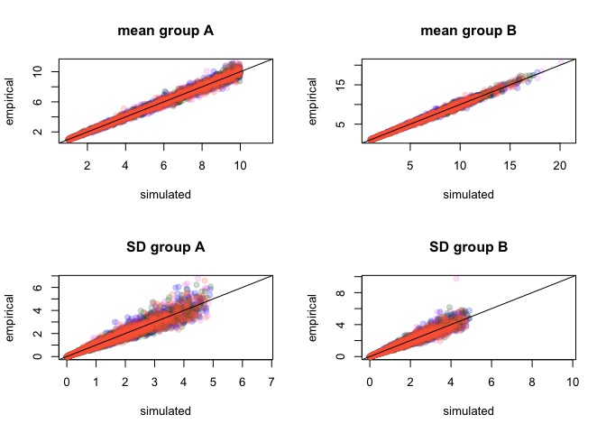

Simulations
================

-   [False positives and power](#false-positives-and-power)
    -   [Running Analysis](#running-analysis)
    -   [Visualizing Results](#visualizing-results)
-   [Threshold scenario: high within-group variability, centroid distance ~1JND](#threshold-scenario-high-within-group-variability-centroid-distance-1jnd)
    -   [Running analyses](#running-analyses)
    -   [Visualizing results](#visualizing-results-1)

``` r
require(pavo)
```

    ## Loading required package: pavo

``` r
require(vegan)
```

    ## Loading required package: vegan

    ## Loading required package: permute

    ## Loading required package: lattice

    ## This is vegan 2.4-3

``` r
require(RColorBrewer)
```

    ## Loading required package: RColorBrewer

``` r
# load aesthetic functions (plot, make colors transparent)
source('R/aesthetic.R')

# load function to convert JND to cartesian coordinates
source('R/jnd2xyz.R')

# load simulation and analysis functions
source('R/simfoos.R')
source('R/simanalysis.R')
```

False positives and power
=========================

We will simulate data with varying effect sizes (centroid distance relative to the variance-covariance matrix, or Mahalanobis distance):

``` r
effs <- c(0, 0.1, 0.25, 0.5, 0.75, 1, 1.5, 2, 2.5, 3)
timeseach <- 200
simN <- 50

effsims <- rep(effs, each=timeseach)

simulatedata <- lapply(effsims,
                       function(x)
                       simdich(N=simN, sgsqsrate=0.5, multiplier=NULL, effsize=x)
                       )


# we need to add the reference points since we didn't run vismodel()
#apply(do.call(rbind, lapply(simulatedata, function(x) apply(x, 2, max))), 2, max)
#data(sicalis)
#rfs <- attr(vismodel(sicalis, visual='star',relative=FALSE), 'resrefs')

rfs <- 
matrix(c(100,01,01,01,
         01,100,01,01,
         01,01,100,01,
         01,01,01,100,
         50,50,50,50
         ), ncol=4, byrow=TRUE)
rownames(rfs) <- c('refforjnd2xyz.u','refforjnd2xyz.s','refforjnd2xyz.m','refforjnd2xyz.l', 'refforjnd2xyz.acent')
colnames(rfs) <- c('u','s','m','l')

simulatedata <- lapply(simulatedata, 'attr<-', which='resrefs', value=rfs)


simulatecoldist <- parallel::mclapply(simulatedata, function(x) {
  Y <- suppressWarnings(coldist(x, achro=FALSE, qcatch='Qi'))
  Y$comparison <- NA
  Y$comparison[grepl('A', Y$patch1) & grepl('A', Y$patch2)] <- 'intra.A'
  Y$comparison[grepl('B', Y$patch1) & grepl('B', Y$patch2)] <- 'intra.B'
  Y$comparison[grepl('A', Y$patch1) & grepl('B', Y$patch2)] <- 'inter'
  Y
  }, mc.cores=4)
```

Validating simulations:



Verifying that values obtained in the simulation (empirical) are close to what we wanted to simulate (simulated) for the four cones (violet, blue, green, red)

Running Analysis
----------------

Run adonis, volume overlap, calculate distance between centroids:

``` r
gc(verbose=FALSE)
adonissim <- parallel::mclapply(simulatecoldist, adoniscoldist, mc.cores=4)
vovsim <- parallel::mclapply(simulatedata, voloverlaptest, mc.cores=4)
centdist <- unlist(lapply(simulatedata, centroidist))
gc(verbose=FALSE)
```

Run Pyke MANOVA:

``` r
scd2 <- lapply(simulatecoldist,'[', ,1:3, drop=FALSE)
for(i in 1:length(scd2)){
  attr(scd2[[i]], 'resrefs') <- attr(simulatecoldist[[i]],'resrefs')
  attr(scd2[[i]], 'conenumb') <- attr(simulatecoldist[[i]],'conenumb')
  }

pykesim <- lapply(scd2, jnd2xyz)
pykelm <- lapply(pykesim, function(x) lm(as.matrix(x) ~ rep(c('gA','gB'), each=50)))
pykemanova <- lapply(pykelm, function(x) summary(manova(x)))

vovpyke <- parallel::mclapply(pykesim, function(x)
  voloverlap(x[1:simN,], x[(simN+1):(simN*2), ]), mc.cores=4)
```

Calculate statistics of interest:

``` r
# Pyke MANOVA: P-values, which significant
manovaPval <- unlist(lapply(pykemanova, function(x) x$stats[1,'Pr(>F)']))
manovaP <- manovaPval < 0.05

# Adonis: P-values, which significant, R-squared
adonisPval <- unlist(lapply(adonissim, function(x) x$aov.tab$'Pr(>F)'[1]))
adonisP <- adonisPval < 0.05
adonisR2 <- unlist(lapply(adonissim, function(x) x$aov.tab$'R2'[1])) * 100

# Disagreement in significance between Pyke and Adonis
disagreement <- !manovaP == adonisP

# Proportion of tests significant by effect size, according to each method
pvsimsadonis <- tapply(adonisP, effsims, mean)
pvsimsmanova <- tapply(manovaP, effsims, mean)

# Volume overlap
overlap <- unlist(lapply(vovsim, '[','vboth')) * 100
overlapyke <- unlist(lapply(vovpyke, '[','vboth')) * 100


# Centroids: intra-group distances, inter-group distances, which centroid distances > 1
gmeans <- lapply(simulatecoldist, function(x) tapply(x$dS, x$comparison, mean))
gmeans <- do.call(rbind, gmeans)

intradist <- rowMeans(gmeans[, -1])
interdist <- gmeans[,"inter"]

centroidP <- centdist > 1

# Mahalanobis distance between centroids
mahd <- unlist(lapply(simulatedata, function(x) sqrt(mahalanobis(colMeans(x[1:50,]), colMeans(x[51:100,]), cov(x[1:50,]) ))))

# Color palette for plots
palette <- rcbalpha(0.8, 4, 'Set1')

#sigpal <- as.character(factor(adonisP, labels=palette[1:2]))
sigpal <- as.character(factor(paste(adonisP, centroidP), 
          levels=c("FALSE FALSE", "FALSE TRUE", "TRUE FALSE", "TRUE TRUE"), 
          labels=rcbalpha(0.8, 6, 'RdBu')[c(3,1,6,4)] ))
```

Visualizing Results
-------------------


The simulation was successful in producing samples that had the desired mahalanobis distance. There is some spread because of the small sample size relative to the dimensionality of the dataset, and for that reason the distances between groups asymptotes before zero.


Both tests had similar power. For very low effect sizes, Type-I Error rate is close to the desired 0.05 (dashed line).

Both tests are quite sensitive too, with signifcant results when the distance between centroids is of about the same magnitude as the pooled standard deviations. Further, Pyke-MANOVA seems less conservative overall than Adonis, though they are very close to each other at very small effect sizes.


However, there is some discrepancy in test results. There doesn't seem to be a bias - results are centered around the 1:1 line, difference in P-values from the tests is centered and mostly symmetric around 0. But there are occasions in which results are significant for one test but not the other (red; the space between the dashed lines in the first plot).

So tests have similar power but disagree as to the outcome in terms of what is significant:

    ##        manovaP
    ## adonisP  FALSE   TRUE
    ##   FALSE 0.4680 0.0810
    ##   TRUE  0.0245 0.4265

About 10% divergence in results, maybe not worth worrying about. Note that most of the discrepancy comes from results that are significant in MANOVA but not in Adonis, suggesting again that MANOVA approach is less conservative.

There is disagreement particularly when the effect size is marginal: 


Even though centroid distance increases with effect size, there's a lot of spread, which is the core of the problem we're trying to address - you can have a huge centroid distance with a small Mahalanobis distance (small separation bewtwen the groups). Note centroid is in log scale.


R2 increases with increasing effect size, which is good. We can also see that even though a lot of the simulations have a distance between centroids greater than 1 (0.969), they are still not significant (red) according to either approach. Transition from non-siginificant to significant occurs for Mahalanobis Distance between 0.5 and 1.


This just shows the Pyke transformation is working and that the Euclidean distance between the centroids calculated in this transformed space is identical to the distance between the centroids in JNDs.

Threshold scenario: high within-group variability, centroid distance ~1JND
==========================================================================

Generate data

``` r
simN <- 50

simulatedata3a <- replicate(500, 
# this gave some interesting results we might want to revisit.
#                  simdich(N=simN, sgsqsrate=1, sdmeanratio=FALSE, multiplier=c(0.95, 1.05)), 
                  simdich(N=simN, sgsqsrate=5, sdmeanratio=FALSE, multiplier=c(0.97, 1.03)),
                  simplify=FALSE)

simulatedata3b <- replicate(500, 
                  simdich(N=simN, sgsqsrate=5, sdmeanratio=FALSE, multiplier=c(0.97, 1.03)),
                  simplify=FALSE)

simulatedata3 <- c(simulatedata3a, simulatedata3b)
rm(simulatedata3a, simulatedata3b)
# we need to add the reference points since we didn't run vismodel()
#apply(do.call(rbind, lapply(simulatedata, function(x) apply(x, 2, max))), 2, max)
#data(sicalis)
#rfs <- attr(vismodel(sicalis, visual='star',relative=FALSE), 'resrefs')

rfs <- 
matrix(c(100,01,01,01,
         01,100,01,01,
         01,01,100,01,
         01,01,01,100,
         50,50,50,50
         ), ncol=4, byrow=TRUE)
rownames(rfs) <- c('refforjnd2xyz.u','refforjnd2xyz.s','refforjnd2xyz.m','refforjnd2xyz.l', 'refforjnd2xyz.acent')
colnames(rfs) <- c('u','s','m','l')

simulatedata3 <- lapply(simulatedata3, 'attr<-', which='resrefs', value=rfs)


simulatecoldist3a <- parallel::mclapply(simulatedata3[1:500], function(x) {
  Y <- suppressWarnings(coldist(x, achro=FALSE, qcatch='Qi'))
  Y$comparison <- NA
  Y$comparison[grepl('A', Y$patch1) & grepl('A', Y$patch2)] <- 'intra.A'
  Y$comparison[grepl('B', Y$patch1) & grepl('B', Y$patch2)] <- 'intra.B'
  Y$comparison[grepl('A', Y$patch1) & grepl('B', Y$patch2)] <- 'inter'
  Y
  }, mc.cores=4)

simulatecoldist3b <- parallel::mclapply(simulatedata3[501:1000], function(x) {
  Y <- suppressWarnings(coldist(x, achro=FALSE, qcatch='Qi'))
  Y$comparison <- NA
  Y$comparison[grepl('A', Y$patch1) & grepl('A', Y$patch2)] <- 'intra.A'
  Y$comparison[grepl('B', Y$patch1) & grepl('B', Y$patch2)] <- 'intra.B'
  Y$comparison[grepl('A', Y$patch1) & grepl('B', Y$patch2)] <- 'inter'
  Y
  }, mc.cores=4)

simulatecoldist3 <- c(simulatecoldist3a, simulatecoldist3b)
rm(simulatecoldist3a, simulatecoldist3b)
```

Validating simulations:


Verifying that values obtained in the simulation (empirical) are close to what we wanted to simulate (simulated) for the four cones (violet, blue, green, red)


mean centroid distance of 0.2584677, quantiles of 0.0671478, 0.647076

Running analyses
----------------

``` r
adonissim3a <- parallel::mclapply(simulatecoldist3[1:500], adoniscoldist, mc.cores=4)
Sys.sleep(10)
adonissim3b <- parallel::mclapply(simulatecoldist3[501:1000], adoniscoldist, mc.cores=4)
adonissim3 <- c(adonissim3a, adonissim3b)
vovsim3 <- parallel::mclapply(simulatedata3, voloverlaptest, mc.cores=4)

scd23 <- lapply(simulatecoldist3,'[', ,1:3, drop=FALSE)
for(i in 1:length(scd23)){
  attr(scd23[[i]], 'resrefs') <- attr(simulatecoldist3[[i]],'resrefs')
  attr(scd23[[i]], 'conenumb') <- attr(simulatecoldist3[[i]],'conenumb')
  }
```

``` r
pykesim3 <- lapply(scd23, jnd2xyz)
pykelm3 <- lapply(pykesim3, function(x) lm(as.matrix(x) ~ rep(c('gA','gB'), each=50)))
pykemanova3 <- lapply(pykelm3, function(x) summary(manova(x)))
vovpyke3 <- parallel::mclapply(pykesim3, function(x)
  voloverlap(x[1:simN,], x[(simN+1):(simN*2), ]), mc.cores=6)

gc(verbose=FALSE)
```

    ##             used   (Mb) gc trigger   (Mb)  max used   (Mb)
    ## Ncells  12120396  647.3   20885653 1115.5  17371378  927.8
    ## Vcells 223264675 1703.4  336383250 2566.5 336350266 2566.2

Visualizing results
-------------------

color legend:

-   dark colors: methods disagree (BAD)
-   light colors: methods agree (GOOD)

-   light blue: adonis and centroid distance &gt; 1 (GOOD)
-   dark blue: adonis significant, centroid distance &lt; 1 (BAD)
-   dark red: adonis non-significant, centroid distance &gt; 1 (BAD)
-   light red: adonis and centroid distance &lt; 1 (GOOD) 

``` r
sessionInfo()
```

    ## R version 3.4.1 (2017-06-30)
    ## Platform: x86_64-apple-darwin15.6.0 (64-bit)
    ## Running under: macOS Sierra 10.12.6
    ## 
    ## Matrix products: default
    ## BLAS: /Library/Frameworks/R.framework/Versions/3.4/Resources/lib/libRblas.0.dylib
    ## LAPACK: /Library/Frameworks/R.framework/Versions/3.4/Resources/lib/libRlapack.dylib
    ## 
    ## locale:
    ## [1] en_US.UTF-8/en_US.UTF-8/en_US.UTF-8/C/en_US.UTF-8/en_US.UTF-8
    ## 
    ## attached base packages:
    ## [1] stats     graphics  grDevices utils     datasets  methods   base     
    ## 
    ## other attached packages:
    ## [1] RColorBrewer_1.1-2 vegan_2.4-3        lattice_0.20-35   
    ## [4] permute_0.9-4      pavo_1.2.1        
    ## 
    ## loaded via a namespace (and not attached):
    ##  [1] Rcpp_0.12.12         cluster_2.0.6        knitr_1.16          
    ##  [4] magrittr_1.5         maps_3.2.0           magic_1.5-6         
    ##  [7] MASS_7.3-47          scatterplot3d_0.3-40 geometry_0.3-6      
    ## [10] stringr_1.2.0        tools_3.4.1          parallel_3.4.1      
    ## [13] grid_3.4.1           nlme_3.1-131         mgcv_1.8-17         
    ## [16] htmltools_0.3.6      yaml_2.1.14          rprojroot_1.2       
    ## [19] digest_0.6.12        Matrix_1.2-10        mapproj_1.2-5       
    ## [22] rcdd_1.2             evaluate_0.10.1      rmarkdown_1.6       
    ## [25] stringi_1.1.5        compiler_3.4.1       backports_1.1.0

``` r
plotrange <- function(x, log=TRUE){
  res <- range(x)
  res[1] <- floor(res[1])
  res[2] <- ceiling(res[2])
  if(log && res[1] == 0)
    res[1] <- range(x)[1]*0.8
  
  if(log && res[2] < 10)
    res[2] <- 10
  
  res
}

############
# EXAMPLES #
############
pdf(height=4*1.3, width=7*1.3, file='figures/exampletetra.pdf')
par(mfrow=c(1,2))
eg1 <- simulatedata[[10]]
attr(eg1, 'conenumb') <- '4'
attr(eg1, 'relative') <- FALSE
attr(eg1, 'qcatch') <- 'Qi'
class(eg1) <- c('vismodel', 'data.frame')
plot(colspace(eg1), col=rep(palette[1:2], each=50), view=200, scale.y=2, out.lwd=2, vertexsize=2, margin=c(1,0,1,0))
```

    ## Warning: Quantum catch are not relative, and have been transformed

``` r
eg2 <- simulatedata[[2000]]
attr(eg2, 'conenumb') <- '4'
attr(eg2, 'relative') <- FALSE
attr(eg2, 'qcatch') <- 'Qi'
class(eg2) <- c('vismodel', 'data.frame')
plot(colspace(eg2), col=rep(palette[1:2], each=50), view=200, scale.y=2, out.lwd=2, vertexsize=2, margin=c(1,0,1,0))
```

    ## Warning: Quantum catch are not relative, and have been transformed

``` r
dev.off()
```

    ## pdf 
    ##   2

``` r
######################
# RESULTS FROM SIM 1 #
######################
pdf(height=4*1.3, width=7*1.3, file='figures/samplesize_3.pdf')
par(mfrow=c(1,2))

plot(centdist~mahd, pch=21, 
     xlim=c(0.05, 10), ylim=c(0.1,100),
     col=NA, 
     bg=as.character(factor(adonisP, labels=palette[1:2])),
     log='xy', yaxt='n', xaxt='n',
     ylab='Distance between centroids (JND)', xlab='Effect size (Mahalanobis distance)')

axis(1, at=c(0.1, 1, 10), labels=c(0.1, 1, 10))
axis(1, at=c(seq(0.06,0.09, by=0.01), seq(0.2,0.9, by=0.1), seq(2,9, by=1)), tcl=par("tcl")*0.5, labels=FALSE)
axis(2, at=c(0.1, 1, 10, 100), labels=c(0.1, 1, 10, 100))
axis(2, at=c(seq(0.2,0.9, by=0.1), seq(2,9, by=1), seq(20,90, by=10)), tcl=par("tcl")*0.5, labels=FALSE)

abline(h=1,lty=3, lwd=2)

legend('topleft', bty='n', pch=21, col=NA, pt.bg=palette[1:2], 
       legend=c('p > 0.05', 'p < 0.05'))


plot(overlap~mahd, pch=21, 
     xlim=c(0.05, 10), ylim=c(0,80),
     bg=as.character(factor(adonisP, labels=palette[1:2])), 
     col=NA,
     log='x', yaxt='n', xaxt='n',
     ylab='Colour volume overlap (%)', xlab='Effect size (Mahalanobis distance)')

axis(1, at=c(0.1, 1, 10), labels=c(0.1, 1, 10))
axis(1, at=c(seq(0.06,0.09, by=0.01), seq(0.2,0.9, by=0.1), seq(2,9, by=1)), tcl=par("tcl")*0.5, labels=FALSE)
axis(2, at=c(0, 20, 40, 60, 80))

dev.off()
```

    ## pdf 
    ##   2

``` r
######################
# RESULTS FROM SIM 2 #
######################
pdf(height=4*1.3, width=7*1.3, file='figures/threshold_1.pdf')
par(mfrow=c(2,3), mar=c(4,5,1,1))

plot(centdistT~intradistT, 
     xlab='mean within-group distance (JND)\n ', ylab=' \ncentroid distance (JND)', 
     ylim=plotrange(c(intradistT,centdistT)), xlim=plotrange(c(intradistT,centdistT)), 
     pch=21, bg=sigpalT, col=NA, log='xy', yaxt='n', xaxt='n')
axis(1, at=c(0.1, 1, 10), labels=c(0.1, 1, 10))
axis(1, at=c(seq(0.2,0.9, by=0.1), seq(2,9, by=1)), tcl=par("tcl")*0.5, labels=FALSE)
axis(2, at=c(0.1, 1, 10), labels=c(0.1, 1, 10))
axis(2, at=c(seq(0.2,0.9, by=0.1), seq(2,9, by=1)), tcl=par("tcl")*0.5, labels=FALSE)

abline(0,1, lty=2)
abline(h=1, lty=3)
abline(v=1, lty=3)
abline(-0.5, 1, lty=5, col='grey')

#the grey line represents an intercept of 1/sqrt(4) so MahD = 1

legend('topleft', pch=21, cex=0.9, bty='n', col=NA, pt.bg=rcbalpha(1, 6, 'RdBu')[c(1,3,6,4)],
       legend=c('p > 0.05, JND > 1',
                'p > 0.05, JND < 1',
                'p < 0.05, JND < 1',
                'p < 0.05, JND > 1'))

plot(adonisR2T~centdistT, 
     ylab=expression(paste(R^2,' (%)')), xlab='centroid distance (JND)\n ', 
     ylim=plotrange(adonisR2T), xlim=plotrange(centdistT),
     pch=21, bg=sigpalT, col=NA, log='xy', yaxt='n', xaxt='n')
#axis(2, at=c(0.05, 0.5, 5, 50), labels=c(0.05, 0.5, 5, 50))
axis(2, at=c(0.01, 0.1, 1, 10,100), labels=c(0.01, 0.1, 1, 10,100))
#axis(2, at=c(0.06,0.07,0.08,0.09, 0.2, 0.3, 0.4, 0.6, 0.7, 0.8, 0.9, 2, 3, 4, 6, 7, 8, 9, 20, 30, 40), tcl=par("tcl")*0.5, labels=FALSE)
axis(2, at=c(seq(0.02,0.09,by=0.01), seq(0.2,0.9,by=0.1), seq(2,9,by=1), seq(20,90,by=10)), tcl=par("tcl")*0.5, labels=FALSE)
#axis(2, at=c(0.1, 1, 10), tcl=par("tcl")*1, labels=FALSE)
axis(1, at=c(0.1, 1, 10), labels=c(0.1, 1, 10))
axis(1, at=c(seq(0.2,0.9, by=0.1), seq(2,9, by=1)), tcl=par("tcl")*0.5, labels=FALSE)

abline(v=1, lty=3)
abline(h=3, lty=3)

plot(adonisR2T~overlapT, 
     ylab=expression(paste(R^2,' (%)')), xlab='color volume overlap (%)\n ',  
     ylim=c(0.01, 100), xlim=plotrange(overlapT, log=FALSE),
     pch=21, bg=sigpalT, col=NA, log='y', yaxt='n', xaxt='n')
axis(1, at=c(0,20,40,60))
#axis(2, at=c(0.05, 0.5, 5, 50), labels=c(0.05, 0.5, 5, 50))
axis(2, at=c(0.01, 0.1, 1, 10,100), labels=c(0.01, 0.1, 1, 10,100))
#axis(2, at=c(0.06,0.07,0.08,0.09, 0.2, 0.3, 0.4, 0.6, 0.7, 0.8, 0.9, 2, 3, 4, 6, 7, 8, 9, 20, 30, 40), tcl=par("tcl")*0.5, labels=FALSE)
axis(2, at=c(seq(0.02,0.09,by=0.01), seq(0.2,0.9,by=0.1), seq(2,9,by=1), seq(20,90,by=10)), tcl=par("tcl")*0.5, labels=FALSE)
#axis(2, at=c(0.1, 1, 10), tcl=par("tcl")*1, labels=FALSE)

plot(overlapykeT~overlapT, 
     ylab="color volume overlap \n(perceptually-corrected, %)", 
     xlab="color volume overlap (%)\n ",
     ylim=plotrange(c(overlapykeT,overlapT), log=FALSE), xlim=plotrange(c(overlapykeT,overlapT), log=FALSE), 
     pch=21, bg=sigpalT, col=NA)
abline(0,1, lty=2)

plot(centdistT~overlapT,
     ylab=' \ncentroid distance (JND)', xlab='color volume overlap (%)\n ',
     ylim=plotrange(centdistT), xlim=plotrange(overlapT, log=FALSE),
     pch=21, bg=sigpalT, col=NA, log='y', yaxt='n', xaxt='n')
axis(1, at=c(0,20,40,60))
axis(2, at=c(0.1, 1, 10), labels=c(0.1, 1, 10))
axis(2, at=c(seq(0.2,0.9, by=0.1), seq(2,9, by=1)), tcl=par("tcl")*0.5, labels=FALSE)
abline(h=1, lty=3)


plot(centdistT~overlapykeT,
     ylab='centroid distance (JND)', xlab='color volume overlap \n(perceptually-corrected, %)',
     ylim=plotrange(centdistT), xlim=plotrange(overlapykeT, log=FALSE),
     pch=21, bg=sigpalT, col=NA, log='y', yaxt='n')
axis(2, at=c(0.1, 1, 10), labels=c(0.1, 1, 10))
axis(2, at=c(seq(0.2,0.9, by=0.1), seq(2,9, by=1)), tcl=par("tcl")*0.5, labels=FALSE)
abline(h=1, lty=3)
dev.off()
```

    ## pdf 
    ##   2
