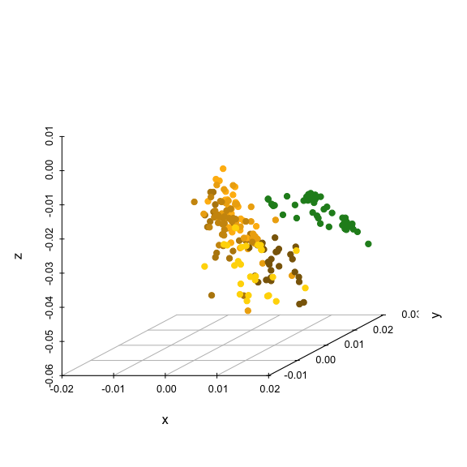

Possible examples w/ real data
==============================

``` r
source('R/bootstrapcentroiddS.R')

adoniscoldist <- function(x){
  dmat <- matrix(0, nrow=length(unique(x$patch1)), ncol=length(unique(x$patch1)))
  rownames(dmat) <- colnames(dmat) <- as.character(unique(x$patch1))
  
  for(i in rownames(dmat))
    for(j in colnames(dmat))
      if(length(x$dS[x$patch1 == i & x$patch2 == j]) != 0)
      dmat[i,j] <- dmat[j,i] <- x$dS[x$patch1 == i & x$patch2 == j]
  
  #grouping <- gsub('[0-9]','', rownames(dmat))
  grouping <- substring(rownames(dmat), 1, 1)
  
  adonis(dmat~grouping)
}
```

#### Example 1: Dichromatism.

Reflectance data from four body regions of male and female *Ctenophorus ornatus* (Whiting et al. 2015, Biol J Linn Soc). Labium, throat, tongue, and mouth-roof.

**Q:** Which body regions are sexually dichromatic?

Calculate deltaS according to conspecific (tetrachromatic) visual system

``` r
specs <- list(lab = as.rspec(read.csv('data/dichromatism/lab.csv'), interp = FALSE),
              throat = as.rspec(read.csv('data/dichromatism/throat.csv'), interp = FALSE),
              roof = as.rspec(read.csv('data/dichromatism/roof.csv'), interp = FALSE),
              tongue = as.rspec(read.csv('data/dichromatism/tongue.csv'), interp = FALSE))
```

    ## wavelengths found in column 1 
    ## wavelengths found in column 1 
    ## wavelengths found in column 1 
    ## wavelengths found in column 1

``` r
# Ctenophorus ornatus
liz_vis <- sensmodel(c(360, 440, 493, 571)) 
names(liz_vis) <- c('wl', 'u', 's', 'm', 'l')

models <- lapply(specs, function(x) vismodel(x, visual = liz_vis, relative = FALSE, 
                                             qcatch = "fi", scale = 10000))  # deltaS
models_rel <- lapply(specs, function(x) vismodel(x, visual = liz_vis, relative = TRUE, 
                                                 qcatch = "fi", scale = 10000))  # tcs 

deltaS <- lapply(models, function(x) coldist(x, achro = FALSE, n1 = 1, n2 = 1, 
                                             n3 = 3.5, n4 = 6, v = 0.10))

# To add group labels (because I'm bad at R and I feel bad)
liz_lab <- function(x){
  x$comparison[grepl('F', x$patch1) & grepl('F', x$patch2)] <- 'intra.F'
  x$comparison[grepl('M', x$patch1) & grepl('M', x$patch2)] <- 'intra.M'
  x$comparison[grepl('M', x$patch1) & grepl('F', x$patch2)] <- 'inter'
  x$comparison[grepl('F', x$patch1) & grepl('M', x$patch2)] <- 'inter'
  x
}

# ew
deltaS$lab <- liz_lab(deltaS$lab) 
deltaS$throat <- liz_lab(deltaS$throat)
deltaS$roof <- liz_lab(deltaS$roof)
deltaS$tongue <- liz_lab(deltaS$tongue)
```

Plot 'em

``` r
par(pty="s", mfrow = c(2, 2))

sp3d <- scatterplot3d(suppressWarnings(tcs(models_rel$lab[grepl("M", rownames(models_rel$lab)), ])
                                       [, c('x','y','z')]), pch=19, box=F, main = 'labium')
sp3d$points3d(suppressWarnings(tcs(models_rel$lab[grepl("F", rownames(models_rel$lab)), ])
                               [, c('x','y','z')]), col='red',pch=19)

sp3d <- scatterplot3d(suppressWarnings(tcs(models_rel$throat[grepl("M", rownames(models_rel$throat)), ])
                                       [, c('x','y','z')]), pch=19, box=F, main = 'throat')
sp3d$points3d(suppressWarnings(tcs(models_rel$throat[grepl("F", rownames(models_rel$throat)), ])
                               [, c('x','y','z')]), col='red',pch=19)

sp3d <- scatterplot3d(suppressWarnings(tcs(models_rel$roof[grepl("M", rownames(models_rel$roof)), ])
                                       [, c('x','y','z')]), pch=19, box=F, main = 'roof')
sp3d$points3d(suppressWarnings(tcs(models_rel$roof[grepl("F", rownames(models_rel$roof)), ])
                               [, c('x','y','z')]), col='red',pch=19)

sp3d <- scatterplot3d(suppressWarnings(tcs(models_rel$tongue[grepl("M", rownames(models_rel$tongue)), ])
                                       [, c('x','y','z')]), pch=19, box=F, main = 'tongue')
sp3d$points3d(suppressWarnings(tcs(models_rel$tongue[grepl("F", rownames(models_rel$tongue)), ])
                               [, c('x','y','z')]), col='red',pch=19)
```


``` r
p1 <- ggplot(deltaS$lab, aes(x=dS, fill=comparison)) + geom_histogram(bins=50) + 
        facet_grid(comparison~., scales='free_y') + geom_vline(xintercept=1) +
        ggtitle('labial') + theme(legend.position="none")

p2 <- ggplot(deltaS$throat, aes(x=dS, fill=comparison)) + geom_histogram(bins=50) + 
        facet_grid(comparison~., scales='free_y') + geom_vline(xintercept=1) +
        ggtitle('throat') + theme(legend.position="none")

p3 <- ggplot(deltaS$roof, aes(x=dS, fill=comparison)) + geom_histogram(bins=50) + 
        facet_grid(comparison~., scales='free_y') + geom_vline(xintercept=1) +
        ggtitle('roof') + theme(legend.position="none")

p4 <- ggplot(deltaS$tongue, aes(x=dS, fill=comparison)) + geom_histogram(bins=50) + 
        facet_grid(comparison~., scales='free_y') + geom_vline(xintercept=1) +
        ggtitle('tongue') + theme(legend.position="none")

grid.arrange(p1, p2, p3, p4, ncol=2)
```


**Step 1:** PERMANOVA

Labium

``` r
adoniscoldist(deltaS$lab)
```

    ## 
    ## Call:
    ## adonis(formula = dmat ~ grouping) 
    ## 
    ## Permutation: free
    ## Number of permutations: 999
    ## 
    ## Terms added sequentially (first to last)
    ## 
    ##           Df SumsOfSqs MeanSqs F.Model      R2 Pr(>F)    
    ## grouping   1     25.02 25.0199  14.117 0.20134  0.001 ***
    ## Residuals 56     99.25  1.7723         0.79866           
    ## Total     57    124.27                 1.00000           
    ## ---
    ## Signif. codes:  0 '***' 0.001 '**' 0.01 '*' 0.05 '.' 0.1 ' ' 1

Throat

``` r
adoniscoldist(deltaS$throat)
```

    ## 
    ## Call:
    ## adonis(formula = dmat ~ grouping) 
    ## 
    ## Permutation: free
    ## Number of permutations: 999
    ## 
    ## Terms added sequentially (first to last)
    ## 
    ##           Df SumsOfSqs MeanSqs F.Model      R2 Pr(>F)    
    ## grouping   1    33.764  33.764  14.978 0.20809  0.001 ***
    ## Residuals 57   128.495   2.254         0.79191           
    ## Total     58   162.259                 1.00000           
    ## ---
    ## Signif. codes:  0 '***' 0.001 '**' 0.01 '*' 0.05 '.' 0.1 ' ' 1

Mouth-roof

``` r
adoniscoldist(deltaS$roof)
```

    ## 
    ## Call:
    ## adonis(formula = dmat ~ grouping) 
    ## 
    ## Permutation: free
    ## Number of permutations: 999
    ## 
    ## Terms added sequentially (first to last)
    ## 
    ##           Df SumsOfSqs MeanSqs F.Model    R2 Pr(>F)
    ## grouping   1     0.537 0.53736 0.49025 0.009  0.544
    ## Residuals 54    59.189 1.09610         0.991       
    ## Total     55    59.727                 1.000

Tongue

``` r
adoniscoldist(deltaS$tongue)
```

    ## 
    ## Call:
    ## adonis(formula = dmat ~ grouping) 
    ## 
    ## Permutation: free
    ## Number of permutations: 999
    ## 
    ## Terms added sequentially (first to last)
    ## 
    ##           Df SumsOfSqs MeanSqs F.Model      R2 Pr(>F)
    ## grouping   1     2.029  2.0288  1.6766 0.02857  0.177
    ## Residuals 57    68.971  1.2100         0.97143       
    ## Total     58    71.000                 1.00000

**Conclusion**: labium = distinct, throat = distinct, mouth = nope, tongue = nope.

**Step 2:** Effect sizes.

Add grouping variable, then bootstrap centroids for different patches, as identified in step 1 (labium & throat).

``` r
# Groups
models$lab$group <- substring(rownames(models$lab), 1, 1)
models$throat$group <- substring(rownames(models$throat), 1, 1)
models$roof$group <- substring(rownames(models$roof), 1, 1)
models$tongue$group <- substring(rownames(models$tongue), 1, 1)

# labium
#bootcentroidDS(models$lab[,1:4], models$lab$group, achro = FALSE, n1 = 1, n2 = 1, n3 = 3.5, n4 = 6, v = 0.10)  # not working in dev pavo

# throat
#bootcentroidDS(models$throat[,1:4], models$throat$group, n1 = 1, n2 = 1, n3 = 3.5, n4 = 6, v = 0.10)
```

I think I'm running into bugs in pavo 1.0's coldist. I'll have to chase it down. This works with v 0.5.

``` r
rm(deltaS, models, models_rel, specs, liz_vis, liz_lab)
```

#### Example 2: Mimicry.

Reflectance data from colour-polymorphic female spiders *Gasteracantha fornicata*, and sympatic flowers from Qld, Australia. (W = white morph, Y = yellow morph, F = flowers)

So three groups, with **two Q's:**

**(1)** Are spiders actually polymorphic (to prey), as naively seems to be the case (for humans)?

**(2)** Do spiders (of each morph) resemble sympatric flowers?

``` r
# specs <- list(spider_w = as.rspec(read.csv('data/mimicry/spiders_white.csv'), interp = FALSE),
#               spider_y = as.rspec(read.csv('data/mimicry/spiders_yellow.csv'), interp = FALSE),
#               flower = as.rspec(read.csv('data/mimicry/flowers.csv'), interp = FALSE))

specs <- as.rspec(read.csv('data/mimicry/flowers_spiders.csv'), interp = FALSE)
```

    ## wavelengths found in column 1

Calculate deltaS (euclidean distances in the hexagon) according to a honeybee

``` r
# Honeybee

models <- vismodel(specs, visual = 'apis', relative = FALSE, vonkries = TRUE, 
                                             bkg = 'green', qcatch = "Ei")
# models_rel <- vismodel(specs, visual = 'apis', relative = TRUE, 
#                                                  qcatch = "fi", scale = 10000)  # max triangle
models_hex <- colspace(models, space = 'hexagon')

deltaS <- coldist(models_hex, achro = FALSE)

# Contrast labels
deltaS$comparison[grepl('W_', deltaS$patch1) & grepl('W_', deltaS$patch2)] <- 'intra.W'
deltaS$comparison[grepl('Y_', deltaS$patch1) & grepl('Y_', deltaS$patch2)] <- 'intra.Y'
deltaS$comparison[grepl('F_', deltaS$patch1) & grepl('F_', deltaS$patch2)] <- 'intra.F'
deltaS$comparison[grepl('Y_', deltaS$patch1) & grepl('W_', deltaS$patch2)] <- 'inter.WY'
deltaS$comparison[grepl('W_', deltaS$patch1) & grepl('F_', deltaS$patch2)] <- 'inter.WF'
deltaS$comparison[grepl('Y_', deltaS$patch1) & grepl('F_', deltaS$patch2)] <- 'inter.YF'
```

``` r
# col isn't working in initial plot call for some reason (pavo bug)
plot(models_hex[grepl("W_", rownames(models_hex)), ], col = 'darkgrey')  
points(models_hex[grepl("W_", rownames(models_hex)), ], col = 'darkgrey')  
points(models_hex[grepl("Y_", rownames(models_hex)), ], pch = 19, col = 'darkgoldenrod1')
points(models_hex[grepl("F_", rownames(models_hex)), ], pch = 19, col = 'forestgreen')
```


Check it. Note there are actually a couple of thresolds in the hexagon model (hence the two lines). &lt; 0.04 is indiscriminable, 0.04 to 0.11 requires differential aversive conditioning, &gt; 0.1 only absolute conditioning. i.e. impossible, hard, and easy to discriminate.

``` r
ggplot(deltaS, aes(x=dS, fill=comparison)) + geom_histogram(bins=50) + 
        facet_grid(comparison~., scales='free_y') + geom_vline(xintercept=c(0.04, 0.11)) +
        ggtitle('labial') + theme(legend.position="none")
```


**Step 1:** PERMANOVA.

On everything, combined. i.e. are these three groups different? Not really required in this situation since we have *a priori* planned tests.

``` r
adoniscoldist(deltaS)
```

    ## 
    ## Call:
    ## adonis(formula = dmat ~ grouping) 
    ## 
    ## Permutation: free
    ## Number of permutations: 999
    ## 
    ## Terms added sequentially (first to last)
    ## 
    ##            Df SumsOfSqs MeanSqs F.Model      R2 Pr(>F)    
    ## grouping    2    1.8644 0.93219  24.971 0.20728  0.001 ***
    ## Residuals 191    7.1301 0.03733         0.79272           
    ## Total     193    8.9945                 1.00000           
    ## ---
    ## Signif. codes:  0 '***' 0.001 '**' 0.01 '*' 0.05 '.' 0.1 ' ' 1

**Q1:** Are spiders polymorphic?

Spider-groups only

``` r
adoniscoldist(subset(deltaS, comparison != c('intra.F', 'inter.WF', 'inter.YF')))
```

    ## 
    ## Call:
    ## adonis(formula = dmat ~ grouping) 
    ## 
    ## Permutation: free
    ## Number of permutations: 999
    ## 
    ## Terms added sequentially (first to last)
    ## 
    ##            Df SumsOfSqs MeanSqs F.Model      R2 Pr(>F)    
    ## grouping    2    1.4049 0.70246  26.708 0.21854  0.001 ***
    ## Residuals 191    5.0237 0.02630         0.78146           
    ## Total     193    6.4286                 1.00000           
    ## ---
    ## Signif. codes:  0 '***' 0.001 '**' 0.01 '*' 0.05 '.' 0.1 ' ' 1

**Q2:** Do they bear an indistinguishable resemblance to sympatric flowers?

``` r
adoniscoldist(subset(deltaS, comparison != c('inter.WY')))  # drop white-yellow comparisons
```

    ## 
    ## Call:
    ## adonis(formula = dmat ~ grouping) 
    ## 
    ## Permutation: free
    ## Number of permutations: 999
    ## 
    ## Terms added sequentially (first to last)
    ## 
    ##            Df SumsOfSqs MeanSqs F.Model      R2 Pr(>F)    
    ## grouping    2    1.1399 0.56996  15.268 0.13784  0.001 ***
    ## Residuals 191    7.1301 0.03733         0.86216           
    ## Total     193    8.2700                 1.00000           
    ## ---
    ## Signif. codes:  0 '***' 0.001 '**' 0.01 '*' 0.05 '.' 0.1 ' ' 1

``` r
#bootcentroidDS(models$lab[,1:4], models$lab$group)
```

**Effect sizes**

``` r
models$group <- substring(rownames(models), 1, 1)
#bootcentroidDS(models[,1:3], models$group)
```

``` r
rm(deltaS, models, models_hex, specs)
```

#### Example 3: Crypsis.

Reflectance data from various body regions (H = head, L = left arm, R = right arm, P = prothorax, W = wing, A = abdomen) of 27 female mantids *Pseudomantis albofimbriata* and 50 background samples (*Lomandra longifolia*, which they pretty much exclusively hang on).

So six groups, one **Q:** Are mantids cryptic? i.e. are all body regions chromaticically indistinguishable from their background?

Calculate deltaS according to blue tits

``` r
specs <- as.rspec(read.csv('data/crypsis/mantids_bkgs.csv'), lim = c(300, 700))
```

    ## wavelengths found in column 1

``` r
models <- vismodel(specs, visual = 'bluetit', relative = FALSE, qcatch = "fi", scale = 10000)  # deltaS
models_rel <- vismodel(specs, visual = 'bluetit', relative = TRUE, qcatch = "fi", scale = 10000, achro = FALSE)  # tcs

deltaS <- coldist(models, achro = FALSE)

# Contrast labels. Only want intra-groups, and mantid-vs-background. No mantid-vs-mantid
# Intragroup
deltaS$comparison[grepl('H_', deltaS$patch1) & grepl('H_', deltaS$patch2)] <- 'intra.H'
deltaS$comparison[grepl('L_', deltaS$patch1) & grepl('L_', deltaS$patch2)] <- 'intra.L'
deltaS$comparison[grepl('R_', deltaS$patch1) & grepl('R_', deltaS$patch2)] <- 'intra.R'
deltaS$comparison[grepl('P_', deltaS$patch1) & grepl('P_', deltaS$patch2)] <- 'intra.P'
deltaS$comparison[grepl('A_', deltaS$patch1) & grepl('A_', deltaS$patch2)] <- 'intra.A'
deltaS$comparison[grepl('W_', deltaS$patch1) & grepl('W_', deltaS$patch2)] <- 'intra.W'

# Intergroup
deltaS$comparison[grepl('H_', deltaS$patch1) & grepl('B_', deltaS$patch2)] <- 'inter.HB'
deltaS$comparison[grepl('L_', deltaS$patch1) & grepl('B_', deltaS$patch2)] <- 'inter.LB'
deltaS$comparison[grepl('R_', deltaS$patch1) & grepl('B_', deltaS$patch2)] <- 'inter.RB'
deltaS$comparison[grepl('P_', deltaS$patch1) & grepl('B_', deltaS$patch2)] <- 'inter.PB'
deltaS$comparison[grepl('A_', deltaS$patch1) & grepl('B_', deltaS$patch2)] <- 'inter.AB'
deltaS$comparison[grepl('W_', deltaS$patch1) & grepl('B_', deltaS$patch2)] <- 'inter.WB'

# Ditch anything unlabelled (i.e. intra-mantid)
deltaS <- deltaS[complete.cases(deltaS),]
```

Plot 'em

``` r
sp3d <- scatterplot3d(suppressWarnings(tcs(models_rel[grepl("B_", rownames(models_rel)), ])
                                       [, c('x','y','z')]), xlim=c(-0.02,0.02), ylim=c(-0.01,0.028), zlim=c(-0.06,0.01), 
                                        pch=19, box=F, color = 'forestgreen')
sp3d$points3d(suppressWarnings(tcs(models_rel[grepl("H_", rownames(models_rel)), ])
                               [, c('x','y','z')]), col='darkgoldenrod',pch=19)
sp3d$points3d(suppressWarnings(tcs(models_rel[grepl("L_", rownames(models_rel)), ])
                               [, c('x','y','z')]), col='darkgoldenrod1',pch=19)
sp3d$points3d(suppressWarnings(tcs(models_rel[grepl("R_", rownames(models_rel)), ])
                               [, c('x','y','z')]), col='darkgoldenrod2',pch=19)
sp3d$points3d(suppressWarnings(tcs(models_rel[grepl("P_", rownames(models_rel)), ])
                               [, c('x','y','z')]), col='darkgoldenrod3',pch=19)
sp3d$points3d(suppressWarnings(tcs(models_rel[grepl("W_", rownames(models_rel)), ])
                               [, c('x','y','z')]), col='darkgoldenrod4',pch=19)
sp3d$points3d(suppressWarnings(tcs(models_rel[grepl("A_", rownames(models_rel)), ])
                               [, c('x','y','z')]), col='gold1',pch=19)
```



**Step 1:** PERMANOVA all the things.

``` r
adoniscoldist(deltaS)
```

    ## 
    ## Call:
    ## adonis(formula = dmat ~ grouping) 
    ## 
    ## Permutation: free
    ## Number of permutations: 999
    ## 
    ## Terms added sequentially (first to last)
    ## 
    ##            Df SumsOfSqs MeanSqs F.Model      R2 Pr(>F)
    ## grouping    5   -289.98 -57.996 -25.839 -5.0071      1
    ## Residuals 155    347.90   2.244          6.0071       
    ## Total     160     57.91                  1.0000

No difference? Huh. Was hoping for a below-threshold example. Need to poke around more.

**Step 2:** Effect sizes anyway

``` r
models$group <- substring(rownames(models), 1, 1)
#bootcentroidDS(models[,1:4], models$group)  # not working yet
```

``` r
sessionInfo()
```

    ## R version 3.3.1 (2016-06-21)
    ## Platform: x86_64-apple-darwin13.4.0 (64-bit)
    ## Running under: OS X 10.11.5 (El Capitan)
    ## 
    ## locale:
    ## [1] en_AU.UTF-8/en_AU.UTF-8/en_AU.UTF-8/C/en_AU.UTF-8/en_AU.UTF-8
    ## 
    ## attached base packages:
    ## [1] stats     graphics  grDevices utils     datasets  methods   base     
    ## 
    ## other attached packages:
    ## [1] lme4_1.1-12          Matrix_1.2-6         vegan_2.4-0         
    ## [4] lattice_0.20-33      permute_0.9-0        gridExtra_2.2.1     
    ## [7] ggplot2_2.1.0        scatterplot3d_0.3-37 pavo_0.99           
    ## 
    ## loaded via a namespace (and not attached):
    ##  [1] Rcpp_0.12.5      nloptr_1.0.4     formatR_1.4      plyr_1.8.4      
    ##  [5] tools_3.3.1      magic_1.5-6      digest_0.6.9     evaluate_0.9    
    ##  [9] gtable_0.2.0     nlme_3.1-128     mgcv_1.8-12      mapproj_1.2-4   
    ## [13] yaml_2.1.13      parallel_3.3.1   stringr_1.0.0    knitr_1.13      
    ## [17] cluster_2.0.4    maps_3.1.0       rcdd_1.1-10      grid_3.3.1      
    ## [21] rmarkdown_0.9.6  minqa_1.2.4      reshape2_1.4.1   magrittr_1.5    
    ## [25] scales_0.4.0     htmltools_0.3.5  MASS_7.3-45      splines_3.3.1   
    ## [29] colorspace_1.2-6 labeling_0.3     stringi_1.1.1    geometry_0.3-6  
    ## [33] munsell_0.4.3
