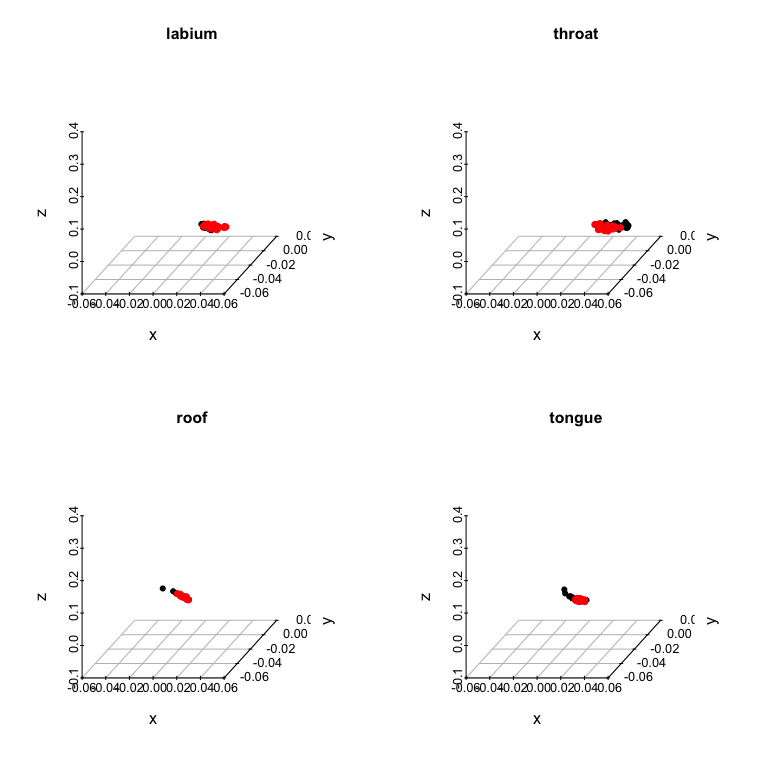
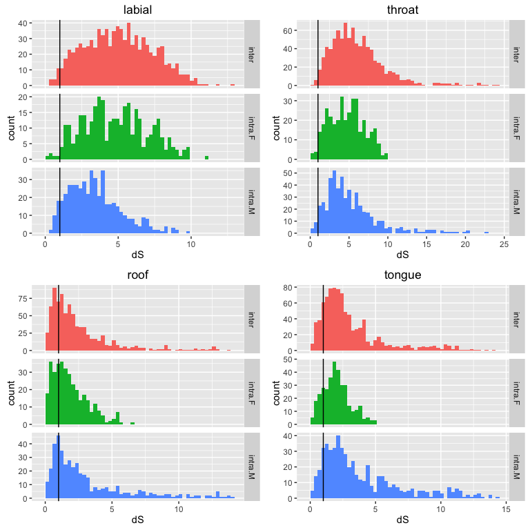

Example w/ real data
====================

### Reflectance data from several body regions of male and female *Ctenophorus ornatus* (Whiting et al. 2015, Biol J Linn Soc)

``` r
# Stolen from simspt2
adoniscoldist <- function(x){
  dmat <- matrix(0, nrow=length(unique(x$patch1)), ncol=length(unique(x$patch1)))
  rownames(dmat) <- colnames(dmat) <- as.character(unique(x$patch1))
  
  for(i in rownames(dmat))
    for(j in colnames(dmat))
      if(length(x$dS[x$patch1 == i & x$patch2 == j]) != 0)
      dmat[i,j] <- dmat[j,i] <- x$dS[x$patch1 == i & x$patch2 == j]
  
  grouping <- gsub('[0-9]','', rownames(dmat))
  
  adonis(dmat~grouping)
  }
```

Calculate deltaS

``` r
specs <- list(lab = as.rspec(read.csv('data/lab.csv'), interp = FALSE),
              throat = as.rspec(read.csv('data/throat.csv'), interp = FALSE),
              roof = as.rspec(read.csv('data/roof.csv'), interp = FALSE),
              tongue = as.rspec(read.csv('data/tongue.csv'), interp = FALSE))
```

    ## wavelengths found in column 1 
    ## wavelengths found in column 1 
    ## wavelengths found in column 1 
    ## wavelengths found in column 1

``` r
# Ctenophorus ornatus
liz_vis <- sensmodel(c(360, 440, 493, 571)) 
names(liz_vis) <- c('wl', 'u', 's', 'm', 'l')

models <- lapply(specs, function(x) vismodel(x, visual = liz_vis, relative = FALSE, 
                                             qcatch = "fi", scale = 10000))  # deltaS
models_rel <- lapply(specs, function(x) vismodel(x, visual = liz_vis, relative = TRUE, 
                                                 qcatch = "fi", scale = 10000))  # tcs 

deltaS <- lapply(models, function(x) coldist(x, achro = FALSE, n1 = 1, n2 = 1, 
                                             n3 = 3.5, n4 = 6, v = 0.10))

# To add group labels (because I'm bad at R and I feel bad)
comp_lab <- function(x){
  x$comparison[grepl('F', x$patch1) & grepl('F', x$patch2)] <- 'intra.F'
  x$comparison[grepl('M', x$patch1) & grepl('M', x$patch2)] <- 'intra.M'
  x$comparison[grepl('M', x$patch1) & grepl('F', x$patch2)] <- 'inter'
  x$comparison[grepl('F', x$patch1) & grepl('M', x$patch2)] <- 'inter'
  x
}

# ew
deltaS$lab <- comp_lab(deltaS$lab) 
deltaS$throat <- comp_lab(deltaS$throat)
deltaS$roof <- comp_lab(deltaS$roof)
deltaS$tongue <- comp_lab(deltaS$tongue)
```

Plot 'em

``` r
par(pty="s", mfrow = c(2, 2))

sp3d <- scatterplot3d(suppressWarnings(tcs(models_rel$lab[grepl("M", rownames(models_rel$lab)), ])
                                       [, c('x','y','z')]), pch=19, box=F, main = 'labium')
sp3d$points3d(suppressWarnings(tcs(models_rel$lab[grepl("F", rownames(models_rel$lab)), ])
                               [, c('x','y','z')]), col='red',pch=19)

sp3d <- scatterplot3d(suppressWarnings(tcs(models_rel$throat[grepl("M", rownames(models_rel$throat)), ])
                                       [, c('x','y','z')]), pch=19, box=F, main = 'throat')
sp3d$points3d(suppressWarnings(tcs(models_rel$throat[grepl("F", rownames(models_rel$throat)), ])
                               [, c('x','y','z')]), col='red',pch=19)

sp3d <- scatterplot3d(suppressWarnings(tcs(models_rel$roof[grepl("M", rownames(models_rel$roof)), ])
                                       [, c('x','y','z')]), pch=19, box=F, main = 'roof')
sp3d$points3d(suppressWarnings(tcs(models_rel$roof[grepl("F", rownames(models_rel$roof)), ])
                               [, c('x','y','z')]), col='red',pch=19)

sp3d <- scatterplot3d(suppressWarnings(tcs(models_rel$tongue[grepl("M", rownames(models_rel$tongue)), ])
                                       [, c('x','y','z')]), pch=19, box=F, main = 'tongue')
sp3d$points3d(suppressWarnings(tcs(models_rel$tongue[grepl("F", rownames(models_rel$tongue)), ])
                               [, c('x','y','z')]), col='red',pch=19)
```

<!-- -->

``` r
p1 <- ggplot(deltaS$lab, aes(x=dS, fill=comparison)) + geom_histogram(bins=50) + 
        facet_grid(comparison~., scales='free_y') + geom_vline(xintercept=1) +
        ggtitle('labial') + theme(legend.position="none")

p2 <- ggplot(deltaS$throat, aes(x=dS, fill=comparison)) + geom_histogram(bins=50) + 
        facet_grid(comparison~., scales='free_y') + geom_vline(xintercept=1) +
        ggtitle('throat') + theme(legend.position="none")

p3 <- ggplot(deltaS$roof, aes(x=dS, fill=comparison)) + geom_histogram(bins=50) + 
        facet_grid(comparison~., scales='free_y') + geom_vline(xintercept=1) +
        ggtitle('roof') + theme(legend.position="none")

p4 <- ggplot(deltaS$tongue, aes(x=dS, fill=comparison)) + geom_histogram(bins=50) + 
        facet_grid(comparison~., scales='free_y') + geom_vline(xintercept=1) +
        ggtitle('tongue') + theme(legend.position="none")

grid.arrange(p1, p2, p3, p4, ncol=2)
```

<!-- -->

### So what's sexually dichromatic?

#### Old school

Use mean inter-sex distance (eg. Bridge et al. 2008):

``` r
mean(deltaS$lab[deltaS$lab$comparison == 'inter', ][['dS']])
```

    ## [1] 5.059284

``` r
mean(deltaS$throat[deltaS$throat$comparison == 'inter', ][['dS']])
```

    ## [1] 6.083588

``` r
mean(deltaS$roof[deltaS$roof$comparison == 'inter', ][['dS']])
```

    ## [1] 2.514028

``` r
mean(deltaS$tongue[deltaS$tongue$comparison == 'inter', ][['dS']])
```

    ## [1] 3.025858

Or the maximums?? (eg. Burns & Schultz 2012):

``` r
max(deltaS$lab[deltaS$lab$comparison == 'inter', ][['dS']])
```

    ## [1] 12.71407

``` r
max(deltaS$throat[deltaS$throat$comparison == 'inter', ][['dS']])
```

    ## [1] 23.90123

``` r
max(deltaS$roof[deltaS$roof$comparison == 'inter', ][['dS']])
```

    ## [1] 13.76762

``` r
max(deltaS$tongue[deltaS$tongue$comparison == 'inter', ][['dS']])
```

    ## [1] 13.93182

Or run some t tests (eg. Igic et al. 2010):

``` r
t.test(deltaS$lab[deltaS$lab$comparison == 'inter', ][['dS']], mu = 1)
```

    ## 
    ##  One Sample t-test
    ## 
    ## data:  deltaS$lab[deltaS$lab$comparison == "inter", ][["dS"]]
    ## t = 51.623, df = 863, p-value < 2.2e-16
    ## alternative hypothesis: true mean is not equal to 1
    ## 95 percent confidence interval:
    ##  4.904951 5.213618
    ## sample estimates:
    ## mean of x 
    ##  5.059284

``` r
t.test(deltaS$throat[deltaS$throat$comparison == 'inter', ][['dS']], mu = 1)
```

    ## 
    ##  One Sample t-test
    ## 
    ## data:  deltaS$throat[deltaS$throat$comparison == "inter", ][["dS"]]
    ## t = 42.348, df = 890, p-value < 2.2e-16
    ## alternative hypothesis: true mean is not equal to 1
    ## 95 percent confidence interval:
    ##  5.847989 6.319187
    ## sample estimates:
    ## mean of x 
    ##  6.083588

``` r
t.test(deltaS$roof[deltaS$roof$comparison == 'inter', ][['dS']], mu = 1)
```

    ## 
    ##  One Sample t-test
    ## 
    ## data:  deltaS$roof[deltaS$roof$comparison == "inter", ][["dS"]]
    ## t = 17.577, df = 809, p-value < 2.2e-16
    ## alternative hypothesis: true mean is not equal to 1
    ## 95 percent confidence interval:
    ##  2.344950 2.683107
    ## sample estimates:
    ## mean of x 
    ##  2.514028

``` r
t.test(deltaS$tongue[deltaS$tongue$comparison == 'inter', ][['dS']], mu = 1)
```

    ## 
    ##  One Sample t-test
    ## 
    ## data:  deltaS$tongue[deltaS$tongue$comparison == "inter", ][["dS"]]
    ## t = 24.356, df = 890, p-value < 2.2e-16
    ## alternative hypothesis: true mean is not equal to 1
    ## 95 percent confidence interval:
    ##  2.862611 3.189105
    ## sample estimates:
    ## mean of x 
    ##  3.025858

...etc

**Conclusion**: Dimorphism everywhere!

#### New method

**Step 1:** Run permuational ANOVA (PERMANOVA) on lizard bits to ask if group A is different than group B

Labium

``` r
adoniscoldist(deltaS$lab)
```

    ## 
    ## Call:
    ## adonis(formula = dmat ~ grouping) 
    ## 
    ## Permutation: free
    ## Number of permutations: 999
    ## 
    ## Terms added sequentially (first to last)
    ## 
    ##           Df SumsOfSqs MeanSqs F.Model      R2 Pr(>F)    
    ## grouping   1    150.12 150.119  14.117 0.20134  0.001 ***
    ## Residuals 56    595.50  10.634         0.79866           
    ## Total     57    745.62                 1.00000           
    ## ---
    ## Signif. codes:  0 '***' 0.001 '**' 0.01 '*' 0.05 '.' 0.1 ' ' 1

Throat

``` r
adoniscoldist(deltaS$throat)
```

    ## 
    ## Call:
    ## adonis(formula = dmat ~ grouping) 
    ## 
    ## Permutation: free
    ## Number of permutations: 999
    ## 
    ## Terms added sequentially (first to last)
    ## 
    ##           Df SumsOfSqs MeanSqs F.Model      R2 Pr(>F)    
    ## grouping   1    202.58 202.583  14.978 0.20809  0.001 ***
    ## Residuals 57    770.97  13.526         0.79191           
    ## Total     58    973.55                 1.00000           
    ## ---
    ## Signif. codes:  0 '***' 0.001 '**' 0.01 '*' 0.05 '.' 0.1 ' ' 1

Mouth-roof

``` r
adoniscoldist(deltaS$roof)
```

    ## 
    ## Call:
    ## adonis(formula = dmat ~ grouping) 
    ## 
    ## Permutation: free
    ## Number of permutations: 999
    ## 
    ## Terms added sequentially (first to last)
    ## 
    ##           Df SumsOfSqs MeanSqs F.Model    R2 Pr(>F)
    ## grouping   1      3.22  3.2242 0.49025 0.009   0.49
    ## Residuals 54    355.14  6.5766         0.991       
    ## Total     55    358.36                 1.000

Tongue

``` r
adoniscoldist(deltaS$tongue)
```

    ## 
    ## Call:
    ## adonis(formula = dmat ~ grouping) 
    ## 
    ## Permutation: free
    ## Number of permutations: 999
    ## 
    ## Terms added sequentially (first to last)
    ## 
    ##           Df SumsOfSqs MeanSqs F.Model      R2 Pr(>F)
    ## grouping   1     12.17 12.1726  1.6766 0.02857  0.188
    ## Residuals 57    413.82  7.2601         0.97143       
    ## Total     58    426.00                 1.00000

**Conclusion**: labium = distinct, throat = distinct, mouth = nope, tongue = nope.

Much more sensible sensible based on the earlier plots & what the lizards actually look like (in the Whiting et al. paper). Neat.

**Step 2:** Does it crack the threshold?

...tbc

``` r
sessionInfo()
```

    ## R version 3.2.3 (2015-12-10)
    ## Platform: x86_64-apple-darwin13.4.0 (64-bit)
    ## Running under: OS X 10.11.5 (El Capitan)
    ## 
    ## locale:
    ## [1] en_AU.UTF-8/en_AU.UTF-8/en_AU.UTF-8/C/en_AU.UTF-8/en_AU.UTF-8
    ## 
    ## attached base packages:
    ## [1] stats     graphics  grDevices utils     datasets  methods   base     
    ## 
    ## other attached packages:
    ## [1] vegan_2.3-5          lattice_0.20-33      permute_0.9-0       
    ## [4] gridExtra_2.0.0      ggplot2_2.0.0        scatterplot3d_0.3-37
    ## [7] pavo_0.5-5           rgl_0.95.1441       
    ## 
    ## loaded via a namespace (and not attached):
    ##  [1] Rcpp_0.12.3      cluster_2.0.3    knitr_1.12.3     magrittr_1.5    
    ##  [5] MASS_7.3-45      maps_3.1.0       magic_1.5-6      munsell_0.4.3   
    ##  [9] colorspace_1.2-6 geometry_0.3-6   plyr_1.8.3       stringr_1.0.0   
    ## [13] tools_3.2.3      parallel_3.2.3   grid_3.2.3       nlme_3.1-124    
    ## [17] gtable_0.1.2     mgcv_1.8-9       htmltools_0.3    yaml_2.1.13     
    ## [21] digest_0.6.9     Matrix_1.2-3     reshape2_1.4.1   mapproj_1.2-4   
    ## [25] formatR_1.2.1    rcdd_1.1-10      evaluate_0.8     rmarkdown_0.9.5 
    ## [29] labeling_0.3     stringi_1.0-1    scales_0.3.0
