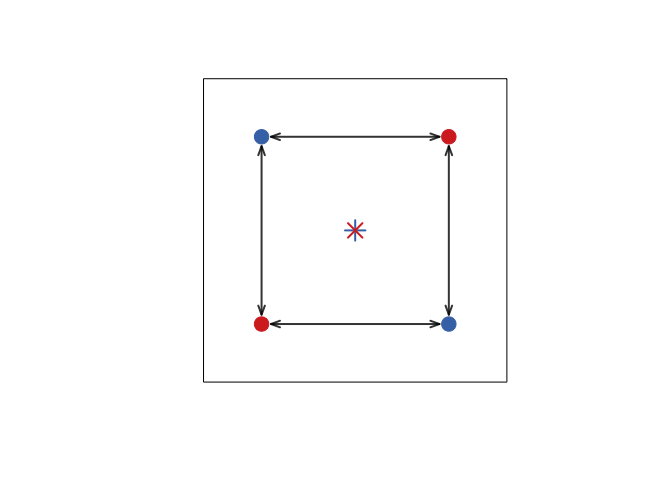

the 'mean difference and difference of means' problem
-----------------------------------------------------

In color analyses, a common approach to estimate the difference between two groups (say, colors of males and females) is to represent these colors as points in cartesian space, then measure the distance between all points in group A and those in group B (between-group distances) and averaging them. If this distance is greater than a stipulated threshold, then the groups are considered to be different. These are usually Euclidean or weighted Euclidean distances.

One problem with this approach is that there is an underlying assumption that the mean of the differences between color points of two different groups reflects the difference between the means of those two groups. That is, if I take all pairwise distances between points and average those, I am getting the same result as, or at least an approximation of, taking the mean of each of those groups and calculating the distance between those means.

mean(distances) ~ distance(means)

We can demonstrate that this does not follow because it overlooks a property of how these distances are calculated.

First, let's demonstrate the case in which it *is* true, to understand when it's *not*. We'll do it in one dimension for simplicity, where the distance between two numbers is just the difference between them.

Let's create a function that calculates the distance between all points in X and all points in Y (but not within X or within Y, just between groups), and then takes the average of those distances.

``` r
meandiff <- function(z1,z2){
  
  res <- vector('numeric', 0)
  
  for(i in 1:length(z1)){
    tmp <- z1[i] - z2
    res <- c(res,tmp)
  }
  
  mean(res)
}
```

(not at all an efficient function but will get the job done)

Now let's create two random samples, and we'll even make them different sample sizes (to show this is not a paired design).

``` r
set.seed(43805)
x <- rnorm(10, 50, 20)
y <- rnorm(13, 70, 20)
```

Now we can show that

``` r
mean(x) - mean(y)
```

    ## [1] -7.338469

gives us the same result as

``` r
meandiff(x,y)
```

    ## [1] -7.338469

But what happens when we look at distances? Let's test with Euclidean distances for this example.

``` r
meaneucdist <- function(z1, z2){
    
  res <- vector('numeric', 0)
  
  for(i in 1:length(z1)){
    tmp <- sqrt((z1[i]-z2)^2)
    res <- c(res,tmp)
  }
  
  mean(res)
}

meaneucdist(x,y)
```

    ## [1] 19.8612

Why does this give a different result? Well, that becomes very clear when we look at the formula for the Euclidean distance:

sqrt((x-y)^2)

Which, in one dimension, simplifies to... (drumrolls!)

|x - y|

Boom. There's our problem.

The Euclidean distance, and by consequence the JND distance, is **translation-invariant**. It ignores *position in space*. This is a desireable property when calculating distances sometimes, because it means 3 - 2 = 2 - 3 = -2 - (-3) = -3 - (-2). That is, regardless on where those two points are in space, *their difference will have the same magnitude*. Which is good - but **not when comparing populations of points!**, because in that case, **the position of points relative to one another matters (a lot!)**

In fact, the mean of Euclidean distances - mean(sqrt((xi - xj)^2)) - is related to the mean of the square root of the squared differences - mean(sqrt((mean(x) - xi)^2)) -, and the (mean) squared difference is a measure of spread, like the standard deviation. *It therefore will increase as a function of the *mean variance of the groups*, not the *mean distance between the groups**.


(I'm actually not sure this is a valid relationship or how it'd scale, but I think I'm on to something.)

Bringing this back to the problem of dichromatism, if color was one-dimensional, and you had:

males = c(2, -2)

females = c(2, -2)

You'd want those two groups to be the same (mean difference = 0). But a translation-invariant metric of distance (such as the Euclidean distance) would tell you they have a mean difference of 2.

To make it clearer how this applies to the comparison between groups in color space, let's show this in two dimensions: 

We can see that taking the average of those distance vectors (arrows) *ignoring their directions* would give a value greater than zero (which is the distance between their means, represented by crosses). Euclidean (and JND) distances ignore position information, which is critical when comparing groups of points.
