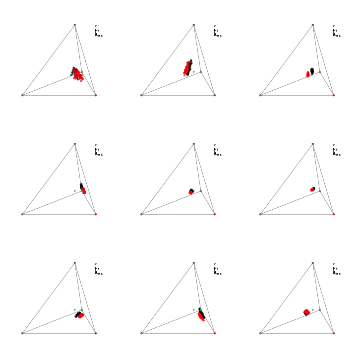
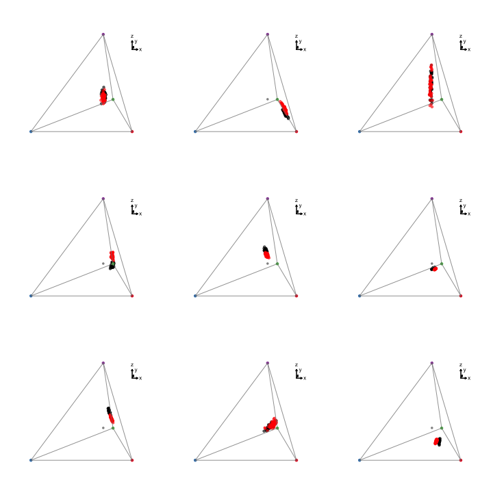
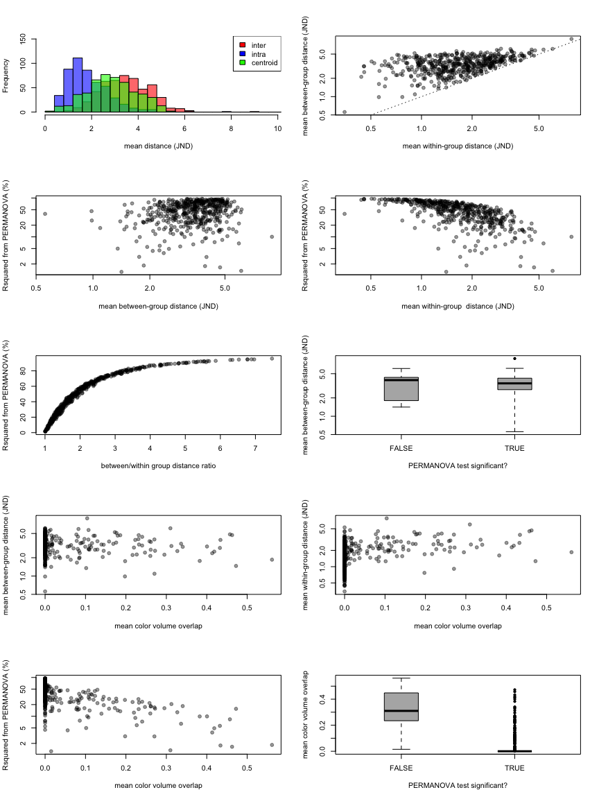

The Problem
-----------

people are really interested in using color and visual models to detect separation between groups (i.e. sexual dichromatism, \[sub\]species differences, so on). These models are really useful because we know from physiological studies that there's a "detection threshold" over which two colors are considered different. This translates to a weighted distance equation in units of "Just Noticeable Differences" (JND), and when these distances (in multivariate space) are above 1, then two colors are considered different.

Therefore, many studies have used the idea that if two groups differ in their means by over 1JND, they are different. So for example, if male colors are 1JND distant from female colors, the species is dichromatic, or if two subspecies are 1JND apart they are visually different.

However, this isn't statistically appropriate because there are conditions where you could take two samples from a same population and compare them and get means that are over 1JND apart. This is particularly problematic if the color is used as a signal, which by definition would require these colors *within a (statistical) population* to be perceptually distinct. That is, for exmaple, if male colors are an ornament and females can tell males apart by their color, then by definition male colors are on average over 1 JND apart - otherwise females wouldn't be able to tell them apart. So if you took two samples from a male population and calculated mean pairwise distances, you'd reach a conclusion that those two samples are "dichromatic", when they are obviously not.

This is of course a basic statistical problem that has permeated the literature: when comparing two distributions you need to consider the distance between means *relative to within-group variation*. That's what a t-test is. In the multivariate case where your "unit" of measure is a distance that because harder but there are methods that allow you to test this (e.g. permuational MANOVA).

Here I propose a two-tiered way of testing whether color differences exist between two groups. For two groups to be considered different, you need to answer "yes" to both these questions:

1.  are the two groups distinguisheable in multivariate space? (tested by permutational MANOVA)
2.  is the difference between these groups above the threshold value? (tested using mixed-models of between-group comparisons and estimating the average effect size and its confidence interval)

### TODO

-   get the centroid for each group, calculate distance between centroids, and between centroids and each point in that group; could be a measure of effect size? How would this relate to JNDs? (JND ratio would be dimensionless).

Simulation definitions
----------------------

-   *u**s**m**l* ∼ 𝓁𝓃𝒩(*l**n*(*μ*),*σ*<sup>2</sup>)
-   *μ*<sub>*u**s**m**l*</sub> ∼ 𝒰(1, 10), covariances = 0
-   *σ*<sub>*u**s**m**l*</sub><sup>2</sup> ∼ ℰ𝓍𝓅(*λ* = 10) (such that $\\overline{\\sigma^2} = 0.1$).
-   Also, *σ*<sub>*A*<sub>*u**s**m**l*</sub></sub><sup>2</sup> = *σ*<sub>*B*<sub>*u**s**m**l*</sub></sub><sup>2</sup>
-   difference between group A and group B: *μ*<sub>*A*<sub>*u**s**m**l*</sub></sub> = *μ*<sub>*B*<sub>*u**s**m**l*</sub></sub> \* *X*, where *X* ∼ 𝒰(0.95, 1.05) (that is, group B *usml* should be up to 5% different than group A *usml*)
-   *N*<sub>*A*</sub> = *N*<sub>*B*</sub> = 50

Make some functions

``` r
# tetrahedral plot
source('R/dichtcp.R')

# simulate two groups of data
simdich <- function(N=50, sgsqsrate=10, multiplier=c(0.95, 1.05)){

  musA <- runif(4, 1e-6, 1e0) # vector of means for group A
  musA <- runif(4, 1, 10)
  #musB <- musA*runif(4, .8, 1.2) # vector of means for group B
  #musB <- musA * rnorm(4, multiplier[1], multiplier[2])
  musB <- musA * runif(4, multiplier[1], multiplier[2])
  sgsqs <- rexp(4, sgsqsrate) # vector of standard deviations
  
  groupA <- matrix(NA, nrow=N, ncol=4)
  groupA[,1] <- rlnorm(N, meanlog=log(musA[1]), sdlog=sgsqs[1])
  groupA[,2] <- rlnorm(N, meanlog=log(musA[2]), sdlog=sgsqs[2])
  groupA[,3] <- rlnorm(N, meanlog=log(musA[3]), sdlog=sgsqs[3])
  groupA[,4] <- rlnorm(N, meanlog=log(musA[4]), sdlog=sgsqs[4])
  
  groupB <- matrix(NA, nrow=N, ncol=4)
  groupB[,1] <- rlnorm(N, meanlog=log(musB[1]), sdlog=sgsqs[1])
  groupB[,2] <- rlnorm(N, meanlog=log(musB[2]), sdlog=sgsqs[2])
  groupB[,3] <- rlnorm(N, meanlog=log(musB[3]), sdlog=sgsqs[3])
  groupB[,4] <- rlnorm(N, meanlog=log(musB[4]), sdlog=sgsqs[4])
  
  combined <- data.frame(rbind(groupA,groupB))
  
  colnames(combined) <- c('u','s','m', 'l')
  rownames(combined) <- paste(rep(c('gA','gB'), each=N),1:N, sep='')
  
  attr(combined, 'relative') <- FALSE
  
  simpars <- data.frame(rbind(musA, musB, sgsqs))
  colnames(simpars) <- c('u','s','m', 'l')
  rownames(simpars) <- c('muA','muB','ssq')
  attr(combined, 'simpar') <- simpars
  
  combined
  }

# make distance matrix and run adonis
adoniscoldist <- function(x){
  dmat <- matrix(0, nrow=length(unique(x$patch1)), ncol=length(unique(x$patch1)))
  rownames(dmat) <- colnames(dmat) <- as.character(unique(x$patch1))
  
  for(i in rownames(dmat))
    for(j in colnames(dmat))
      if(length(x$dS[x$patch1 == i & x$patch2 == j]) != 0)
      dmat[i,j] <- dmat[j,i] <- x$dS[x$patch1 == i & x$patch2 == j]
  
  grouping <- gsub('[0-9]','', rownames(dmat))
  
  adonis(dmat~grouping)
  }

# split data and run volume overlap
voloverlaptest <- function(dat){
  tcsdat <- suppressWarnings(tcs(dat))
  gA <- tcsdat[1:(dim(dat)[1]/2),]
  gB <- tcsdat[(dim(dat)[1]/2+1):(dim(dat)[1]),]
  
  voloverlap(gA, gB)
}

# split data, get centroids, get color distance
centroidist <- function(dat){
  gA.c <- colMeans(dat[1:(dim(dat)[1]/2),])
  gB.c <- colMeans(dat[(dim(dat)[1]/2+1):(dim(dat)[1]),])
  
  coldist(rbind(gA.c, gB.c), achro=FALSE)$dS
}
```

Simulate 500 datasets

``` r
simulatedata <- replicate(500, 
                  simdich(N=50, sgsqsrate=10, multiplier=c(0.95, 1.05)), 
                  simplify=FALSE)

simulatecoldist <- parallel::mclapply(simulatedata, function(x) {
  Y <- coldist(x, achro=FALSE)
  Y$comparison <- NA
  Y$comparison[grepl('A', Y$patch1) & grepl('A', Y$patch2)] <- 'intra.A'
  Y$comparison[grepl('B', Y$patch1) & grepl('B', Y$patch2)] <- 'intra.B'
  Y$comparison[grepl('A', Y$patch1) & grepl('B', Y$patch2)] <- 'inter'
  Y
  }, mc.cores=6)
```

Let's see what some of these simulations look like. We can see how similar groups are. This really is a threshold situation. We can also see that simulations do a pretty good job of covering the entire colorspace, as well as a wide range of correlations and variances.


**Step 1:** Run permuational ANOVA (PERMANOVA) on simulated data to ask if group A is different than group B

``` r
adonissim <- parallel::mclapply(simulatecoldist, adoniscoldist, mc.cores=6)
```

**Step 2:** Run a linear model to get average within- and between-group distances.

``` r
lmesim <- parallel::mclapply(simulatecoldist, function(x) 
  lmer(dS~comparison - 1 + (1|patch1) + (1|patch2), data=x), 
  mc.cores=6)
```

**Step 3** how does it compare to volume overlap?

``` r
vovsim <- parallel::mclapply(simulatedata, voloverlaptest, mc.cores=6)
```

**Step 4** Get JND distance between centroids

``` r
centdist <- unlist(parallel::mclapply(simulatedata, centroidist, mc.cores=6))
```

Let's see what our results look like


-   There is no association between how well groups can be told apart (PERMANOVA R-squared) and the mean between-group distances
-   Between-group JND distance fails to predict if the groups can be told apart (i.e. if the PERMANOVA is significant)
-   If anything these associations are negative - probably because of the mean-variance relationship in lognormal distributions?
-   I actually think now that it's because in overall low JNDs, the inter-group variance dominates, but in high JNDs it's essentially just the within-group varince (so lower resolution between-groups).

This is annoying, wasn't really what I was trying to simulate. But gets the point accross...

**For what it's worth**: There is a near-perfect correlation between estimates obtained from mixed-models and just taking the means within each group. Probably because the design is perfectly balanced. There is no correlation between this distance and the centroid distance, though, which I think is more appropriate.


Let's try some other simulations.

Test 1: increase within-group variance
--------------------------------------

Let's change *σ*<sub>*u**s**m**l*</sub><sup>2</sup> such that *σ*<sub>*u**s**m**l*</sub><sup>2</sup> ∼ ℰ𝓍𝓅(*λ* = 5) (and $\\overline{\\sigma^2} = 0.2$).

Simulate 500 datasets

``` r
simulatedata.t1 <- replicate(500, 
                  simdich(N=50, sgsqsrate=5, multiplier=c(0.95, 1.05)), 
                  simplify=FALSE)

simulatecoldist.t1 <- parallel::mclapply(simulatedata.t1, function(x) {
  Y <- coldist(x, achro=FALSE)
  Y$comparison <- NA
  Y$comparison[grepl('A', Y$patch1) & grepl('A', Y$patch2)] <- 'intra.A'
  Y$comparison[grepl('B', Y$patch1) & grepl('B', Y$patch2)] <- 'intra.B'
  Y$comparison[grepl('A', Y$patch1) & grepl('B', Y$patch2)] <- 'inter'
  Y
  }, mc.cores=6)
```

Groups still overlap a lot but their variation increased a LOT.

``` r
par(mfrow=c(3,3))

for(i in 1:9) dichtcp(simulatedata.t1[[i]])
```


**Step 1:** Run permuational ANOVA (PERMANOVA) on simulated data to ask if group A is different than group B

``` r
adonissim.t1 <- parallel::mclapply(simulatecoldist.t1, adoniscoldist, mc.cores=6)
```

**Step 2:** Run a linear model to get average within- and between-group distances.

``` r
lmesim.t1 <- parallel::mclapply(simulatecoldist.t1, function(x) 
  lmer(dS~comparison - 1 + (1|patch1) + (1|patch2), data=x), 
  mc.cores=6)
```

**Step 3** how does it compare to volume overlap?

``` r
vovsim.t1 <- parallel::mclapply(simulatedata.t1, voloverlaptest, mc.cores=6)
```

**Step 4** Get JND distance between centroids

``` r
centdist.t1 <- unlist(parallel::mclapply(simulatedata.t1, centroidist, mc.cores=6))
```

What do the results look like in this case?



We see the same results. Note that the between-group distance also increased tenfold, but that's just because of the within-group increase (they're essentially sampled from the same population!).

Test 2: increase between-group distance
---------------------------------------

Now let's change the multiplier for the difference between group A and group B such that *X* ∼ 𝒰(0.6, 1.4) (that is, group B *usml* should be up to 40% different than group A *usml*)

Simulate 500 datasets

``` r
simulatedata.t2 <- replicate(500, 
                  simdich(N=50, sgsqsrate=10, multiplier=c(0.6, 1.4)), 
                  simplify=FALSE)

simulatecoldist.t2 <- parallel::mclapply(simulatedata.t2, function(x) {
  Y <- coldist(x, achro=FALSE)
  Y$comparison <- NA
  Y$comparison[grepl('A', Y$patch1) & grepl('A', Y$patch2)] <- 'intra.A'
  Y$comparison[grepl('B', Y$patch1) & grepl('B', Y$patch2)] <- 'intra.B'
  Y$comparison[grepl('A', Y$patch1) & grepl('B', Y$patch2)] <- 'inter'
  Y
  }, mc.cores=6)
```

Groups still overlap a lot but their variation increased a LOT.

``` r
par(mfrow=c(3,3))

for(i in 1:9) dichtcp(simulatedata.t2[[i]])
```



**Step 1:** Run permuational ANOVA (PERMANOVA) on simulated data to ask if group A is different than group B

``` r
adonissim.t2 <- parallel::mclapply(simulatecoldist.t2, adoniscoldist, mc.cores=6)
```

**Step 2:** Run a linear model to get average within- and between-group distances.

``` r
lmesim.t2 <- parallel::mclapply(simulatecoldist.t2, function(x) 
  lmer(dS~comparison - 1 + (1|patch1) + (1|patch2), data=x), 
  mc.cores=6)
```

**Step 3** how does it compare to volume overlap?

``` r
vovsim.t2 <- parallel::mclapply(simulatedata.t2, voloverlaptest, mc.cores=6)
```

**Step 4** Get JND distance between centroids

``` r
centdist.t2 <- unlist(parallel::mclapply(simulatedata.t2, centroidist, mc.cores=6))
```

What do the results look like in this case?



``` r
sessionInfo()
```

    ## R version 3.3.0 (2016-05-03)
    ## Platform: x86_64-apple-darwin13.4.0 (64-bit)
    ## Running under: OS X 10.11.4 (El Capitan)
    ## 
    ## locale:
    ## [1] en_US.UTF-8/en_US.UTF-8/en_US.UTF-8/C/en_US.UTF-8/en_US.UTF-8
    ## 
    ## attached base packages:
    ## [1] stats     graphics  grDevices utils     datasets  methods   base     
    ## 
    ## other attached packages:
    ## [1] lme4_1.1-12          Matrix_1.2-6         vegan_2.4-0         
    ## [4] lattice_0.20-33      permute_0.9-0        scatterplot3d_0.3-37
    ## [7] pavo_0.5-5           rgl_0.95.1441       
    ## 
    ## loaded via a namespace (and not attached):
    ##  [1] Rcpp_0.12.5        cluster_2.0.4      knitr_1.13        
    ##  [4] magrittr_1.5       splines_3.3.0      maps_3.1.0        
    ##  [7] magic_1.5-6        MASS_7.3-45        minqa_1.2.4       
    ## [10] geometry_0.3-6     stringr_1.0.0      tools_3.3.0       
    ## [13] parallel_3.3.0     grid_3.3.0         nlme_3.1-127      
    ## [16] mgcv_1.8-12        htmltools_0.3.5    yaml_2.1.13       
    ## [19] digest_0.6.9       nloptr_1.0.4       mapproj_1.2-4     
    ## [22] formatR_1.4        rcdd_1.1-10        evaluate_0.9      
    ## [25] rmarkdown_0.9.6.10 stringi_1.0-1
