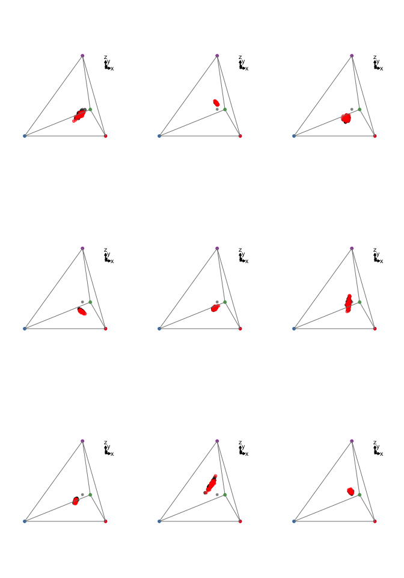
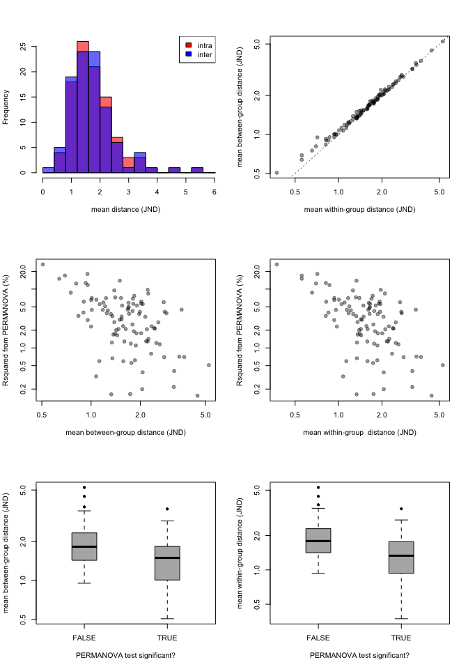
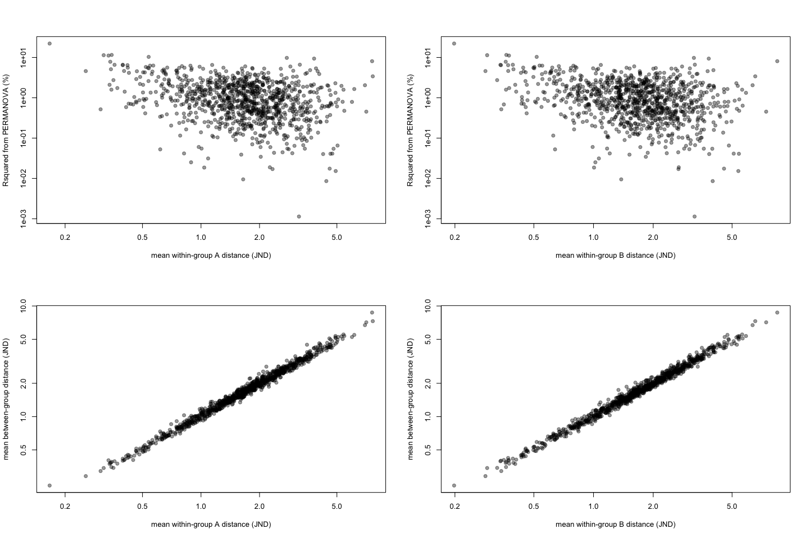
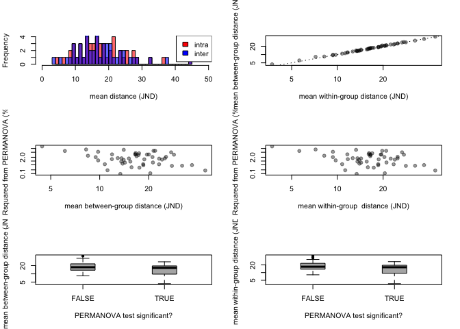

Simulation definitions
----------------------

-   *u**s**m**l* ∼ 𝓁𝓃𝒩(*l**n*(*μ*),*σ*<sup>2</sup>)
-   *μ*<sub>*u**s**m**l*</sub> ∼ 𝒰(1, 10), covariances = 0
-   *σ*<sub>*u**s**m**l*</sub><sup>2</sup> ∼ ℰ𝓍𝓅(*λ* = 10) (such that $\\overline{\\sigma^2} = 0.1$).
-   Also, *σ*<sub>*A*<sub>*u**s**m**l*</sub></sub><sup>2</sup> = *σ*<sub>*B*<sub>*u**s**m**l*</sub></sub><sup>2</sup>
-   difference between group A and group B: *μ*<sub>*A*<sub>*u**s**m**l*</sub></sub> = *μ*<sub>*B*<sub>*u**s**m**l*</sub></sub> \* *X*, where *X* ∼ 𝒰(0.95, 1.05) (that is, group B *usml* should be up to 5% different than group A *usml*)
-   *N*<sub>*A*</sub> = *N*<sub>*B*</sub> = 50

``` r
source('R/dichtcp.R')


simdich <- function(N=50, sgsqsrate=10, multiplier=c(0.95, 1.05)){

  musA <- runif(4, 1e-6, 1e0) # vector of means for group A
  musA <- runif(4, 1, 10)
  #musB <- musA*runif(4, .8, 1.2) # vector of means for group B
  #musB <- musA * rnorm(4, multiplier[1], multiplier[2])
  musB <- musA * runif(4, multiplier[1], multiplier[2])
  sgsqs <- rexp(4, sgsqsrate) # vector of standard deviations
  
  groupA <- matrix(NA, nrow=N, ncol=4)
  groupA[,1] <- rlnorm(N, meanlog=log(musA[1]), sdlog=sgsqs[1])
  groupA[,2] <- rlnorm(N, meanlog=log(musA[2]), sdlog=sgsqs[2])
  groupA[,3] <- rlnorm(N, meanlog=log(musA[3]), sdlog=sgsqs[3])
  groupA[,4] <- rlnorm(N, meanlog=log(musA[4]), sdlog=sgsqs[4])
  
  groupB <- matrix(NA, nrow=N, ncol=4)
  groupB[,1] <- rlnorm(N, meanlog=log(musB[1]), sdlog=sgsqs[1])
  groupB[,2] <- rlnorm(N, meanlog=log(musB[2]), sdlog=sgsqs[2])
  groupB[,3] <- rlnorm(N, meanlog=log(musB[3]), sdlog=sgsqs[3])
  groupB[,4] <- rlnorm(N, meanlog=log(musB[4]), sdlog=sgsqs[4])
  
  combined <- data.frame(rbind(groupA,groupB))
  
  colnames(combined) <- c('u','s','m', 'l')
  rownames(combined) <- paste(rep(c('gA','gB'), each=N),1:N, sep='')
  
  attr(combined, 'relative') <- FALSE
  
  simpars <- data.frame(rbind(musA, musB, sgsqs))
  colnames(simpars) <- c('u','s','m', 'l')
  rownames(simpars) <- c('muA','muB','ssq')
  attr(combined, 'simpar') <- simpars
  
  combined
  }


adoniscoldist <- function(x){
  dmat <- matrix(0, nrow=length(unique(x$patch1)), ncol=length(unique(x$patch1)))
  rownames(dmat) <- colnames(dmat) <- as.character(unique(x$patch1))
  
  for(i in rownames(dmat))
    for(j in colnames(dmat))
      if(length(x$dS[x$patch1 == i & x$patch2 == j]) != 0)
      dmat[i,j] <- dmat[j,i] <- x$dS[x$patch1 == i & x$patch2 == j]
  
  grouping <- gsub('[0-9]','', rownames(dmat))
  
  adonis(dmat~grouping)
  }
```

Simulate 500 datasets

``` r
simulatedata <- replicate(50, 
                  simdich(N=50, sgsqsrate=10, multiplier=c(0.95, 1.05)), 
                  simplify=FALSE)

simulatecoldist <- parallel::mclapply(simulatedata, function(x) {
  Y <- coldist(x, achro=FALSE)
  Y$comparison <- NA
  Y$comparison[grepl('A', Y$patch1) & grepl('A', Y$patch2)] <- 'intra.A'
  Y$comparison[grepl('B', Y$patch1) & grepl('B', Y$patch2)] <- 'intra.B'
  Y$comparison[grepl('A', Y$patch1) & grepl('B', Y$patch2)] <- 'inter'
  Y
  }, mc.cores=6)
```

Let's see what some of these simulations look like. We can see how similar groups are. This really is a threshold situation. We can also see that simulations do a pretty good job of covering the entire colorspace, as well as a wide range of correlations and variances.



**Step 1:** Run permuational ANOVA (PERMANOVA) on simulated data to ask if group A is different than group B

``` r
adonissim <- parallel::mclapply(simulatecoldist, adoniscoldist, mc.cores=6)
```

**Step 2:** Run a linear model to get average within- and between-group distances.

``` r
lmesim <- parallel::mclapply(simulatecoldist, function(x) 
  lmer(dS~comparison - 1 + (1|patch1) + (1|patch2), data=x), 
  mc.cores=6)
```

Let's see what our results look like



-   There is no association between how well groups can be told apart (PERMANOVA R-squared) and the mean between-group distances
-   There between-group JND distance is not a good predictor of if the groups can be told apart (i.e. if the PERMANOVA is significant)
-   If anything these associations are negative - probably because of the mean-variance relationship in lognormal distributions?

This is annoying, wasn't really what I was trying to simulate. But makes the point accross...

Let's try some other simulations.

Test 1: increase within-group variance
--------------------------------------

Let's change *σ*<sub>*u**s**m**l*</sub><sup>2</sup> such that *σ*<sub>*u**s**m**l*</sub><sup>2</sup> ∼ ℰ𝓍𝓅(*λ* = 1) (and $\\overline{\\sigma^2} = 1$).

Simulate 500 datasets

``` r
simulatedata.t1 <- replicate(50, 
                  simdich(N=50, sgsqsrate=1, multiplier=c(0.7, 1.3)), 
                  simplify=FALSE)

simulatecoldist.t1 <- parallel::mclapply(simulatedata.t1, function(x) {
  Y <- coldist(x, achro=FALSE)
  Y$comparison <- NA
  Y$comparison[grepl('A', Y$patch1) & grepl('A', Y$patch2)] <- 'intra.A'
  Y$comparison[grepl('B', Y$patch1) & grepl('B', Y$patch2)] <- 'intra.B'
  Y$comparison[grepl('A', Y$patch1) & grepl('B', Y$patch2)] <- 'inter'
  Y
  }, mc.cores=6)
```

Groups still overlap a lot but their variation increased a LOT.

``` r
par(mfrow=c(3,3))

for(i in 1:9) dichtcp(simulatedata.t1[[i]])
```



**Step 1:** Run permuational ANOVA (PERMANOVA) on simulated data to ask if group A is different than group B

``` r
adonissim.t1 <- parallel::mclapply(simulatecoldist.t1, adoniscoldist, mc.cores=6)
```

**Step 2:** Run a linear model to get average within- and between-group distances.

``` r
lmesim.t1 <- parallel::mclapply(simulatecoldist.t1, function(x) 
  lmer(dS~comparison - 1 + (1|patch1) + (1|patch2), data=x), 
  mc.cores=6)
```

What do the results look like in this case?



We see the same results. Note that the between-group distance also increased tenfold, but that's just because of the within-group increase (they're essentially sampled from the same population!).

``` r
sessionInfo()
```

    ## R version 3.3.0 (2016-05-03)
    ## Platform: x86_64-apple-darwin13.4.0 (64-bit)
    ## Running under: OS X 10.11.4 (El Capitan)
    ## 
    ## locale:
    ## [1] en_US.UTF-8/en_US.UTF-8/en_US.UTF-8/C/en_US.UTF-8/en_US.UTF-8
    ## 
    ## attached base packages:
    ## [1] stats     graphics  grDevices utils     datasets  methods   base     
    ## 
    ## other attached packages:
    ## [1] lme4_1.1-12          Matrix_1.2-6         vegan_2.4-0         
    ## [4] lattice_0.20-33      permute_0.9-0        scatterplot3d_0.3-37
    ## [7] pavo_0.5-5           rgl_0.95.1441       
    ## 
    ## loaded via a namespace (and not attached):
    ##  [1] Rcpp_0.12.5        cluster_2.0.4      knitr_1.13        
    ##  [4] magrittr_1.5       splines_3.3.0      maps_3.1.0        
    ##  [7] magic_1.5-6        MASS_7.3-45        minqa_1.2.4       
    ## [10] geometry_0.3-6     stringr_1.0.0      tools_3.3.0       
    ## [13] parallel_3.3.0     grid_3.3.0         nlme_3.1-127      
    ## [16] mgcv_1.8-12        htmltools_0.3.5    yaml_2.1.13       
    ## [19] digest_0.6.9       nloptr_1.0.4       mapproj_1.2-4     
    ## [22] formatR_1.4        codetools_0.2-14   rcdd_1.1-10       
    ## [25] evaluate_0.9       rmarkdown_0.9.6.10 stringi_1.0-1
