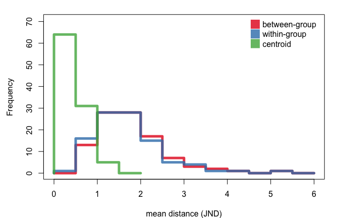
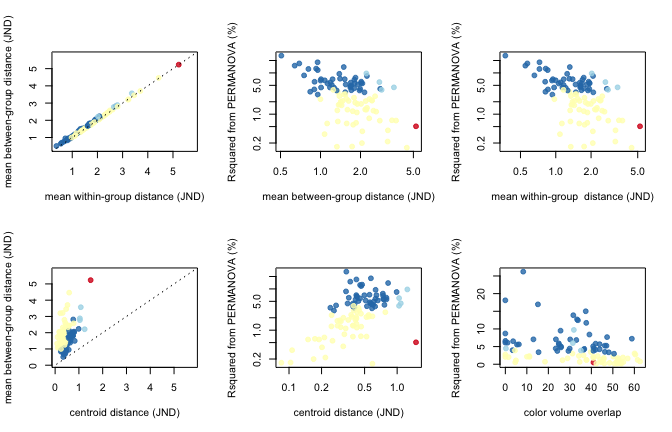
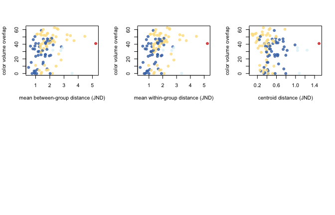
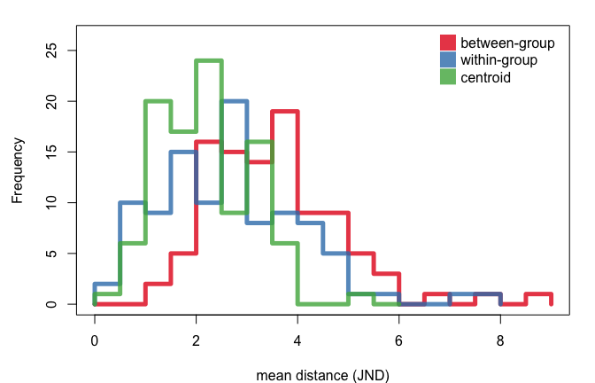
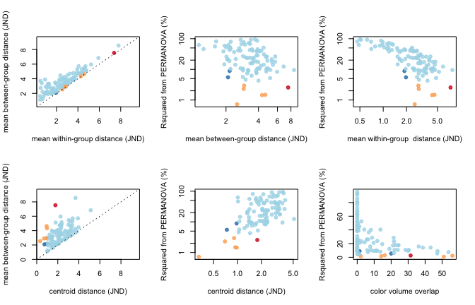
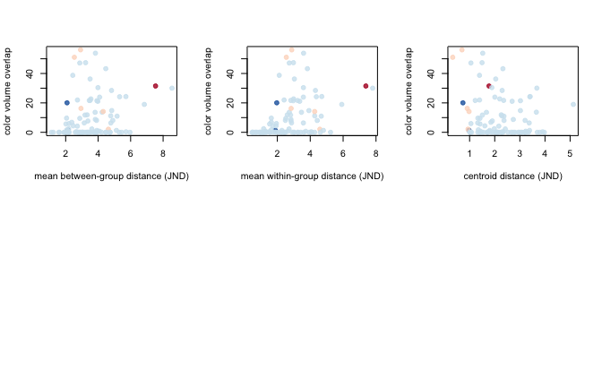

``` r
# Make RColorBrewer colors transparent
rcbalpha <- function(alpha=1, ...){
  aa <- data.frame(t(col2rgb(RColorBrewer::brewer.pal(...), alpha=F)))/255
  #aa$alpha <- alpha
  rgb(aa, alpha=alpha)
}

# significant/not significant histogram 
yesnohist <- function(x, xlab=""){
  bq <- 0.5  
  while(length(seq(0, ceiling(max(x)),by=bq)) < 10) 
    bq <- bq/2

yes <- hist(x[adonisP], breaks=seq(0, ceiling(max(x)),by=bq), plot=F)
no <- hist(x[!adonisP], breaks=seq(0, ceiling(max(x)),by=bq), plot=F)

plot(c(0,yes$breaks), c(0,yes$counts,0), type='s',col=palette[1], lwd=5,
     ylab='Frequency', xlab=xlab,
     ylim=range(c(yes$counts,no$counts))* c(0,1.1),
     xlim=c(0, max(c(yes$breaks, no$breaks)*1.1)))
lines(c(0,no$breaks), c(0,no$counts,0), col=palette[2], type='s', lwd=5)

legend('topright', col=palette[1:2], c('significant  ','not significant  '), 
       pch=15, pt.cex=2.5, bty='n')
}


# tetrahedral plot
source('R/dichtcp.R')

# simulate two groups of data
simdich <- function(N=50, sgsqsrate=10, multiplier=c(0.95, 1.05)){

  musA <- runif(4, 1e-6, 1e0) # vector of means for group A
  musA <- runif(4, 1, 10)
  #musB <- musA*runif(4, .8, 1.2) # vector of means for group B
  #musB <- musA * rnorm(4, multiplier[1], multiplier[2])
  musB <- musA * runif(4, multiplier[1], multiplier[2])
  sgsqs <- rexp(4, sgsqsrate) # vector of standard deviations
  
  groupA <- matrix(NA, nrow=N, ncol=4)
  groupA[,1] <- rlnorm(N, meanlog=log(musA[1]), sdlog=sgsqs[1])
  groupA[,2] <- rlnorm(N, meanlog=log(musA[2]), sdlog=sgsqs[2])
  groupA[,3] <- rlnorm(N, meanlog=log(musA[3]), sdlog=sgsqs[3])
  groupA[,4] <- rlnorm(N, meanlog=log(musA[4]), sdlog=sgsqs[4])
  
  groupB <- matrix(NA, nrow=N, ncol=4)
  groupB[,1] <- rlnorm(N, meanlog=log(musB[1]), sdlog=sgsqs[1])
  groupB[,2] <- rlnorm(N, meanlog=log(musB[2]), sdlog=sgsqs[2])
  groupB[,3] <- rlnorm(N, meanlog=log(musB[3]), sdlog=sgsqs[3])
  groupB[,4] <- rlnorm(N, meanlog=log(musB[4]), sdlog=sgsqs[4])
  
  combined <- data.frame(rbind(groupA,groupB))
  
  colnames(combined) <- c('u','s','m', 'l')
  rownames(combined) <- paste(rep(c('gA','gB'), each=N),1:N, sep='')
  
  attr(combined, 'relative') <- FALSE
  
  simpars <- data.frame(rbind(musA, musB, sgsqs))
  colnames(simpars) <- c('u','s','m', 'l')
  rownames(simpars) <- c('muA','muB','ssq')
  attr(combined, 'simpar') <- simpars
  
  combined
  }

# make distance matrix and run adonis
adoniscoldist <- function(x, ...){
  dmat <- matrix(0, nrow=length(unique(x$patch1)), ncol=length(unique(x$patch1)))
  rownames(dmat) <- colnames(dmat) <- as.character(unique(x$patch1))
  
  for(i in rownames(dmat))
    for(j in colnames(dmat))
      if(length(x$dS[x$patch1 == i & x$patch2 == j]) != 0)
      dmat[i,j] <- dmat[j,i] <- x$dS[x$patch1 == i & x$patch2 == j]
  
  grouping <- gsub('[0-9]','', rownames(dmat))
  
  adonis(dmat~grouping, ...)
  }

# split data and run volume overlap
voloverlaptest <- function(dat){
  tcsdat <- suppressWarnings(tcs(dat))
  gA <- tcsdat[1:(dim(dat)[1]/2),]
  gB <- tcsdat[(dim(dat)[1]/2+1):(dim(dat)[1]),]
  
  voloverlap(gA, gB)
}

# split data, get centroids, get color distance
centroidist <- function(dat){
  gA.c <- colMeans(dat[1:(dim(dat)[1]/2),])
  gB.c <- colMeans(dat[(dim(dat)[1]/2+1):(dim(dat)[1]),])
  
  coldist(rbind(gA.c, gB.c), achro=FALSE)$dS
}
```

Scenario 1
----------

Generate data

``` r
simulatedata <- replicate(100, 
                  simdich(N=50, sgsqsrate=10, multiplier=c(0.95, 1.05)), 
                  simplify=FALSE)

simulatecoldist <- parallel::mclapply(simulatedata, function(x) {
  Y <- coldist(x, achro=FALSE)
  Y$comparison <- NA
  Y$comparison[grepl('A', Y$patch1) & grepl('A', Y$patch2)] <- 'intra.A'
  Y$comparison[grepl('B', Y$patch1) & grepl('B', Y$patch2)] <- 'intra.B'
  Y$comparison[grepl('A', Y$patch1) & grepl('B', Y$patch2)] <- 'inter'
  Y
  }, mc.cores=6)
```

Run stuff

``` r
adonissim <- parallel::mclapply(simulatecoldist, adoniscoldist, sqrt.dist=TRUE, mc.cores=6)
vovsim <- parallel::mclapply(simulatedata, voloverlaptest, mc.cores=6)
centdist <- unlist(parallel::mclapply(simulatedata, centroidist, mc.cores=6))
gc()
```

    ##            used  (Mb) gc trigger  (Mb) max used  (Mb)
    ## Ncells  1338682  71.5    2164898 115.7  1770749  94.6
    ## Vcells 27231203 207.8   43565530 332.4 36237816 276.5



color legend:

-   dark colors: methods disagree (BAD)
-   light colors: methods agree (GOOD)

-   light blue: adonis and centroid distance &gt; 1 (GOOD)
-   dark blue: adonis significant, centroid distance &lt; 1 (BAD)
-   dark red: adonis non-significant, centroid distance &gt; 1 (BAD)
-   light red: adonis and centroid distance &lt; 1 (GOOD)



Scenario 2
----------

Generate data

``` r
simulatedata2 <- replicate(100, 
                  simdich(N=50, sgsqsrate=7, multiplier=c(0.7, 1.3)), 
                  simplify=FALSE)

simulatecoldist2 <- parallel::mclapply(simulatedata2, function(x) {
  Y <- coldist(x, achro=FALSE)
  Y$comparison <- NA
  Y$comparison[grepl('A', Y$patch1) & grepl('A', Y$patch2)] <- 'intra.A'
  Y$comparison[grepl('B', Y$patch1) & grepl('B', Y$patch2)] <- 'intra.B'
  Y$comparison[grepl('A', Y$patch1) & grepl('B', Y$patch2)] <- 'inter'
  Y
  }, mc.cores=6)
```

Run stuff

``` r
adonissim2 <- parallel::mclapply(simulatecoldist2, adoniscoldist, sqrt.dist=TRUE, mc.cores=6)
vovsim2 <- parallel::mclapply(simulatedata2, voloverlaptest, mc.cores=6)
centdist2 <- unlist(parallel::mclapply(simulatedata2, centroidist, mc.cores=6))
gc()
```

    ##            used  (Mb) gc trigger  (Mb) max used  (Mb)
    ## Ncells  1415732  75.7    2164898 115.7  2164898 115.7
    ## Vcells 52652237 401.8   75801323 578.4 62606487 477.7



color legend:

-   dark colors: methods disagree (BAD)
-   light colors: methods agree (GOOD)

-   light blue: adonis and centroid distance &gt; 1 (GOOD)
-   dark blue: adonis significant, centroid distance &lt; 1 (BAD)
-   dark red: adonis non-significant, centroid distance &gt; 1 (BAD)
-   light red: adonis and centroid distance &lt; 1 (GOOD) 

``` r
sessionInfo()
```

    ## R version 3.3.0 (2016-05-03)
    ## Platform: x86_64-apple-darwin13.4.0 (64-bit)
    ## Running under: OS X 10.11.4 (El Capitan)
    ## 
    ## locale:
    ## [1] en_US.UTF-8/en_US.UTF-8/en_US.UTF-8/C/en_US.UTF-8/en_US.UTF-8
    ## 
    ## attached base packages:
    ## [1] stats     graphics  grDevices utils     datasets  methods   base     
    ## 
    ## other attached packages:
    ## [1] vegan_2.4-0          lattice_0.20-33      permute_0.9-0       
    ## [4] scatterplot3d_0.3-37 pavo_0.5-5           rgl_0.95.1441       
    ## 
    ## loaded via a namespace (and not attached):
    ##  [1] Rcpp_0.12.5        cluster_2.0.4      knitr_1.13        
    ##  [4] magrittr_1.5       maps_3.1.0         magic_1.5-6       
    ##  [7] MASS_7.3-45        geometry_0.3-6     stringr_1.0.0     
    ## [10] tools_3.3.0        parallel_3.3.0     grid_3.3.0        
    ## [13] nlme_3.1-127       mgcv_1.8-12        htmltools_0.3.5   
    ## [16] yaml_2.1.13        digest_0.6.9       Matrix_1.2-6      
    ## [19] RColorBrewer_1.1-2 mapproj_1.2-4      formatR_1.4       
    ## [22] rcdd_1.1-10        evaluate_0.9       rmarkdown_0.9.6.10
    ## [25] stringi_1.0-1
